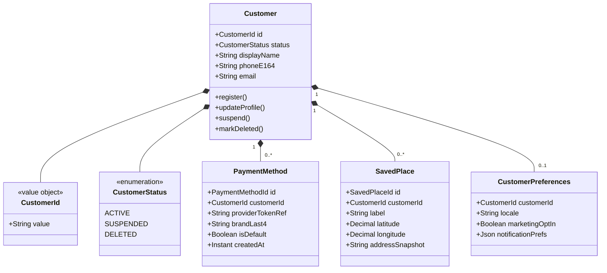
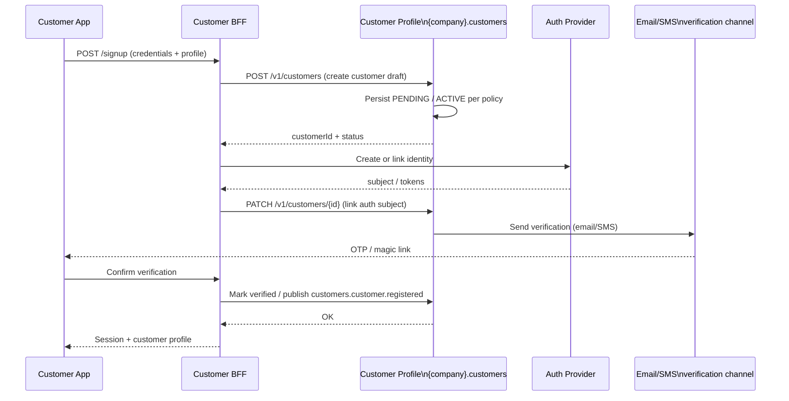
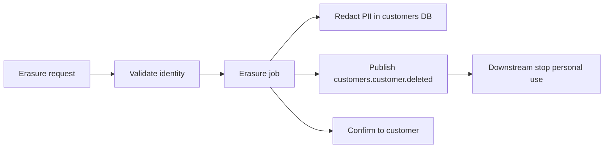

# 🧑 Customer Profile


---

## 📋 1. Overview

The **Customer Profile** bounded context (`{company}.customers`) manages **customer accounts**, **preferences**, **saved payment method tokens**, and **order history projections** suitable for the customer app. It is the system of record for "who the customer is" in the platform sense, not for raw order orchestration or payment capture.

### 1.1 What this domain owns

| Area | Ownership |
|------|-----------|
| **Customer entity** | Account lifecycle, profile fields, status |
| **Saved places** | Home, work, favorites with labels and coordinates as stored for UX |
| **Payment method tokens** | References and metadata for cards/wallets (**no** PAN/CVV; tokenized) |
| **Preferences** | Language, notifications, accessibility, defaults |

### 1.2 What this domain does **not** own

| Concern | Owning domain |
|---------|----------------|
| **Order aggregate and lifecycle** | Order Service (`{company}.orders`) |
| **Payment processing, capture, refunds** | Payment Service (`{company}.payments.*`) |

---

## 🧩 2. Domain Model

Core types live under `{company}.customers.domain`. Identifiers are opaque UUIDs at the API boundary.



---

## 🚀 3. Customer Registration Flow

Happy path: mobile app registers a new customer through the BFF, which delegates identity to the platform auth provider and triggers verification.



---

## 🔌 4. API Surface

Base path: **`/v1/customers`**. Clients use the Customer BFF; internal callers use the mesh host from Backstage. Generated clients: `@{company}/api-client-customers`.

| Method | Path | Description |
|--------|------|-------------|
| `POST` | `/v1/customers` | Create customer; publishes `customers.customer.registered` when account is committed. |
| `GET` | `/v1/customers/{id}` | Read profile, preferences summary, default payment pointer. |
| `PATCH` | `/v1/customers/{id}` | Update profile fields; publishes `customers.customer.updated`. |
| `DELETE` | `/v1/customers/{id}` | GDPR erasure workflow (async); publishes `customers.customer.deleted` when tombstone/complete. |
| `GET` | `/v1/customers/{id}/payment-methods` | List tokenized methods (no secrets). |
| `POST` | `/v1/customers/{id}/payment-methods` | Register new method via Payment Service tokenization callback pattern. |
| `PATCH` | `/v1/customers/{id}/payment-methods/{pmId}` | Set default, update label. |
| `DELETE` | `/v1/customers/{id}/payment-methods/{pmId}` | Remove method reference. |
| `GET` | `/v1/customers/{id}/saved-places` | List saved places. |
| `POST` | `/v1/customers/{id}/saved-places` | Add saved place. |
| `PATCH` | `/v1/customers/{id}/saved-places/{placeId}` | Update label or coordinates. |
| `DELETE` | `/v1/customers/{id}/saved-places/{placeId}` | Remove saved place. |
| `GET` | `/v1/customers/{id}/preferences` | Read preferences. |
| `PUT` | `/v1/customers/{id}/preferences` | Replace preferences document. |
| `GET` | `/v1/customers/{id}/order-history` | Paginated history from projection (sourced from consumed events). |

---

## 📤 5. Events Published

Producer: `{company}.customers` - subject prefix `customers.customer`.

| Topic / event | Payload summary | Consumers |
|---------------|-----------------|-----------|
| `customers.customer.registered` | `customerId`, `registeredAt` | Analytics, Fraud (optional), Marketing (policy) |
| `customers.customer.updated` | `customerId`, changed fields hash / version | BFF cache, Analytics |
| `customers.customer.deleted` | `customerId`, `deletedAt`, erasure job id | Analytics (stop processing), Search index, Data warehouse GDPR |

---

## 📥 6. Events Consumed

| Topic | Description | Handler behavior |
|-------|-------------|------------------|
| `orders.order.completed` | Order completed | Append or update **order history** projection for the customer (order id, time, price summary - no payment PAN). |
| `payments.payment.captured` | Successful capture | Link **receipt** reference on history row or separate projection for "receipt available". |

---

## 💾 7. Data Store

| Attribute | Value |
|-----------|--------|
| Engine | **Amazon RDS PostgreSQL** (customers cluster) |
| Schema | `customers_profile` (owned by Team Customers) |

### 7.1 Key tables

| Table | Purpose |
|-------|---------|
| `customers` | Customer aggregate: ids, status, profile, auth subject link, verification flags |
| `payment_methods` | **Tokenized** references only: `provider_token_ref`, display metadata, `customer_id` |
| `saved_places` | Saved locations per customer |
| `customer_preferences` | Key-value or JSON document per customer |
| `order_history` (or projection table) | Denormalized history from `orders.order.completed` / payments events |

---

## 🔒 8. GDPR Considerations

### 8.1 Right to erasure

1. Customer requests deletion (app or DSR ticket).  
2. Customer Profile **queues erasure job**: stop marketing prefs, anonymize or delete PII columns per retention policy.  
3. **Payment Service** and **Orders** may retain legal/financial records per finance policy - Customer Profile publishes `customers.customer.deleted` and stops being source of truth for **new** customer-facing reads.  
4. Confirmation returned when profile row is tombstoned or removed per jurisdictional rules.



### 8.2 Data export

- Export bundles **profile, preferences, saved places, payment method metadata (masked), order history projection** as JSON/CSV via authenticated export API (implementation in Backstage runbooks).

### 8.3 PII fields requiring encryption

| Field / store | Treatment |
|---------------|-----------|
| `customers.email`, `customers.phone_e164` | **Application-level encryption** or RDS column encryption; minimize log exposure |
| `saved_places.address_snapshot` | Encrypt at rest; treat as PII |
| `payment_methods` | **Never** store PAN/CVV; token refs only; encrypt provider refs if required by PSP contract |
| Backup snapshots | Same encryption scope as primary DB |

---

## 🔗 9. Dependencies

```mermaid
flowchart TB
    subgraph cp [Customer Profile - {company}.customers]
        API[REST API]
        DB[(RDS PostgreSQL)]
        OUT[Kafka produce]
        IN[Kafka consume]
    end

    subgraph pay [Payments - async only]
        PAY[payments.payment.captured]
    end

    subgraph orders [Orders - async only]
        ORD[orders.order.completed]
    end

    API --> DB
    DB --> OUT
    ORD --> IN
    PAY --> IN
    API -.->|tokenization via BFF / Payment API| PSP[Payment Service\nno direct PAN storage]
```

---

## 📊 10. Key Metrics

| Category | Metric | Use |
|----------|--------|-----|
| Growth | **Registration completion rate** | Signup funnel health |
| Engagement | **DAU / MAU** | Customer app stickiness |
| Payments UX | **Payment method success rate** | Add-card and default-charge flows (via BFF + Payments telemetry) |

---

## 👥 11. Team & Ownership

| Item | Detail |
|------|--------|
| Team | **Team Customers** |
| Bounded context | `{company}.customers` |

Coordinate **Orders** and **Payments** for event schema changes affecting history and receipts.

---

## 📈 12. SLOs and Error Budgets

| SLO | Target | Measurement |
|-----|--------|-------------|
| **Availability** | 99.9% (measured monthly) | Successful responses / total requests (excluding scheduled maintenance) |
| **Latency (p99)** | < 150ms for profile reads | Prometheus histogram on REST handler duration |
| **Error rate** | < 0.1% 5xx responses | Istio telemetry + application error counters |

**Error budget policy:** When the monthly error budget is exhausted, the team halts feature releases and dedicates the next sprint to reliability. New features resume only after the error budget recovers.

---

## ⚠️ 13. Failure Modes

| Failure Scenario | User Impact | Fallback Strategy |
|-----------------|-------------|-------------------|
| **Profile DB read unavailable** | Customer cannot view their profile, saved places, or preferences | Return cached profile from Redis (stale read, TTL 5 min); customer app shows last-known profile state |
| **Profile DB write unavailable** | Preference updates, saved place edits fail | Queue update via outbox pattern; return 503 with `Retry-After`; preference updates are **queued** and applied when DB recovers |
| **Payment method token write failure** | Customer cannot add/update payment methods | Return user-friendly error; tokenization is idempotent via PSP reference - client can retry safely |
| **Kafka producer failure** | Downstream consumers (Analytics, Fraud) miss registration/update events | Outbox table ensures events are persisted to DB first; outbox poller retries publishing |
| **Order history projection lag** | Customer sees stale order history | Acceptable up to 5 minutes; projection is eventually consistent by design; stale indicator shown if lag > 2 min |

---

## 📐 14. Capacity Sizing

| Resource | Configuration |
|----------|--------------|
| **Min replicas** | 3 (production) |
| **Max replicas** | 20 (HPA) |
| **HPA target** | 60% CPU utilization |
| **DB connection pool** | 20 connections per pod (PgBouncer sidecar) |
| **Peak QPS** | ~800 req/s (read-heavy; 85% reads, 15% writes) |
| **Memory** | 1Gi request / 2Gi limit per pod |
| **CPU** | 500m request / 2000m limit per pod |

---

## 🗃️ 15. Data Retention Matrix

| Store | Data | Retention | Deletion Mechanism |
|-------|------|-----------|-------------------|
| **RDS PostgreSQL** - `customers` table | Customer profile, status, auth subject | Until account deletion (GDPR erasure) | Erasure job: redact PII, tombstone row |
| **RDS PostgreSQL** - `payment_methods` | Tokenized payment references | Until customer removes method or account deletion | DELETE on customer action; cascade on erasure |
| **RDS PostgreSQL** - `saved_places` | Saved locations (PII - addresses) | Until customer removes or account deletion | DELETE on customer action; cascade on erasure |
| **RDS PostgreSQL** - `customer_preferences` | Locale, notification, marketing prefs | Until account deletion | Cascade on erasure |
| **RDS PostgreSQL** - `order_history` | Denormalized order projection | 7 years (tax/regulatory) - anonymized on erasure | Anonymize `customerId` on erasure; archive after 7 years |
| **Kafka** - `customers.customer.*` topics | Customer domain events | 14 days (platform default) | Kafka topic retention policy |
| **CloudWatch Logs** | Application logs | 30 days | CloudWatch log group retention policy |

---

## 🔐 16. Allowed Callers

| Caller | Protocol | Authorization |
|--------|----------|--------------|
| Order Service (`{company}.orders`) | gRPC | mTLS + RBAC role `customers.orders-read` |
| Payment Service (`{company}.payments`) | Kafka (consume `customers.customer.*`) | mTLS + consumer ACL |
| Fraud Engine (`{company}.fraud`) | Kafka (consume `customers.customer.*`) | mTLS + consumer ACL |
| Customer BFF (`{company}.bff.customer`) | REST | mTLS + OAuth2 subject |

---
<div align="center">

⬅️ [Back to section](./README.md) · 🏠 [Back to root](../README.md)

</div>
