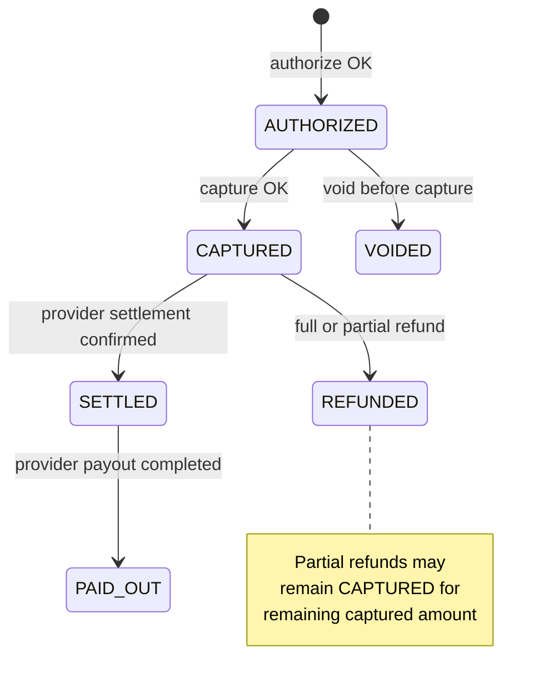
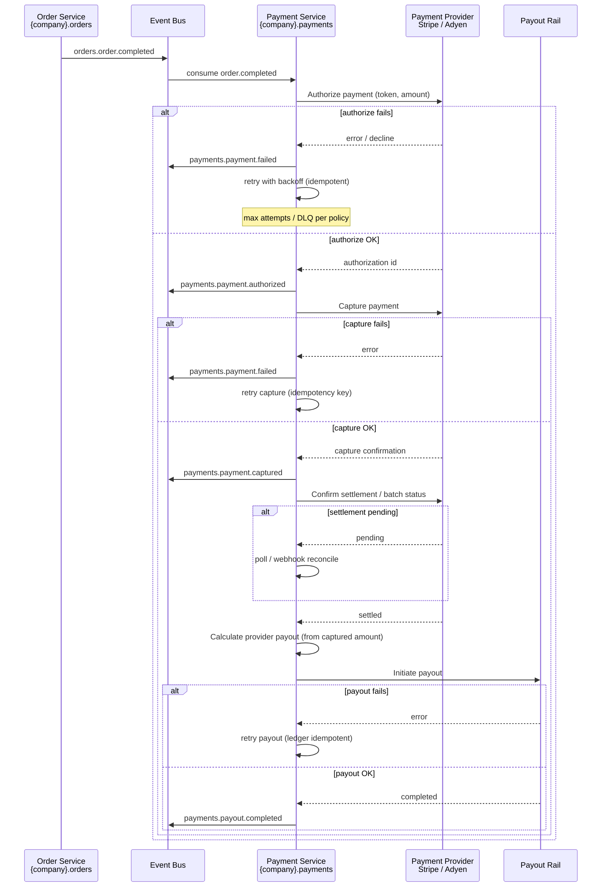
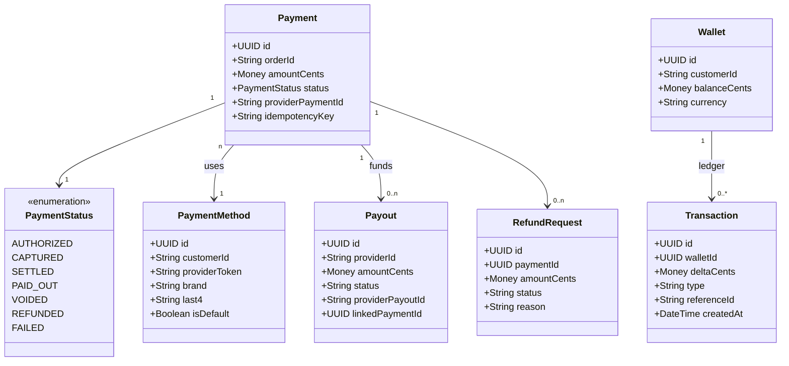
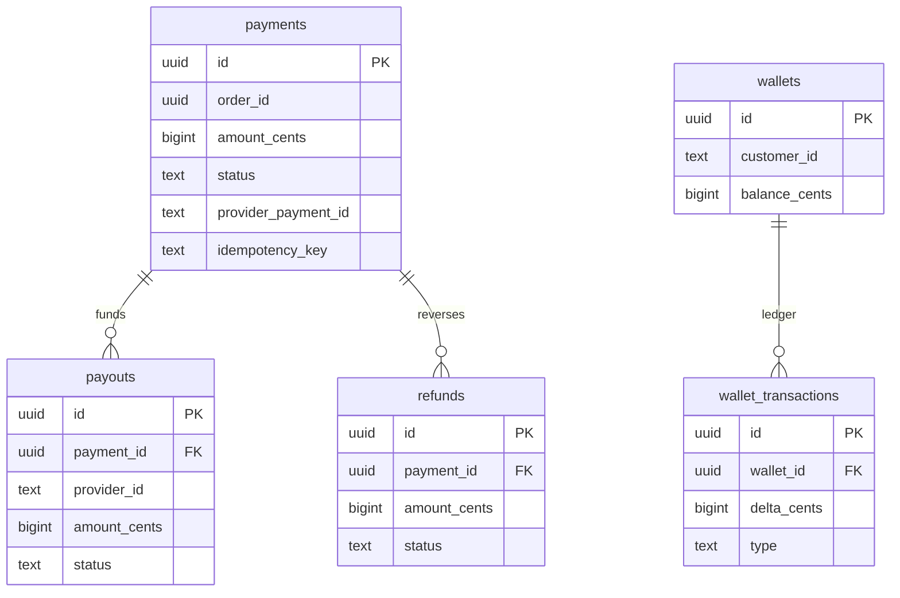

# 💳 Payment Service


**Service identifier:** `{company}.payments`

---

## 📋 1. Overview

The **Payment Service** is the bounded context responsible for **payment processing**, **settlements**, **customer wallets**, and **refunds** after an order's financial outcome is known. It integrates with external payment providers (e.g., Stripe, Adyen) under the `{company}.orders` ecosystem contracts.

### 1.1 Ownership

| Owns | Does not own |
|------|----------------|
| Payment transactions (authorize, capture, void, refund) | Price calculation (Pricing Service) |
| Provider payouts and payout scheduling | Order lifecycle state (Order Service) |
| Customer wallet balances and wallet ledger entries | Card network / issuer rules (provider) |

### 1.2 PCI-DSS scope boundaries

Cardholder data is **never** persisted in platform systems in raw form. **Tokenization and vaulting** are delegated to the payment provider; the platform stores only **provider tokens**, **last4**, **brand**, and **expiry metadata** where permitted. The **PCI-DSS assessment scope** for application infrastructure is limited to **token handling** and **provider API integration** - not full card data processing.

```mermaid
flowchart LR
    subgraph platform_pci [{Company} - reduced PCI scope]
        PS[Payment Service]
        API[REST APIs]
        DB[(Aurora - tokens & ledger)]
        PS --> API
        PS --> DB
    end

    subgraph provider_pci [Payment Provider - full PCI scope]
        TOK[Tokenization / vault]
        CHD[Cardholder data zone]
        CHD --> TOK
    end

    Customer[Customer / Client] -->|card via provider SDK| provider_pci
    PS <-->|tokens only| provider_pci
```

---

## 🔄 2. Payment lifecycle

State transitions for a single payment intent tied to an order (`{company}.orders` correlation).



| State | Meaning |
|-------|---------|
| **AUTHORIZED** | Funds held; not yet transferred to settlement. |
| **CAPTURED** | Charge completed; awaiting settlement batch from provider. |
| **SETTLED** | Provider settlement reconciled to internal ledger. |
| **PAID_OUT** | Provider share paid via payout rail. |
| **VOIDED** | Authorization released; no capture. |
| **REFUNDED** | Full or partial money returned to customer (provider-side). |

---

## 🔀 3. Payment flow

End-to-end flow from order completion through payout, including failure and retry semantics.



---

## 🧩 4. Domain model

Core aggregates and value objects for the Payment Service.



---

## 🔌 5. API surface

Base path: `/v1` · All mutation endpoints require **`Idempotency-Key`** header (see §9).

| Method | Path | Description |
|--------|------|---------------|
| `POST` | `/v1/payments/authorize` | Hold funds for an order; returns payment id and provider auth reference. |
| `POST` | `/v1/payments/{id}/capture` | Finalize charge for authorized payment. |
| `POST` | `/v1/payments/{id}/refund` | Full or partial refund (body: `amountCents`, optional `reason`). |
| `GET` | `/v1/payments/{id}` | Payment status, amounts (cents), timestamps, linked order id. |
| `GET` | `/v1/wallets/{customerId}` | Wallet balance and recent transaction summary (paginated). |

**Internal contract packages:** `{company}.payments.api` (REST), `{company}.payments.events` (async).

---

## 📤 6. Events published

| Event name | Payload highlights | Typical consumers |
|------------|-------------------|-------------------|
| `payments.payment.authorized` | `paymentId`, `orderId`, `amountCents`, `customerId` | Fraud Engine, Analytics Pipeline, Notifications |
| `payments.payment.captured` | `paymentId`, `orderId`, `capturedCents`, `providerReference` | Accounting / Finance feeds, Analytics Pipeline, Orders (read-model enrichment) |
| `payments.payment.failed` | `paymentId`, `orderId`, `reasonCode`, `retryable` | Notifications, Fraud Engine, Support tooling |
| `payments.payout.completed` | `payoutId`, `providerId`, `amountCents`, `paymentId` | Provider Profile, Notifications, Accounting |
| `payments.refund.processed` | `refundId`, `paymentId`, `amountCents`, `status` | Customer Profile, Notifications, Analytics Pipeline |

---

## 📥 7. Events consumed

| Event name | Producer | Purpose |
|------------|----------|---------|
| `orders.order.completed` | Order Service (`{company}.orders`) | Trigger authorize → capture → settlement → payout pipeline for the finalized price. |
| `orders.order.cancelled` | Order Service | Void uncaptured authorizations or apply cancellation fee policy via capture/refund rules. |

---

## 💾 8. Data store

| Aspect | Choice |
|--------|--------|
| **Primary database** | **Amazon Aurora PostgreSQL** - ACID guarantees for ledger, payouts, and wallet balances. |
| **Monetary amounts** | **Integer cents** everywhere (DB columns, APIs, events); single currency per row where applicable. |

### 8.1 Core tables

| Table | Role |
|-------|------|
| `payments` | Payment intents, status, provider ids, order correlation, idempotency keys. |
| `payouts` | Provider payouts, linkage to payments, rail references. |
| `wallets` | Per-customer wallet header (balance in cents). |
| `wallet_transactions` | Append-only ledger lines for wallet credits/debits. |
| `refunds` | Refund requests and outcomes tied to `payments`. |



---

## 🔒 9. Security and compliance

| Topic | Payment Service policy |
|-------|------------------------------|
| **PCI-DSS** | No storage of raw PAN/CVV; **tokenization via Stripe/Adyen**; provider maintains PCI validation; platform handles tokens and non-sensitive metadata only. |
| **Idempotency** | **`Idempotency-Key` mandatory** on all mutating REST operations (`authorize`, `capture`, `refund`, wallet adjustments) to prevent duplicate side effects. |
| **Double-charge prevention** | **Distributed locking** (e.g., Redis Redlock or DB advisory locks) keyed by `orderId` + payment phase during authorize/capture windows. |
| **Secrets** | Provider API keys in AWS Secrets Manager; no keys in application images or repos. |

---

## 🔄 10. Reconciliation

```mermaid
flowchart TB
    subgraph daily [Daily reconciliation job - {company}.payments]
        J[L internal ledger<br/>payments / payouts]
        P[Provider reports<br/>settlements / fees]
        J --> C[Compare totals & line items]
        P --> C
        C --> OK{match?}
        OK -->|yes| LOG[audit log]
        OK -->|no| ALERT[P2 severity alert<br/>Finance / Payments on-call]
    end
```

| Step | Description |
|------|-------------|
| **Schedule** | Automated **daily** reconciliation between internal Aurora ledger and payment provider settlement files / APIs. |
| **Scope** | Captured amounts, fees, refunds, payout batches. |
| **Discrepancies** | Raised as **P2 severity** alerts with ticket automation; no silent adjustment without human or policy-approved rules engine. |

---

## 📊 11. Key metrics

| Metric | Target |
|--------|--------|
| **Availability** | **99.99%** monthly (excluding provider outages attributed separately). |
| **Payment success rate** | **> 99.5%** for capture after successful authorization (platform-attributable failures). |
| **P99 latency** | **< 1s** for synchronous authorize/capture API paths (platform service + provider round-trip budget shared). |
| **Settlement lag** | **< 24h** from capture to internally reconciled **SETTLED** state under normal provider batching. |

---

## 👥 12. Team and ownership

| Role | Assignment |
|------|------------|
| **Owning team** | **Team Payments** |
| **Escalations** | P2 reconciliation, payout failures, PCI-related incidents |
| **Related domains** | Orders (`{company}.orders`), Pricing, Fraud Engine, Customer/Provider profiles |

---
<div align="center">

⬅️ [Back to section](./README.md) · 🏠 [Back to root](../README.md)

</div>
