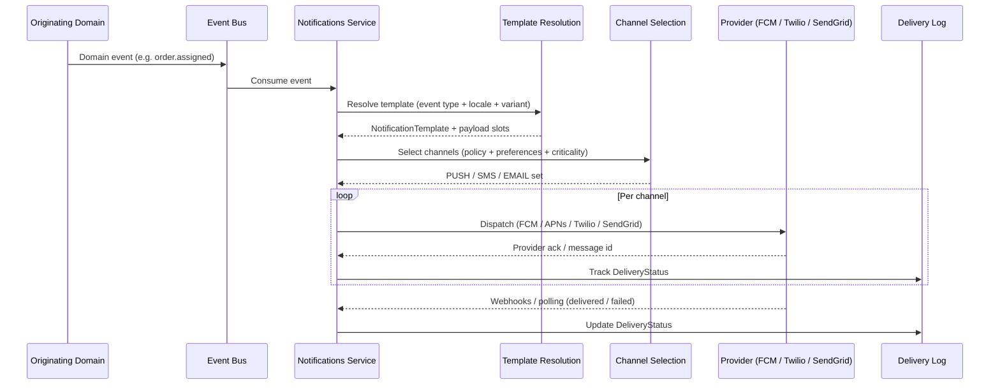
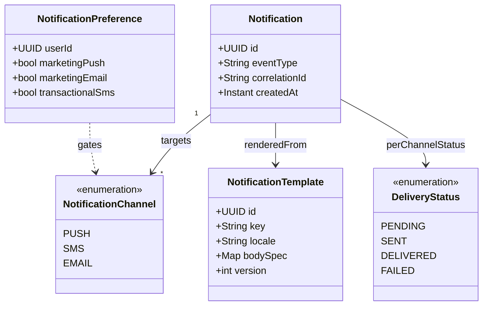
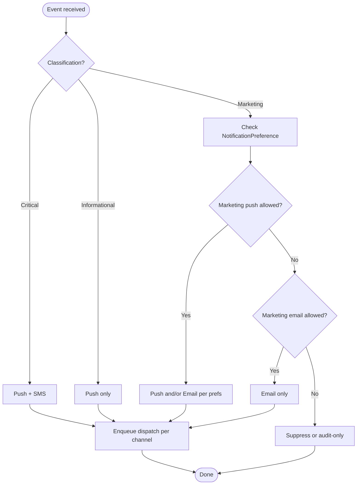

# Notifications — Domain Documentation

| Field | Value |
|-------|-------|
| **Status** | Active |
| **Owner** | Platform |
| **Last Updated** | 2025 |

**Service identifier:** `com.{company}.notifications`

---

## 1. Overview

The **Notifications** domain is the platform's **multi-channel notification dispatch** layer. It delivers messages over **push**, **SMS**, and **email**, and centralizes **template management**, **delivery status**, and **channel routing**.

### 1.1 Ownership

| Owns | Does not own |
|------|----------------|
| Notification templates (structure, placeholders, versioning) | **What** to send — content decisions live in originating domains (Orders, Payments, Providers, etc.) |
| Delivery status and delivery audit trail | Business rules that trigger a notification (those domains emit events) |
| Channel routing and provider integration | End-user copy approval outside template governance |

Other domains decide **what** to send and **when** (via events); Notifications decides **how** it is rendered and **which channels** carry it, subject to policy and user preferences.

---

## 2. Notification flow

End-to-end path from a domain event to tracked delivery on the platform's providers.

---

## 3. Domain model

Core entities for notification orchestration.

---

## 4. Channel selection logic

Policy used by Notifications after template resolution (simplified; actual rules may add quiet hours and legal constraints).

| Classification | Default channels |
|----------------|------------------|
| **Critical** | Push + SMS (e.g., safety, payment failure requiring immediate awareness) |
| **Informational** | Push only |
| **Marketing** | Push and/or email per **NotificationPreference**; respect opt-out |

---

## 5. API surface

REST-style APIs exposed to internal platform services and admin tooling (exact paths are implementation details; capabilities below).

| Capability | Typical REST operations |
|------------|-------------------------|
| Send notification | `POST` — submit rendered or template-keyed send request with correlation metadata |
| Delivery status | `GET` — by notification id or provider message id |
| Manage templates | `GET` / `POST` / `PUT` / `DELETE` — template CRUD and versioning |
| Update preferences | `PUT` / `PATCH` — per-user channel and marketing flags |

Authentication and authorization follow platform standards (service-to-service and admin roles).

---

## 6. Events consumed

Notifications subscribes to cross-domain events (names illustrative; align with platform event registry).

| Event | Typical use |
|-------|-------------|
| `orders.order.assigned` | Customer/provider alerts for assignment |
| `orders.order.completed` | Receipt / summary messaging |
| `orders.order.cancelled` | Cancellation confirmations |
| `payments.payment.captured` | Payment success notifications |
| `payments.payment.failed` | Payment failure / retry messaging |
| `providers.provider.approved` | Onboarding / status updates |

---

## 7. Data store

**RDS PostgreSQL** — system of record for notifications, templates, delivery history, and preferences.

| Table | Role |
|-------|------|
| `notifications` | Logical notification instance, correlation ids, template reference |
| `templates` | Template definitions and versions |
| `delivery_log` | Per-channel attempts, provider ids, **DeliveryStatus** transitions |
| `notification_preferences` | User opt-in/out and channel preferences |

---

## 8. External integrations

| Channel | Provider |
|---------|----------|
| Android push | **FCM** (Firebase Cloud Messaging) |
| iOS push | **APNs** (Apple Push Notification service) |
| SMS | **Twilio** |
| Email | **SendGrid** |

---

## 9. Key metrics

| Metric | Purpose |
|--------|---------|
| **Delivery success rate** (per channel) | Provider health and template/payload quality |
| **Notification latency** (event → delivery) | SLA and user experience |
| **Opt-out rate** | Preference hygiene and marketing pressure |

---

## 10. Team

**Platform** — owns the Notifications bounded context, templates infrastructure, and provider integrations.

---

← [Back to Domain Catalog](./README.md)
