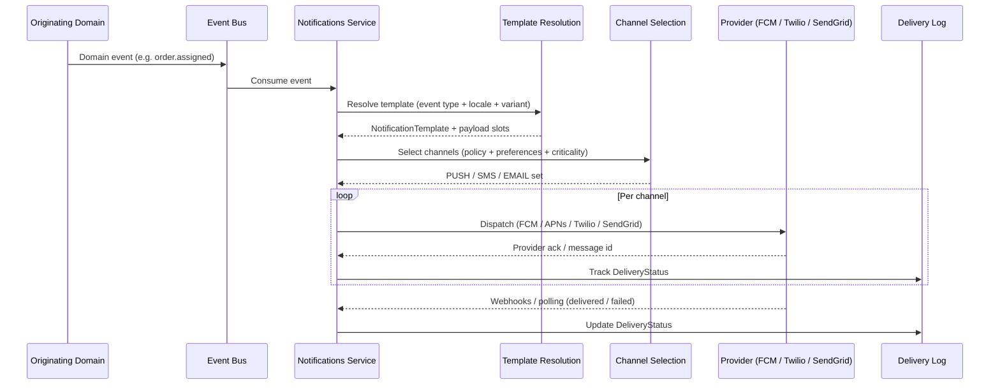
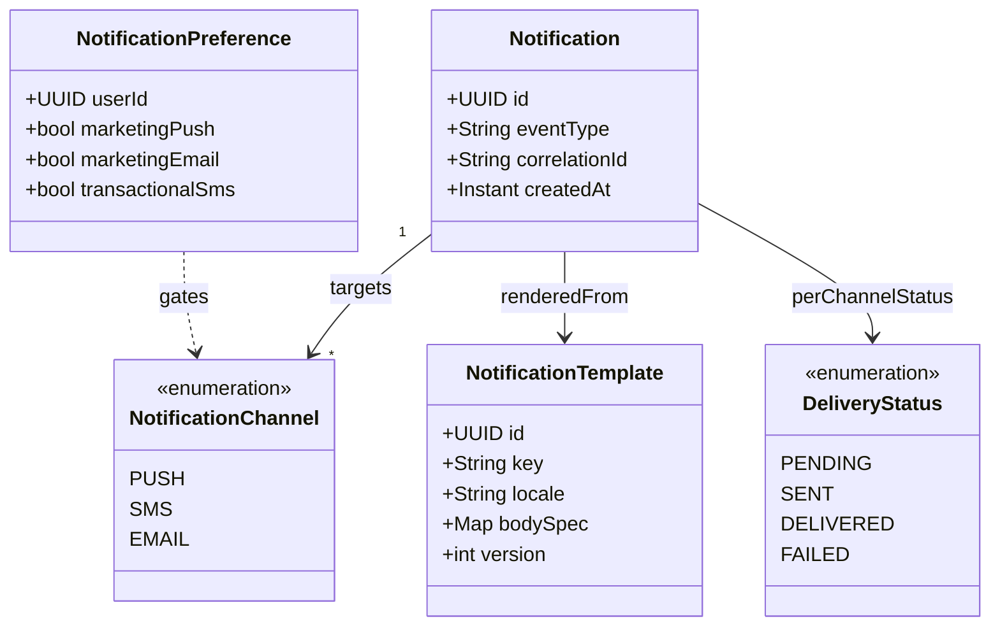

# 🔔 Notifications

**Service identifier:** `{company}.notifications`

---

## 📋 1. Overview

The **Notifications** domain is the platform's **multi-channel notification dispatch** layer. It delivers messages over **push**, **SMS**, and **email**, and centralizes **template management**, **delivery status**, and **channel routing**.

### 1.1 Ownership

| Owns | Does not own |
|------|----------------|
| Notification templates (structure, placeholders, versioning) | **What** to send - content decisions live in originating domains (Orders, Payments, Providers, etc.) |
| Delivery status and delivery audit trail | Business rules that trigger a notification (those domains emit events) |
| Channel routing and provider integration | End-user copy approval outside template governance |

Other domains decide **what** to send and **when** (via events); Notifications decides **how** it is rendered and **which channels** carry it, subject to policy and user preferences.

---

## 🔄 2. Notification flow

End-to-end path from a domain event to tracked delivery on the platform's providers.

---

## 🧩 3. Domain model

Core entities for notification orchestration.

---

## 📡 4. Channel selection logic

Policy used by Notifications after template resolution (simplified; actual rules may add quiet hours and legal constraints).

| Classification | Default channels |
|----------------|------------------|
| **Critical** | Push + SMS (e.g., safety, payment failure requiring immediate awareness) |
| **Informational** | Push only |
| **Marketing** | Push and/or email per **NotificationPreference**; respect opt-out |

---

## 🔌 5. API surface

REST-style APIs exposed to internal platform services and admin tooling (exact paths are implementation details; capabilities below).

| Capability | Typical REST operations |
|------------|-------------------------|
| Send notification | `POST` - submit rendered or template-keyed send request with correlation metadata |
| Delivery status | `GET` - by notification id or provider message id |
| Manage templates | `GET` / `POST` / `PUT` / `DELETE` - template CRUD and versioning |
| Update preferences | `PUT` / `PATCH` - per-user channel and marketing flags |

Authentication and authorization follow platform standards (service-to-service and admin roles).

---

## 📥 6. Events consumed

Notifications subscribes to cross-domain events (names illustrative; align with platform event registry).

| Event | Typical use |
|-------|-------------|
| `orders.order.assigned` | Customer/provider alerts for assignment |
| `orders.order.completed` | Receipt / summary messaging |
| `orders.order.cancelled` | Cancellation confirmations |
| `payments.payment.captured` | Payment success notifications |
| `payments.payment.failed` | Payment failure / retry messaging |
| `providers.provider.approved` | Onboarding / status updates |

---

## 💾 7. Data store

**RDS PostgreSQL** - system of record for notifications, templates, delivery history, and preferences.

| Table | Role |
|-------|------|
| `notifications` | Logical notification instance, correlation ids, template reference |
| `templates` | Template definitions and versions |
| `delivery_log` | Per-channel attempts, provider ids, **DeliveryStatus** transitions |
| `notification_preferences` | User opt-in/out and channel preferences |

---

## 🔗 8. External integrations

| Channel | Provider |
|---------|----------|
| Android push | **FCM** (Firebase Cloud Messaging) |
| iOS push | **APNs** (Apple Push Notification service) |
| SMS | **Twilio** |
| Email | **SendGrid** |

---

## 📊 9. Key metrics

| Metric | Purpose |
|--------|---------|
| **Delivery success rate** (per channel) | Provider health and template/payload quality |
| **Notification latency** (event → delivery) | SLA and user experience |
| **Opt-out rate** | Preference hygiene and marketing pressure |

---

## 👥 10. Team

**Platform** - owns the Notifications bounded context, templates infrastructure, and provider integrations.

---

## 📈 11. SLOs and Error Budgets

| SLO | Target | Measurement |
|-----|--------|-------------|
| **Delivery rate** | 99.5% of notifications delivered successfully within 60 seconds of dispatch | Delivery log success count / total dispatched (per channel) |
| **Dispatch latency (p99)** | < 5 seconds from event consumption to provider dispatch | Prometheus histogram: event received timestamp → provider ack timestamp |
| **Error rate** | < 0.5% provider-side delivery failures (after retries) | Delivery log FAILED status count / total dispatched |

**Error budget policy:** When the monthly delivery rate drops below 99.5%, the team investigates provider health, channel routing logic, and template errors. Feature work pauses if the rate remains below target for 3 consecutive days.

---

## ⚠️ 12. Failure Modes

| Failure Scenario | User Impact | Fallback Strategy |
|-----------------|-------------|-------------------|
| **Push delivery failure (FCM/APNs)** | Customer/provider does not receive push notification | **Channel fallback:** retry push once → fall back to **SMS** for critical notifications |
| **SMS delivery failure (Twilio)** | Customer/provider does not receive SMS | **Channel fallback:** fall back to **email** for critical notifications; log failure for non-critical |
| **Email delivery failure (SendGrid)** | Customer/provider does not receive email | Retry with exponential backoff (3 attempts); alert on-call if failure rate exceeds 5% in 5-minute window |
| **All channels degraded** | No notifications reaching users | Circuit breaker opens on all providers; notifications are queued in DB; alert fires for immediate investigation; notifications dispatched when providers recover |
| **Template resolution failure** | Notification cannot be rendered | Skip dispatch; log error with event context; alert template owner; no partial/broken notifications sent to users |
| **Kafka consumer lag** | Delayed notification delivery | Acceptable up to 60 seconds; beyond that, consumer lag alert fires and auto-scaling kicks in |

---

## 📐 13. Capacity Sizing

| Resource | Configuration |
|----------|--------------|
| **Min replicas** | 3 (production) |
| **Max replicas** | 25 (HPA) - notifications are bursty around order completion and assignment |
| **HPA target** | 70% CPU utilization |
| **DB connection pool** | 15 connections per pod |
| **Peak QPS** | ~1,200 events/s consumed (burst during peak hours) |
| **Memory** | 512Mi request / 1Gi limit per pod |
| **CPU** | 250m request / 1000m limit per pod |

---

## 🗃️ 14. Data Retention Matrix

| Store | Data | Retention | Deletion Mechanism |
|-------|------|-----------|-------------------|
| **RDS PostgreSQL** - `notifications` | Notification instances, correlation IDs | 90 days | Scheduled cleanup job; archive to S3 for audit |
| **RDS PostgreSQL** - `templates` | Template definitions and versions | Indefinite (versioned) | Soft-delete deprecated templates; never hard-delete |
| **RDS PostgreSQL** - `delivery_log` | Per-channel delivery attempts and status | 90 days | Scheduled cleanup job; aggregate metrics retained indefinitely |
| **RDS PostgreSQL** - `notification_preferences` | User opt-in/out preferences | Until account deletion (GDPR erasure cascade) | Deleted on `customers.customer.deleted` event |
| **Kafka** - consumed event topics | Incoming domain events | 14 days (platform default) | Kafka topic retention policy |
| **CloudWatch Logs** | Application logs | 30 days | CloudWatch log group retention policy |

---

⬅️ [Back to section](./README.md) · 🏠 [Back to root](../README.md)

