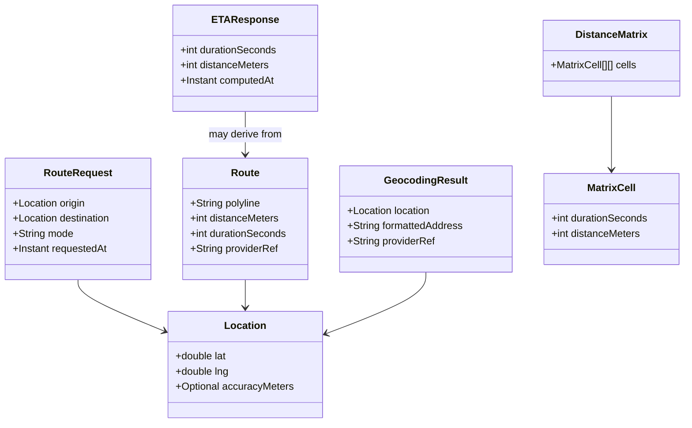
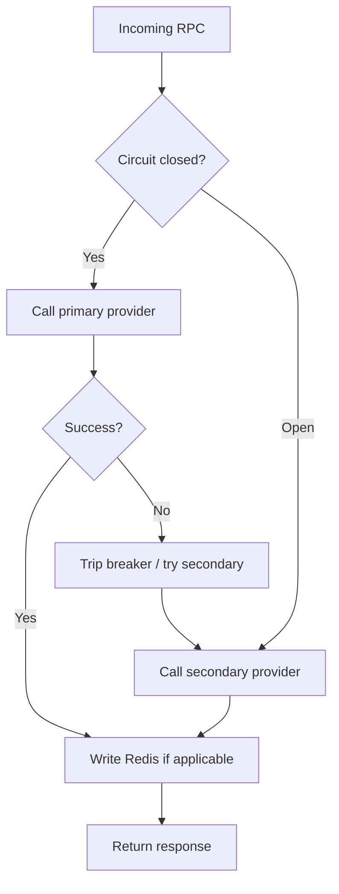

# 📍 Geolocation Service


**Service identifier:** `com.{company}.geolocation`

---

## 📋 1. Overview

The **Geolocation Service** domain powers **ETA calculation**, **route planning**, **geocoding**, and **reverse geocoding** for the platform. It is intentionally a **proxy service**: it wraps external mapping providers (**Google Maps**, **HERE**) behind a **stable internal API** so order flows do not depend directly on vendor SDKs or URL shapes.

### 1.1 Ownership

| Owns | Does not own |
|------|----------------|
| **Route caching** and cache key design | Raw map tiles, proprietary map data, or POI databases at rest |
| **Provider abstraction** (ports/adapters) | Ground truth of road networks (owned by providers) |
| Normalized **Route**, **ETA**, **Geocoding** contracts for the platform | Business decisions built on top of ETAs (Fulfillment, Pricing, etc.) |

All persistent geographic truth remains with the external providers; the platform holds only **ephemeral** computed results in cache.

---

## 🏗️ 2. Architecture

Internal platform consumers call **Geolocation Service**, which uses **Redis** before hitting external APIs. **Cache hit** avoids provider cost and latency; **cache miss** fetches from the configured provider.

```mermaid
flowchart TB
    subgraph internal [Internal platform services]
        OE[Orders / ETA consumers]
        FE[Fulfillment Engine]
        OTH[Other callers]
    end

    GS[Geolocation Service - com.{company}.geolocation]
    R[(Redis cache)]

    subgraph external [External providers]
        G[Google Maps APIs]
        H[HERE APIs]
    end

    OE --> GS
    FE --> GS
    OTH --> GS

    GS --> R
    R -->|cache HIT| GS
    R -->|cache MISS| GS
    GS -->|fetch| G
    GS -->|fallback / secondary| H
    GS -->|populate| R
```

---

## 🧩 3. Domain model

Types exposed by the Geolocation bounded context (language-agnostic view).



---

## 🔌 4. Provider abstraction (hexagonal)

The **domain port** defines operations (calculate route, ETA, geocode, matrix). **Adapters** implement that port per vendor (**Google**, **HERE**), making provider switches a configuration and adapter concern - not a rewrite of platform logic.

```mermaid
flowchart LR
    subgraph domain [Domain core - com.{company}.geolocation]
        P[MappingPort interface]
    end

    subgraph adapters [Adapters]
        GA[GoogleMapsAdapter]
        HA[HereAdapter]
    end

    P --> GA
    P --> HA
    GA --> GAPI[Google APIs]
    HA --> HAPI[HERE APIs]
```

---

## 🔌 5. API surface

**gRPC** is the primary interface (names are logical service methods).

| RPC | Purpose |
|-----|---------|
| `CalculateRoute` | Turn **RouteRequest** into a **Route** (polyline, distance, duration) |
| `GetETA` | Duration (and optionally distance) for origin → destination |
| `Geocode` | Address or place text → **GeocodingResult** |
| `ReverseGeocode` | **Location** → formatted address / **GeocodingResult** |
| `GetDistanceMatrix` | Many-to-many durations/distances → **DistanceMatrix** |

---

## 🗄️ 6. Caching strategy

**Redis**, TTL-based, no relational database.

| Cache | TTL | Key idea |
|-------|-----|----------|
| **Route** | **5 minutes** | Same origin/destination pair (and mode) within TTL returns cached **Route** / ETA slice |
| **Geocoding** | **24 hours** | Stable address ↔ coordinate mappings change slowly |

All cached data is **ephemeral** and **reconstructible** by re-calling providers.

---

## 💾 7. Data store

| Store | Usage |
|-------|--------|
| **Redis** | Route and geocoding cache only |
| **Relational DB** | **None** for this domain |

---

## 🛡️ 8. Resilience

- **Circuit breaker** on outbound calls to the primary mapping provider to avoid cascading failures and thundering herds.
- **Fallback** to a **secondary** provider (e.g., HERE when Google is unhealthy, or vice versa per platform config) when the primary is open or errors exceed thresholds.



---

## 📊 9. Key metrics

| Metric | Target / note |
|--------|----------------|
| **Cache hit rate** | Target **> 60%** (tune keys, TTL, and traffic patterns) |
| **Provider latency P99** | Track per adapter for SLOs |
| **Provider error rate** | Drives circuit breaker and fallback tuning |
| **Cost per API call** | Finance and capacity; cache reduces spend |

---

## 👥 10. Team

**Team Orders** - owns Geolocation Service, provider contracts, and cache/resilience behavior for the platform experience.

---

## 📈 11. SLOs and Error Budgets

| SLO | Target | Measurement |
|-----|--------|-------------|
| **Availability** | 99.9% (measured monthly) | Successful gRPC responses / total requests |
| **ETA latency (p99)** | < 100ms for `GetETA` and `CalculateRoute` | Prometheus histogram on gRPC handler duration (includes cache hit path) |
| **Geocoding latency (p99)** | < 200ms for `Geocode` / `ReverseGeocode` | Prometheus histogram on gRPC handler duration |
| **Error rate** | < 0.1% 5xx / gRPC INTERNAL errors | Application error counters per RPC method |

**Error budget policy:** Geolocation is on the critical path for order creation and fulfillment. When the monthly error budget is exhausted, the team must pause non-reliability work and conduct a service review with the Orders and Fulfillment teams.

---

## ⚠️ 12. Failure Modes

| Failure Scenario | User Impact | Fallback Strategy |
|-----------------|-------------|-------------------|
| **Primary provider (Google Maps) unavailable** | ETA/route calls fail on primary | **Automatic failover** to secondary provider (HERE) via circuit breaker; transparent to callers |
| **Both external providers unavailable** | No fresh ETA/route data | Return **cached route** from Redis if available (stale but usable); if no cache hit, return gRPC `UNAVAILABLE` with appropriate error message; order flow uses last-known ETA with staleness indicator |
| **Redis cache unavailable** | All requests go directly to external providers | Service continues to function but with higher latency and increased provider API costs; alert fires for cache restoration |
| **Degraded ETA estimation** | ETA accuracy reduced during provider instability | Return best-effort ETA with a `confidence: LOW` flag in the response; consuming services (Fulfillment, customer app) display "estimated" qualifier to users |
| **Distance matrix timeout** | Fulfillment cannot compute optimal assignments | Fulfillment falls back to straight-line distance heuristic; suboptimal but functional assignment continues |

---

## 📐 13. Capacity Sizing

| Resource | Configuration |
|----------|--------------|
| **Min replicas** | 3 (production) |
| **Max replicas** | 20 (HPA) |
| **HPA target** | 60% CPU utilization |
| **Redis** | ElastiCache cluster (cluster mode enabled); no relational DB |
| **Peak QPS** | ~2,000 req/s (dominated by `GetETA` during peak order hours) |
| **Memory** | 512Mi request / 1Gi limit per pod |
| **CPU** | 500m request / 2000m limit per pod |

---

## 🗃️ 14. Data Retention Matrix

| Store | Data | Retention | Deletion Mechanism |
|-------|------|-----------|-------------------|
| **Redis** - route cache | Computed routes (polyline, distance, duration) | 5 minutes TTL | Automatic TTL expiry |
| **Redis** - geocoding cache | Address ↔ coordinate mappings | 24 hours TTL | Automatic TTL expiry |
| **CloudWatch Logs** | Application logs | 30 days | CloudWatch log group retention policy |

Geolocation Service has **no relational database** and no long-term data retention. All cached data is ephemeral and reconstructible by re-calling external providers.

---
<div align="center">

⬅️ [Back to section](./README.md) · 🏠 [Back to root](../README.md)

</div>
