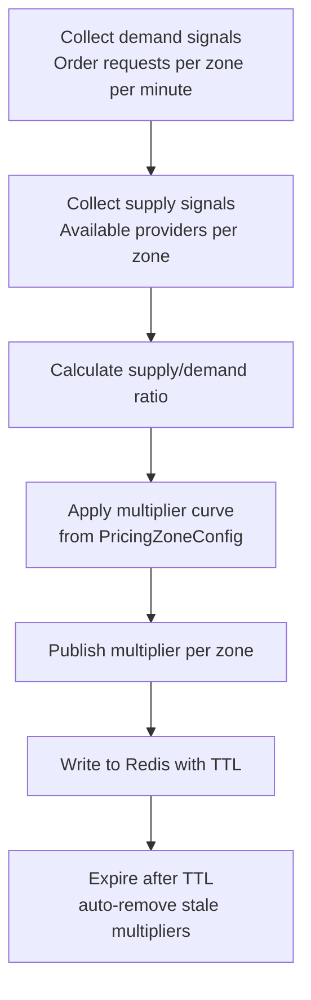
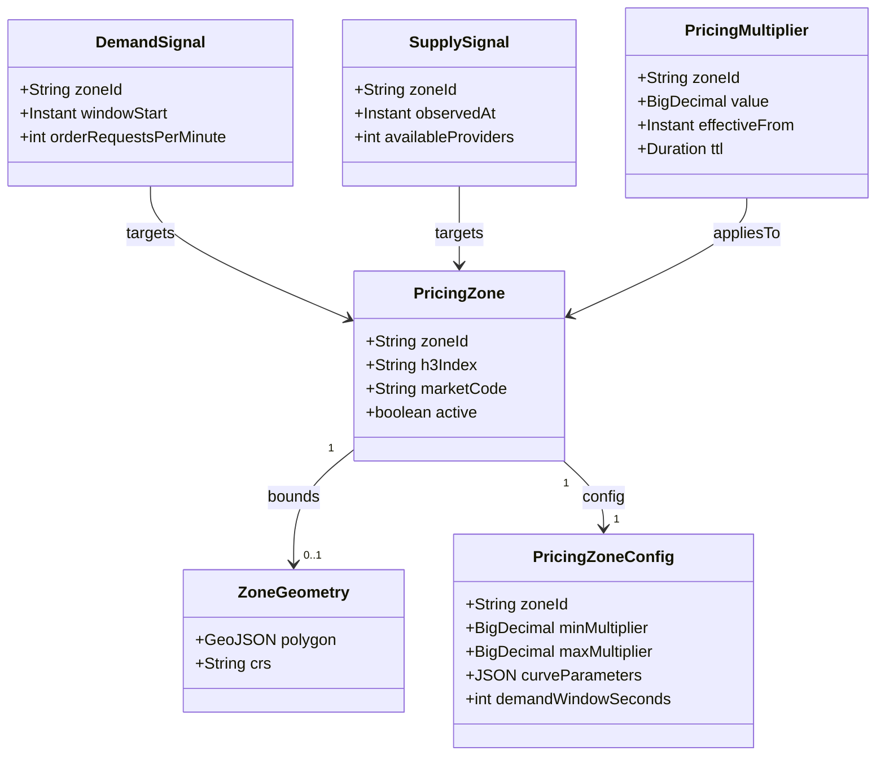
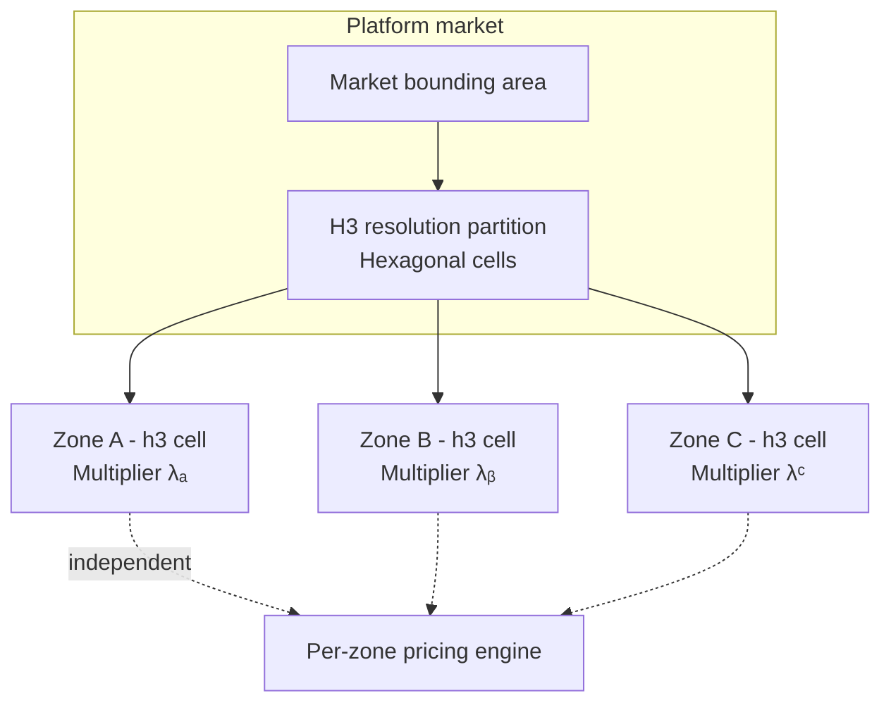

# 📈 Dynamic Pricing

  

---

## 📋 1. Overview

The **Dynamic Pricing** domain (`{company}.dynamicpricing`) balances **supply and demand** in real time across the platform network. It performs **real-time supply/demand analysis**, **pricing zone management**, and **multiplier calculation** so customers see fair, market-responsive prices and providers are incentivized to serve where demand is high.

**This domain owns**

| Concern | Description |
| --- | --- |
| Pricing zones | Geographic partitions (H3 hex cells) with independent pricing multipliers. |
| Demand signals | Aggregated order-request intensity per zone and time window. |
| Supply signals | Available-provider counts and capacity signals per zone. |
| Multiplier values | Current effective pricing multipliers published for downstream consumption. |

**This domain does not own**

| Concern | Owning domain |
| --- | --- |
| Base price calculation | **Pricing Service** (`{company}.pricing`) - composes base + distance + time; **consumes** pricing multipliers. |
| Order lifecycle | **Order Service** - assignment, state, completion; Dynamic Pricing **reads** order events for signals only. |

---

## 🔄 2. Dynamic Pricing Calculation Flow

**Visual overview:**

**Notes**

- Demand and supply windows roll up to the **same zone identity** (H3 cell or configured zone id).
- The **multiplier curve** maps ratio → multiplier (caps, floors, and smoothing live in `PricingZoneConfig`).
- Published values drive **`dynamicpricing.multiplier.updated`** for Pricing and analytics.

---

## 🧩 3. Domain Model

**Visual overview:**

---

## 🗺️ 4. Zone Management

The platform partitions each **market** into **hexagonal zones** using **H3 geospatial indexing**. Each cell is a first-class **pricing zone** with its **own multiplier**, computed from local demand and supply. Ops can overlay custom geometries where policy requires finer control.

**Visual overview:**

---

## 🔌 5. API Surface

### 5.1 gRPC (internal - `{company}.dynamicpricing.v1`)

| RPC | Purpose |
| --- | --- |
| `GetCurrentMultiplier` | Returns the active pricing multiplier for a **`zone_id`** (and optional service slice if modeled). |
| `GetZoneForLocation` | Resolves **`lat`, `lng`** to the authoritative pricing **zone id** (H3 or configured zone). |

### 5.2 REST (operations)

| Method | Path | Purpose |
| --- | --- | --- |
| `GET` | `/v1/dynamic-pricing/zones` | List/configure pricing zones, geometry metadata, and status for ops consoles. |
| `PUT` | `/v1/dynamic-pricing/zones/{id}/config` | Update caps, curves, TTL hints, or activation for a zone (validated, audited). |

---

## 📤 6. Events Published

All topics use the platform naming prefix `{company}.events`.

| Event | Key consumers | Purpose |
| --- | --- | --- |
| `dynamicpricing.multiplier.updated` | **Pricing Service**, **Analytics** | Current multiplier per zone (or market slice); Pricing applies on estimates and price paths. |
| `dynamicpricing.zone.demand-spike` | **Ops alerting**, **Notifications** (optional) | Rapid demand increase in a zone for human or automated response. |

---

## 📥 7. Events Consumed

| Event | Source | Purpose in Dynamic Pricing |
| --- | --- | --- |
| `orders.order.requested` | Order Service | **Demand signal** - increment / roll up order requests per zone per minute. |
| `providers.provider.location-updated` | Provider location pipeline | **Supply signal** - infer available providers per zone (with eligibility rules). |
| `orders.order.started` | Order Service | **Demand fulfilled** - reduce outstanding demand pressure for assignment context. |

---

## 💾 8. Data Store

| Store | Role |
| --- | --- |
| **Redis** | **Real-time multiplier values** - key per zone (or composite key), **TTL ~5 minutes** so stale pricing auto-expires without manual cleanup. |
| **RDS** | **Zone configuration** (geometry refs, H3 resolution, curve ids) and **pricing history** (multiplier time series, audit) for analytics and replay. |

---

## 📊 9. Key Metrics

| Metric | Description |
| --- | --- |
| **Multiplier distribution** | What **percentage of orders** run under dynamic pricing (and histogram of multiplier values). |
| **Customer conversion during dynamic pricing** | Request → accept / complete funnel when multiplier > 1.0 vs baseline. |
| **Supply response time** | How quickly **providers enter high-demand zones** after multiplier rise (latency to supply shift). |

---

## 👥 10. Team & Ownership

| Role | Team |
| --- | --- |
| Service owner | **Team Commercial** |

---

## 📈 11. SLOs and Error Budgets

| SLO | Target | Measurement |
|-----|--------|-------------|
| **Availability** | 99.9% (measured monthly) | Successful gRPC responses / total requests |
| **Multiplier lookup latency (p99)** | < 50ms for `GetCurrentMultiplier` | Prometheus histogram on gRPC handler duration (Redis read path) |
| **Zone resolution latency (p99)** | < 100ms for `GetZoneForLocation` | Prometheus histogram on gRPC handler duration |
| **Error rate** | < 0.1% 5xx / gRPC INTERNAL errors | Application error counters per RPC method |

**Error budget policy:** Dynamic Pricing directly affects customer-facing price estimates. When the monthly error budget is exhausted, the team must conduct a reliability review and defer feature work until the budget recovers.

---

## ⚠️ 12. Failure Modes

| Failure Scenario | User Impact | Fallback Strategy |
|-----------------|-------------|-------------------|
| **Redis unavailable (multiplier store)** | Cannot retrieve current multiplier for a zone | **Fallback to 1.0x multiplier** (base pricing only) - customers see standard pricing; no dynamic component. Alert fires immediately. |
| **Multiplier computation pipeline stalled** | Stale multipliers remain in Redis past their TTL | Multipliers auto-expire via Redis TTL (~5 min); after expiry, `GetCurrentMultiplier` returns 1.0x default. Stale zone data is tolerated for up to the TTL window. |
| **Demand/supply signal consumer lag** | Multipliers do not reflect current demand accurately | Multipliers are computed from last-available signals; acceptable staleness up to 2 minutes. Beyond that, consumer lag alert fires and the pipeline is investigated. |
| **RDS (zone config) unavailable** | Cannot load or update zone configurations | Zone configs are cached in-memory at startup and refreshed periodically; cached config continues to serve. Config updates are deferred until RDS recovers. |
| **H3 zone resolution failure** | Cannot map a location to a pricing zone | Return gRPC `NOT_FOUND` with appropriate message; Pricing Service falls back to market-level default multiplier |

---

## 📐 13. Capacity Sizing

| Resource | Configuration |
|----------|--------------|
| **Min replicas** | 3 (production) |
| **Max replicas** | 15 (HPA) |
| **HPA target** | 60% CPU utilization |
| **Redis** | ElastiCache cluster (cluster mode enabled) for multiplier values |
| **RDS** | Shared Commercial team RDS cluster for zone config and pricing history |
| **DB connection pool** | 10 connections per pod |
| **Peak QPS** | ~1,500 req/s for `GetCurrentMultiplier` (called on every price estimate) |
| **Memory** | 512Mi request / 1Gi limit per pod |
| **CPU** | 500m request / 1000m limit per pod |

---

## 🗃️ 14. Data Retention Matrix

| Store | Data | Retention | Deletion Mechanism |
|-------|------|-----------|-------------------|
| **Redis** - multiplier values | Current effective multiplier per zone | ~5 minutes TTL | Automatic TTL expiry; stale multipliers are never served |
| **RDS** - `pricing_zones` / `pricing_zone_configs` | Zone definitions, geometry refs, curve parameters | Indefinite (configuration data) | Soft-delete inactive zones; never hard-delete for audit |
| **RDS** - `multiplier_history` | Time series of multiplier values per zone | 1 year | Scheduled archival job → S3; deleted from RDS after archival |
| **Kafka** - `dynamicpricing.*` topics | Published multiplier events and demand spikes | 14 days (platform default) | Kafka topic retention policy |
| **Kafka** - consumed event topics | Order and provider location events | 14 days (platform default) | Kafka topic retention policy |
| **CloudWatch Logs** | Application logs | 30 days | CloudWatch log group retention policy |

---

## 🔐 15. Allowed Callers

| Caller | Protocol | Authorization |
|--------|----------|--------------|
| Pricing Service (`{company}.pricing`) | gRPC | mTLS + RBAC role `dynamicpricing.pricing-peer` |
| Kafka consumers (`{company}.dynamicpricing-workers`) | Kafka (consume order and location topics) | mTLS + consumer ACL |
| Commercial ops tooling (`{company}.pricing-ops`) | REST / gRPC admin | mTLS + break-glass RBAC |

---

⬅️ [Back to section](./README.md) · 🏠 [Back to root](../README.md)

