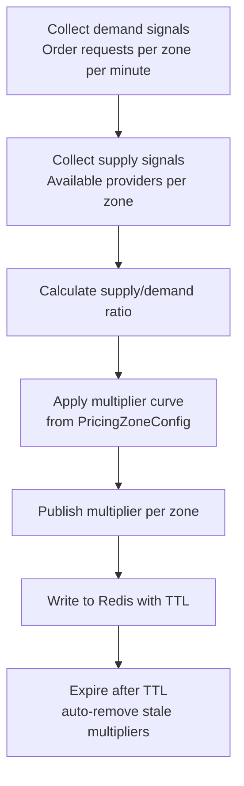
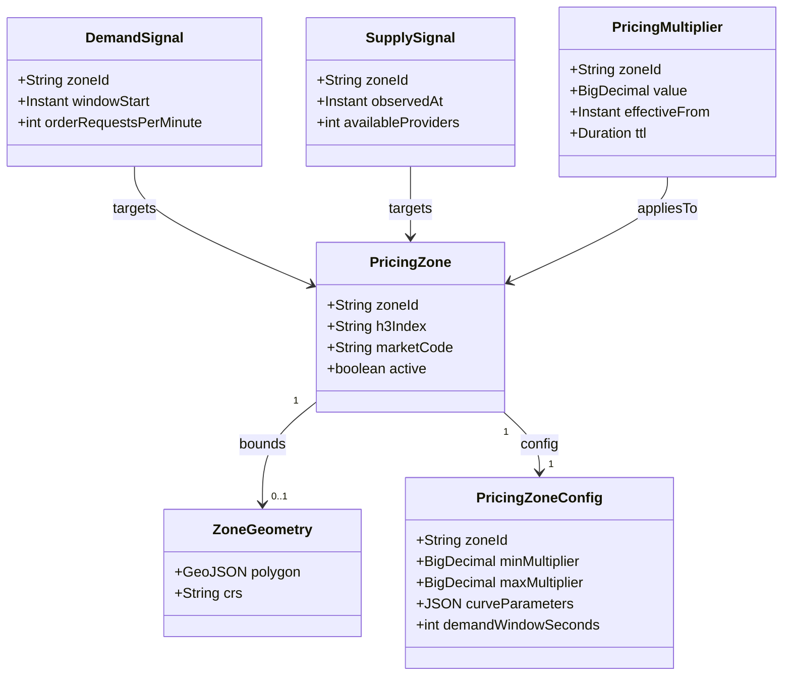
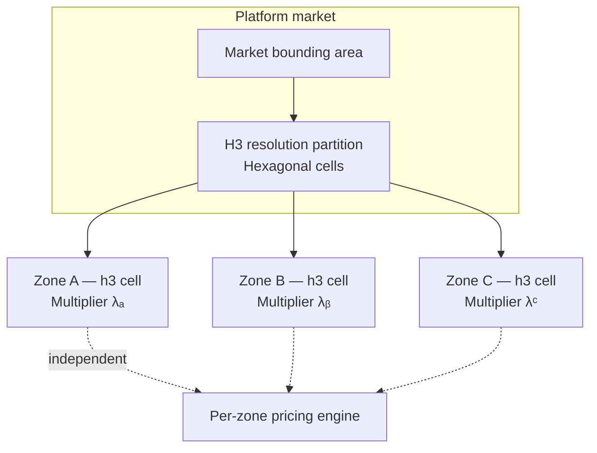

# Dynamic Pricing

| Field | Value |
| --- | --- |
| **Status** | Active |
| **Owner** | Team Commercial |
| **Last Updated** | 2025 |

---

## 1. Overview

The **Dynamic Pricing** domain (`com.{company}.dynamicpricing`) balances **supply and demand** in real time across the platform network. It performs **real-time supply/demand analysis**, **pricing zone management**, and **multiplier calculation** so customers see fair, market-responsive prices and providers are incentivized to serve where demand is high.

**This domain owns**

| Concern | Description |
| --- | --- |
| Pricing zones | Geographic partitions (H3 hex cells) with independent pricing multipliers. |
| Demand signals | Aggregated order-request intensity per zone and time window. |
| Supply signals | Available-provider counts and capacity signals per zone. |
| Multiplier values | Current effective pricing multipliers published for downstream consumption. |

**This domain does not own**

| Concern | Owning domain |
| --- | --- |
| Base price calculation | **Pricing Service** (`com.{company}.pricing`) — composes base + distance + time; **consumes** pricing multipliers. |
| Order lifecycle | **Order Service** — assignment, state, completion; Dynamic Pricing **reads** order events for signals only. |

---

## 2. Dynamic Pricing Calculation Flow

**Notes**

- Demand and supply windows roll up to the **same zone identity** (H3 cell or configured zone id).
- The **multiplier curve** maps ratio → multiplier (caps, floors, and smoothing live in `PricingZoneConfig`).
- Published values drive **`dynamicpricing.multiplier.updated`** for Pricing and analytics.

---

## 3. Domain Model

---

## 4. Zone Management

The platform partitions each **market** into **hexagonal zones** using **H3 geospatial indexing**. Each cell is a first-class **pricing zone** with its **own multiplier**, computed from local demand and supply. Ops can overlay custom geometries where policy requires finer control.

---

## 5. API Surface

### 5.1 gRPC (internal — `com.{company}.dynamicpricing.v1`)

| RPC | Purpose |
| --- | --- |
| `GetCurrentMultiplier` | Returns the active pricing multiplier for a **`zone_id`** (and optional service slice if modeled). |
| `GetZoneForLocation` | Resolves **`lat`, `lng`** to the authoritative pricing **zone id** (H3 or configured zone). |

### 5.2 REST (operations)

| Method | Path | Purpose |
| --- | --- | --- |
| `GET` | `/v1/dynamic-pricing/zones` | List/configure pricing zones, geometry metadata, and status for ops consoles. |
| `PUT` | `/v1/dynamic-pricing/zones/{id}/config` | Update caps, curves, TTL hints, or activation for a zone (validated, audited). |

---

## 6. Events Published

All topics use the platform naming prefix `com.{company}.events`.

| Event | Key consumers | Purpose |
| --- | --- | --- |
| `dynamicpricing.multiplier.updated` | **Pricing Service**, **Analytics** | Current multiplier per zone (or market slice); Pricing applies on estimates and price paths. |
| `dynamicpricing.zone.demand-spike` | **Ops alerting**, **Notifications** (optional) | Rapid demand increase in a zone for human or automated response. |

---

## 7. Events Consumed

| Event | Source | Purpose in Dynamic Pricing |
| --- | --- | --- |
| `orders.order.requested` | Order Service | **Demand signal** — increment / roll up order requests per zone per minute. |
| `providers.provider.location-updated` | Provider location pipeline | **Supply signal** — infer available providers per zone (with eligibility rules). |
| `orders.order.started` | Order Service | **Demand fulfilled** — reduce outstanding demand pressure for assignment context. |

---

## 8. Data Store

| Store | Role |
| --- | --- |
| **Redis** | **Real-time multiplier values** — key per zone (or composite key), **TTL ~5 minutes** so stale pricing auto-expires without manual cleanup. |
| **RDS** | **Zone configuration** (geometry refs, H3 resolution, curve ids) and **pricing history** (multiplier time series, audit) for analytics and replay. |

---

## 9. Key Metrics

| Metric | Description |
| --- | --- |
| **Multiplier distribution** | What **percentage of orders** run under dynamic pricing (and histogram of multiplier values). |
| **Customer conversion during dynamic pricing** | Request → accept / complete funnel when multiplier > 1.0 vs baseline. |
| **Supply response time** | How quickly **providers enter high-demand zones** after multiplier rise (latency to supply shift). |

---

## 10. Team & Ownership

| Role | Team |
| --- | --- |
| Service owner | **Team Commercial** |

---

← [Back to Domain Catalog](./README.md)
