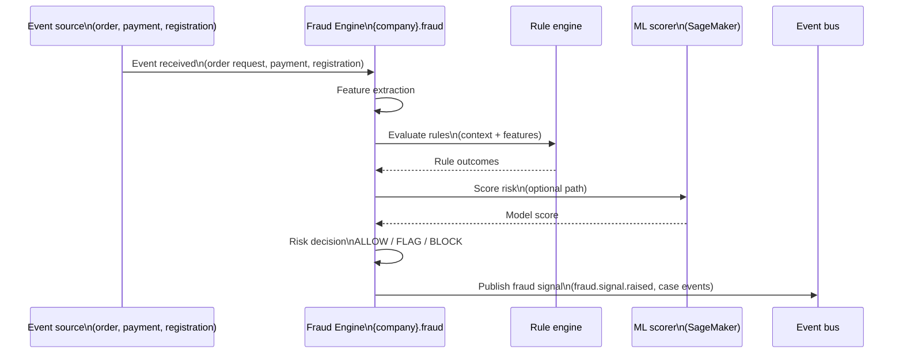
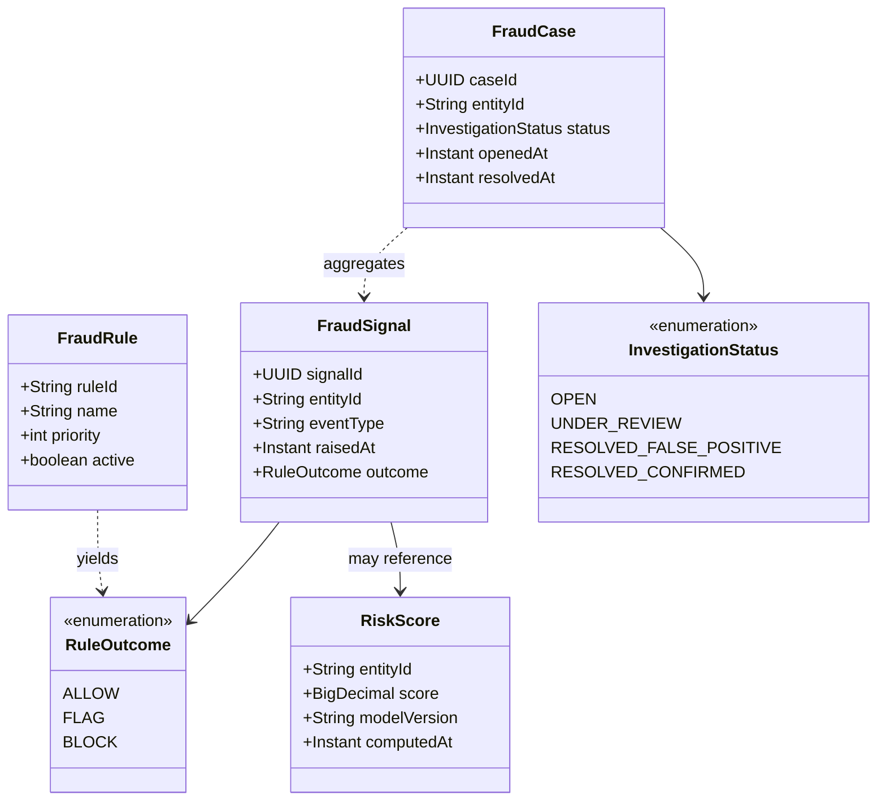
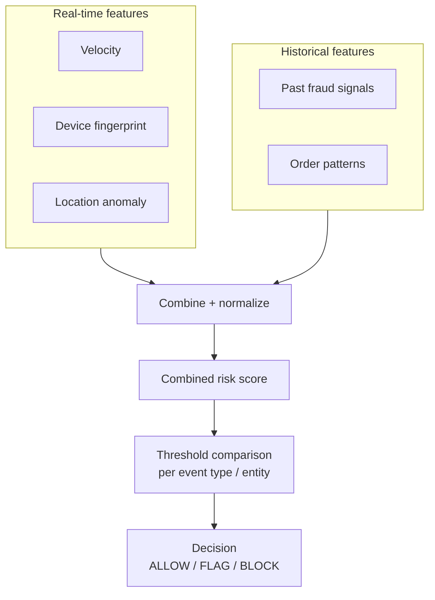

# 🕵️ Fraud Engine

---

## 📋 1. Overview

The **Fraud Engine** (`{company}.fraud`) provides **real-time fraud detection**, **risk scoring**, and **automated blocking** across orders, payments, and account lifecycle events. It centralizes **fraud rules**, **risk scores**, and **block/allow decisions** so the platform can act quickly without duplicating logic in every service.

**This domain owns**

| Concern | Description |
| --- | --- |
| Fraud rules | Versioned rules, thresholds, and outcomes (allow / flag / block). |
| Risk scores | Numeric or tiered risk for an entity and event context. |
| Block/allow decisions | Authoritative decision for a evaluated event, with audit trail. |

**This domain does not own**

| Concern | Owning domain |
| --- | --- |
| User account management | **Profile services** (customer/provider) - identity, KYC containers; Fraud **signals** into those flows. |
| Payment disputes/chargebacks | **Payment Service** - settlement and dispute workflows; Fraud may **open cases** but does not own money movement. |

---

## 🔄 2. Fraud Detection Flow

---

## 🧩 3. Domain Model

---

## 📊 4. Risk Scoring Architecture

**Notes**

- Real-time features are often **cached in Redis** (fingerprints, counters) for low-latency evaluation.
- Historical features are loaded from **Aurora** (cases, past signals, aggregates).

---

## 🔌 5. API Surface

### 5.1 gRPC (internal - `{company}.fraud.v1`)

| RPC | Purpose |
| --- | --- |
| `EvaluateRisk` | **`entity_id`**, **`event_type`**, **`context`** (map/struct) → synchronous decision + optional case creation. |
| `GetRiskScore` | Latest or cached **risk score** for **`entity_id`** for dashboards and downstream gating. |

### 5.2 REST (operations)

| Method | Path | Purpose |
| --- | --- | --- |
| `GET` | `/v1/fraud/cases` | Search and list fraud cases with filters (status, entity, date range). |
| `POST` | `/v1/fraud/rules` | Create or version fraud rules (validated rollout). |
| `PUT` | `/v1/fraud/cases/{id}/resolve` | Resolve a case (false positive, confirmed fraud, etc.). |

---

## 📤 6. Events Published

All topics use the platform naming prefix `{company}.events`.

| Event | Typical consumers |
| --- | --- |
| `fraud.signal.raised` | **Fulfillment Engine**, **Order Service**, **Notifications**, **Provider Profile** |
| `fraud.case.opened` | **Order Service**, **Notifications**, **Provider Profile** |
| `fraud.case.resolved` | **Fulfillment Engine**, **Order Service**, **Notifications**, **Provider Profile** |

**Payload highlights (conceptual)**

- `fraud.signal.raised` - `signalId`, `entityId`, `eventType`, `outcome` (ALLOW/FLAG/BLOCK), `correlationId`.
- `fraud.case.opened` / `fraud.case.resolved` - `caseId`, `entityId`, `status`, timestamps, resolver reference.

---

## 📥 7. Events Consumed

| Event | Purpose in Fraud |
| --- | --- |
| `orders.order.requested` | Order-intent fraud: velocity, route abuse, collusion patterns. |
| `orders.order.completed` | Post-order reconciliation, incentive abuse, pattern updates. |
| `payments.payment.captured` | Payment fraud, instrument testing, anomaly vs customer history. |
| `customers.customer.registered` | Account creation risk, duplicate device, synthetic identity. |
| `providers.provider.registered` | Onboarding fraud, document replay, duplicate providers. |

---

## 💾 8. Data Store

| Store | Role |
| --- | --- |
| **Aurora PostgreSQL** | **Fraud cases**, **rules**, **investigation history**, audit and resolution records (authoritative). |
| **Redis** | **Real-time feature cache** - device fingerprint lookups, **velocity counters**, short-lived evaluation context. |

---

## 🤖 9. ML Integration

The primary **fraud scoring model** is served from an **AWS SageMaker** endpoint. The Fraud Engine calls the endpoint as part of `EvaluateRisk` (or an async enrichment path). If the endpoint is **unavailable** or times out, the system **falls back to rule-based scoring** (deterministic outcomes from `FraudRule` evaluation only), with metrics and alerts on degraded mode.

---

## 📊 10. Key Metrics

| Metric | Target / note |
| --- | --- |
| **False positive rate** | Target **< 5%** (flag/block that are later overturned or benign). |
| **Fraud detection rate** | Share of confirmed fraud caught vs total confirmed fraud (operational definition). |
| **Fraud loss as % of GMV** | Financial exposure vs gross merchandise value. |
| **Mean time to detect** | Latency from fraudulent action to signal or case (SLA for critical paths). |

---

## 👥 11. Team & Ownership

| Role | Team |
| --- | --- |
| Service owner | **Team Trust & Safety** |

---

## 📈 12. SLOs and Error Budgets

| SLO | Target | Measurement |
|-----|--------|-------------|
| **Availability** | 99.95% (measured monthly) - higher than standard due to critical-path role | Successful gRPC responses / total requests |
| **Risk scoring latency (p99)** | < 200ms for `EvaluateRisk` | Prometheus histogram on gRPC handler duration (includes rule engine + optional ML call) |
| **Risk score lookup latency (p99)** | < 50ms for `GetRiskScore` | Prometheus histogram on gRPC handler duration (Redis/cache read path) |
| **Error rate** | < 0.05% 5xx / gRPC INTERNAL errors | Application error counters per RPC method |

**Error budget policy:** The Fraud Engine is on the critical path for order creation and payment authorization. When the monthly error budget is exhausted, **all** feature work stops, and the team conducts a reliability review. The VP of Engineering is notified if the budget is breached in consecutive months.

---

## ⚠️ 13. Failure Modes

The Fraud Engine uses a **fail-open vs fail-closed** model depending on the signal type. The decision is deliberate: some fraud signals are advisory (fail-open preserves user experience), while others are protective (fail-closed prevents financial loss).

| Signal Type | Fail Mode | Rationale |
|------------|-----------|-----------|
| **Order velocity check** | Fail-open (ALLOW) | False block on high-volume legitimate customers is worse than a delayed fraud catch |
| **Device fingerprint anomaly** | Fail-open (ALLOW + FLAG) | Flag for async review; do not block order |
| **Payment instrument risk** | Fail-closed (BLOCK) | Financial loss prevention takes priority |
| **Account creation risk** | Fail-open (ALLOW + FLAG) | Blocking legitimate signups is costly; flag for review |
| **Provider document fraud** | Fail-closed (BLOCK) | Safety-critical; block and require manual review |
| **Location anomaly** | Fail-open (ALLOW + FLAG) | GPS inaccuracy causes false positives; flag only |

### ML Model Fallback

| Failure Scenario | User Impact | Fallback Strategy |
|-----------------|-------------|-------------------|
| **SageMaker endpoint unavailable or timeout** | ML-based risk score unavailable | **Fall back to rule-based scoring** (deterministic outcomes from `FraudRule` evaluation only). Metrics and alerts fire on degraded mode. |
| **Rule engine failure** | No fraud evaluation possible | **Fail-open for non-payment signals** (ALLOW + log); **fail-closed for payment signals** (BLOCK + alert). This is the last-resort policy. |
| **Redis (feature cache) unavailable** | Real-time features (velocity, fingerprint) unavailable | Evaluate with historical features from Aurora only; reduced accuracy but functional. Alert fires for cache restoration. |
| **Aurora unavailable** | No access to cases, rules, or historical features | Emergency mode: rule engine uses in-memory rule cache (loaded at startup); ML endpoint provides scoring without historical enrichment. P1 alert fires immediately. |
| **Kafka consumer lag (event ingestion)** | Delayed fraud signals for downstream services | Acceptable up to 60 seconds; beyond that, consumer lag alert fires. In-flight orders continue with last-known risk state. |

---

## 📐 14. Capacity Sizing

| Resource | Configuration |
|----------|--------------|
| **Min replicas** | 5 (production) - higher minimum due to Tier 1 criticality |
| **Max replicas** | 30 (HPA) |
| **HPA target** | 50% CPU utilization (aggressive scaling due to latency sensitivity) |
| **Aurora connection pool** | 20 connections per pod (RDS Proxy) |
| **Redis** | ElastiCache cluster (cluster mode enabled) for feature cache and velocity counters |
| **Peak QPS** | ~1,000 req/s for `EvaluateRisk` (called on every order request and payment) |
| **Memory** | 1Gi request / 2Gi limit per pod |
| **CPU** | 1000m request / 4000m limit per pod |

---

## 🗃️ 15. Data Retention Matrix

| Store | Data | Retention | Deletion Mechanism |
|-------|------|-----------|-------------------|
| **Aurora PostgreSQL** - `fraud_signals` | Individual fraud signal records | 2 years | Scheduled archival job → S3; deleted from Aurora after archival |
| **Aurora PostgreSQL** - `fraud_cases` | Investigation cases and resolution records | 7 years (regulatory/legal) | Archived to S3 after 2 years; deleted after 7 years |
| **Aurora PostgreSQL** - `fraud_rules` | Rule definitions and versions | Indefinite (versioned, never hard-deleted) | Soft-delete deprecated rules |
| **Aurora PostgreSQL** - `risk_scores` | Historical risk scores per entity | 1 year | Scheduled cleanup job; aggregate metrics retained indefinitely |
| **Redis** - feature cache | Device fingerprints, velocity counters | Variable TTL (1 hour – 24 hours depending on feature) | Automatic TTL expiry |
| **Kafka** - `fraud.*` topics | Published fraud signals and case events | 14 days (platform default) | Kafka topic retention policy |
| **Kafka** - consumed event topics | Order, payment, registration events | 14 days (platform default) | Kafka topic retention policy |
| **CloudWatch Logs** | Application logs | 90 days (extended for fraud investigation) | CloudWatch log group retention policy |

---

⬅️ [Back to section](./README.md) · 🏠 [Back to root](../README.md)

