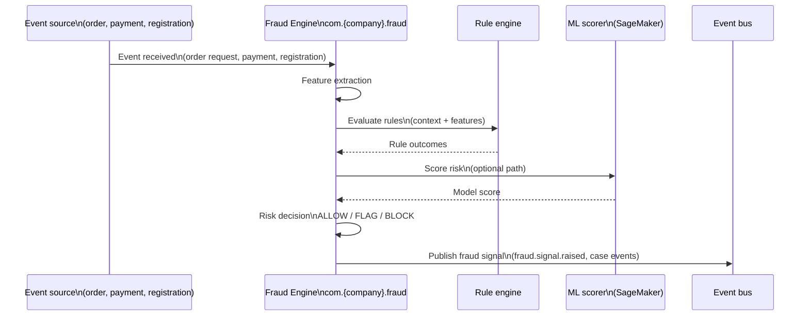
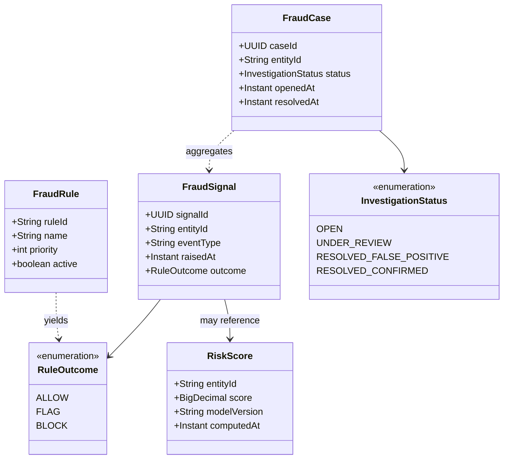
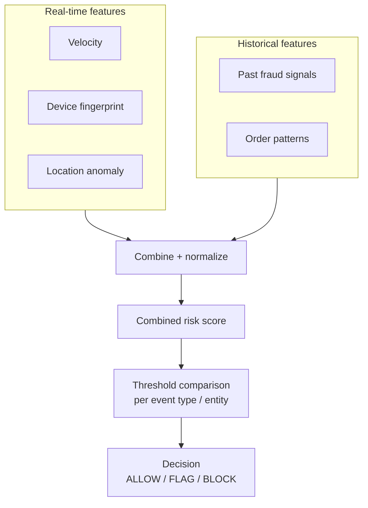

# Fraud Engine

| Field | Value |
| --- | --- |
| **Status** | Active |
| **Owner** | Team Trust & Safety |
| **Last Updated** | 2025 |

---

## 1. Overview

The **Fraud Engine** (`com.{company}.fraud`) provides **real-time fraud detection**, **risk scoring**, and **automated blocking** across orders, payments, and account lifecycle events. It centralizes **fraud rules**, **risk scores**, and **block/allow decisions** so the platform can act quickly without duplicating logic in every service.

**This domain owns**

| Concern | Description |
| --- | --- |
| Fraud rules | Versioned rules, thresholds, and outcomes (allow / flag / block). |
| Risk scores | Numeric or tiered risk for an entity and event context. |
| Block/allow decisions | Authoritative decision for a evaluated event, with audit trail. |

**This domain does not own**

| Concern | Owning domain |
| --- | --- |
| User account management | **Profile services** (customer/provider) — identity, KYC containers; Fraud **signals** into those flows. |
| Payment disputes/chargebacks | **Payment Service** — settlement and dispute workflows; Fraud may **open cases** but does not own money movement. |

---

## 2. Fraud Detection Flow

---

## 3. Domain Model

---

## 4. Risk Scoring Architecture

**Notes**

- Real-time features are often **cached in Redis** (fingerprints, counters) for low-latency evaluation.
- Historical features are loaded from **Aurora** (cases, past signals, aggregates).

---

## 5. API Surface

### 5.1 gRPC (internal — `com.{company}.fraud.v1`)

| RPC | Purpose |
| --- | --- |
| `EvaluateRisk` | **`entity_id`**, **`event_type`**, **`context`** (map/struct) → synchronous decision + optional case creation. |
| `GetRiskScore` | Latest or cached **risk score** for **`entity_id`** for dashboards and downstream gating. |

### 5.2 REST (operations)

| Method | Path | Purpose |
| --- | --- | --- |
| `GET` | `/v1/fraud/cases` | Search and list fraud cases with filters (status, entity, date range). |
| `POST` | `/v1/fraud/rules` | Create or version fraud rules (validated rollout). |
| `PUT` | `/v1/fraud/cases/{id}/resolve` | Resolve a case (false positive, confirmed fraud, etc.). |

---

## 6. Events Published

All topics use the platform naming prefix `com.{company}.events`.

| Event | Typical consumers |
| --- | --- |
| `fraud.signal.raised` | **Fulfillment Engine**, **Order Service**, **Notifications**, **Provider Profile** |
| `fraud.case.opened` | **Order Service**, **Notifications**, **Provider Profile** |
| `fraud.case.resolved` | **Fulfillment Engine**, **Order Service**, **Notifications**, **Provider Profile** |

**Payload highlights (conceptual)**

- `fraud.signal.raised` — `signalId`, `entityId`, `eventType`, `outcome` (ALLOW/FLAG/BLOCK), `correlationId`.
- `fraud.case.opened` / `fraud.case.resolved` — `caseId`, `entityId`, `status`, timestamps, resolver reference.

---

## 7. Events Consumed

| Event | Purpose in Fraud |
| --- | --- |
| `orders.order.requested` | Order-intent fraud: velocity, route abuse, collusion patterns. |
| `orders.order.completed` | Post-order reconciliation, incentive abuse, pattern updates. |
| `payments.payment.captured` | Payment fraud, instrument testing, anomaly vs customer history. |
| `customers.customer.registered` | Account creation risk, duplicate device, synthetic identity. |
| `providers.provider.registered` | Onboarding fraud, document replay, duplicate providers. |

---

## 8. Data Store

| Store | Role |
| --- | --- |
| **Aurora PostgreSQL** | **Fraud cases**, **rules**, **investigation history**, audit and resolution records (authoritative). |
| **Redis** | **Real-time feature cache** — device fingerprint lookups, **velocity counters**, short-lived evaluation context. |

---

## 9. ML Integration

The primary **fraud scoring model** is served from an **AWS SageMaker** endpoint. The Fraud Engine calls the endpoint as part of `EvaluateRisk` (or an async enrichment path). If the endpoint is **unavailable** or times out, the system **falls back to rule-based scoring** (deterministic outcomes from `FraudRule` evaluation only), with metrics and alerts on degraded mode.

---

## 10. Key Metrics

| Metric | Target / note |
| --- | --- |
| **False positive rate** | Target **< 5%** (flag/block that are later overturned or benign). |
| **Fraud detection rate** | Share of confirmed fraud caught vs total confirmed fraud (operational definition). |
| **Fraud loss as % of GMV** | Financial exposure vs gross merchandise value. |
| **Mean time to detect** | Latency from fraudulent action to signal or case (SLA for critical paths). |

---

## 11. Team & Ownership

| Role | Team |
| --- | --- |
| Service owner | **Team Trust & Safety** |

---

← [Back to Domain Catalog](./README.md)
