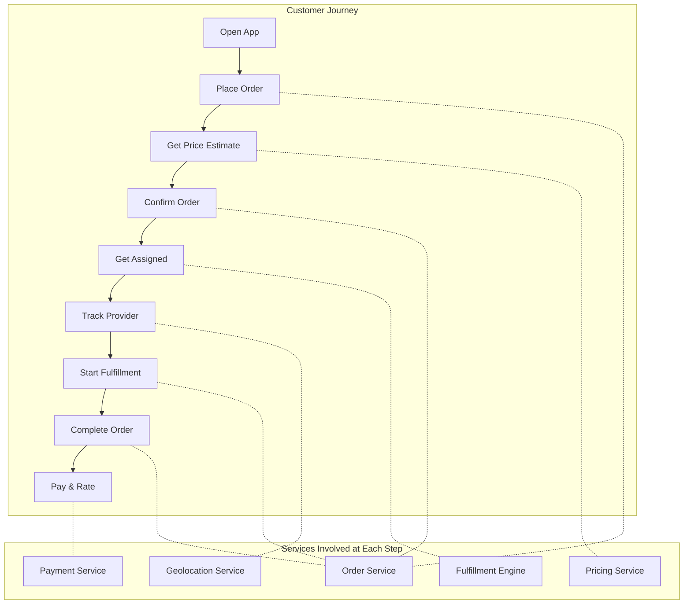
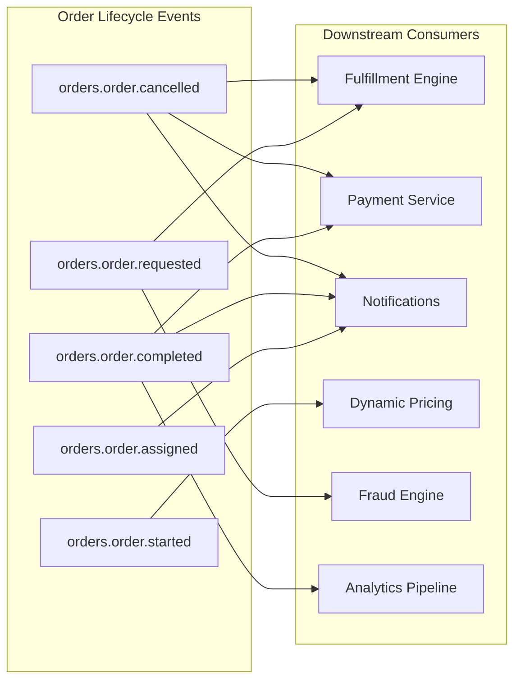
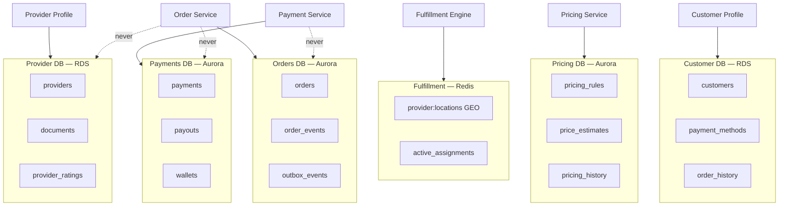

# 🗂️ 11 — Domain Catalog

Detailed documentation for each bounded context in the platform — responsibilities, APIs, events, data models, dependencies, and team ownership.

## 🗺️ Domain Landscape

## 👥 Domain Ownership Matrix

| Domain | Team | Data Store | Key Events | Tier |
|--------|------|-----------|------------|------|
| [Order Service](./01-order-service.md) | Orders | Aurora PostgreSQL | `orders.order.*` | Tier 1 — Critical |
| [Fulfillment Engine](./02-fulfillment-engine.md) | Orders | Redis (geospatial) | `fulfillment.assignment.*` | Tier 1 — Critical |
| [Pricing Service](./03-pricing-service.md) | Commercial | Aurora PostgreSQL | `pricing.price.*` | Tier 1 — Critical |
| [Provider Profile](./04-provider-profile.md) | Providers | RDS PostgreSQL | `providers.provider.*` | Tier 2 — Important |
| [Customer Profile](./05-customer-profile.md) | Customers | RDS PostgreSQL | `customers.customer.*` | Tier 2 — Important |
| [Payment Service](./06-payment-service.md) | Payments | Aurora PostgreSQL | `payments.payment.*` | Tier 1 — Critical |
| [Notifications](./07-notifications.md) | Platform | RDS PostgreSQL | `notifications.*` | Tier 3 — Standard |
| [Geolocation Service](./08-geolocation-service.md) | Orders | (proxies external) | — | Tier 2 — Important |
| [Dynamic Pricing](./09-dynamic-pricing.md) | Commercial | Redis + RDS | `dynamicpricing.*` | Tier 2 — Important |
| [Fraud Engine](./10-fraud-engine.md) | Trust & Safety | Aurora PostgreSQL | `fraud.signal.*` | Tier 1 — Critical |

## 🔀 Cross-Domain Event Flow

## 🔐 Data Ownership Boundaries

*Dashed lines with "never" = forbidden direct database access. Services communicate via APIs and events only.*

## 📝 Domain Documentation Standards

Every domain document in this catalog must include the following subsections. When creating or updating a domain document, verify that each section is present and populated. Missing sections should be added during the next domain review cycle.

### Required Subsections

1. **SLOs and Error Budgets** — availability target, latency p99, error rate ceiling, and error budget policy (what happens when the budget is exhausted)
2. **Failure Modes** — degraded behaviour description, user-facing impact, fallback strategy, and blast radius
3. **Capacity Sizing** — instance count (min/max replicas), database connection pool size, peak QPS, and HPA configuration (target CPU/memory, scale-up/scale-down behaviour)
4. **Data Retention Matrix** — per data store (DB tables, Kafka topics, S3 buckets, log groups): what is retained, for how long, and the deletion/archival mechanism
5. **Allowed Callers** — which services may call this service, via which protocol (gRPC, REST, Kafka), and the authorization mechanism (mTLS identity, RBAC role, API key)

### Domain-to-Domain Access Matrix

Allowed synchronous (gRPC) and asynchronous (Kafka) communication paths between domains. Any path not listed here is **forbidden** without an ADR and cross-team review.

| Source ↓ / Target → | Order Service | Fulfillment | Pricing | Provider Profile | Customer Profile | Payments | Notifications | Geolocation | Dynamic Pricing | Fraud Engine |
|----------------------|:---:|:---:|:---:|:---:|:---:|:---:|:---:|:---:|:---:|:---:|
| **Order Service** | — | gRPC | gRPC | gRPC (read) | gRPC (read) | Kafka | Kafka | gRPC | — | gRPC |
| **Fulfillment** | Kafka | — | — | gRPC (read) | — | — | Kafka | gRPC | — | gRPC |
| **Pricing** | — | — | — | — | — | — | — | gRPC | Kafka (consume) | — |
| **Provider Profile** | Kafka (consume) | Kafka | — | — | — | — | Kafka | — | — | Kafka (consume) |
| **Customer Profile** | Kafka (consume) | — | — | — | — | Kafka (consume) | — | — | — | — |
| **Payments** | Kafka (consume) | — | — | — | — | — | Kafka | — | — | Kafka (consume) |
| **Notifications** | Kafka (consume) | — | — | Kafka (consume) | — | Kafka (consume) | — | — | — | — |
| **Geolocation** | — | — | — | — | — | — | — | — | — | — |
| **Dynamic Pricing** | Kafka (consume) | — | — | Kafka (consume) | — | — | Kafka | — | — | — |
| **Fraud Engine** | Kafka (consume) | — | — | Kafka (consume) | Kafka (consume) | Kafka (consume) | Kafka | — | — | — |

### Domain Sunset Process

When a domain is deprecated or merged, follow the deprecation lifecycle process documented in [03-engineering-practices/08-deprecation-lifecycle.md](../03-engineering-practices/08-deprecation-lifecycle.md). This includes consumer notification timelines, traffic migration plans, and data ownership transfer procedures.

---

🏠 [Back to root](../README.md)

