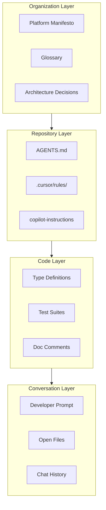

# 🧠 Context Engineering


---

## 1. 🎯 Overview

AI tools are only as good as the context they receive. Two engineers using the same AI assistant on the same codebase will get wildly different results depending on how much context the tool can access and understand.

**Context engineering** is the discipline of deliberately structuring knowledge - code, architecture, decisions, standards - so AI tools can access and apply it correctly. It is not a product you buy. It is an architectural practice you build and maintain.

Without context engineering, AI adoption stays superficial: autocomplete that generates plausible but wrong code, chat assistants that hallucinate your architecture, and code reviews that miss domain-specific patterns. With it, AI tools become force multipliers that enforce standards, accelerate onboarding, and reduce cognitive load.

> **The rule:** Every repository, every service, and every team must maintain machine-readable context. AI tools without context are just expensive autocomplete.

---

## 2. 📚 The Context Stack

Context flows to AI tools in layers. Each layer serves a different scope and update cadence.

**Visual overview:**



| Layer | Scope | Examples | Update Cadence |
|-------|-------|---------|----------------|
| **Organization** | All repositories | Platform manifesto, glossary, ADRs, architecture docs | Monthly / quarterly |
| **Repository** | Single repository | AGENTS.md, .cursor/rules/, copilot-instructions.md | Per PR (when standards change) |
| **Code** | Single file or module | Type definitions, test patterns, doc comments, inline annotations | Per PR |
| **Conversation** | Single AI interaction | Developer prompt, open files, chat history | Per interaction |

Most teams invest only in the conversation layer (writing better prompts). The leverage is in the layers above - organization and repository context that applies to every interaction automatically.

---

## 3. 📂 Repository Context Layer

Every repository must include machine-readable context files so engineers and AI-assisted workflows can apply the same standards. Treat repository context as the source of truth, then wire each tool to read it (automatically where supported, explicitly where not).

### Required Files

| File | Purpose | Primary audience |
|------|---------|------------------|
| `AGENTS.md` | Root-level instructions for AI-assisted editing and agents | Any tool you configure to load it (see matrix below) |
| `.cursor/rules/*.mdc` | Cursor-specific rules with glob-based file matching | Cursor |
| `.github/copilot-instructions.md` | GitHub Copilot workspace instructions | GitHub Copilot |

> **Compatibility note:** `AGENTS.md` is a convention adopted by several AI-assisted development tools, but support varies. Cursor reads it automatically; GitHub Copilot and other tools may require explicit configuration. Verify the exact behavior in your tool's documentation before relying on automatic loading.

**Tool support (typical behavior - confirm in vendor docs):**

| Tool | `AGENTS.md` | Related repo files |
|------|-------------|-------------------|
| Cursor | Loaded automatically from repo root | `.cursor/rules/*.mdc` |
| GitHub Copilot | Often not automatic; use workspace instructions | `.github/copilot-instructions.md` |
| Other assistants (e.g. Windsurf, Cline) | Varies by product and version | Product-specific rules or instruction files |

### AGENTS.md Structure

`AGENTS.md` is the **recommended** root-level convention for agent-oriented instructions: keep it in every repository so teams and tools have a single obvious place to look. It must contain:

| Section | Content |
|---------|---------|
| **Writing style** | Voice, tone, formatting constraints (e.g., no em-dashes, no smart quotes) |
| **Architecture rules** | Patterns the AI must follow (e.g., hexagonal architecture, port naming) |
| **Naming conventions** | How to name files, classes, functions, database tables, Kafka topics |
| **Forbidden patterns** | What the AI must never generate (e.g., raw SQL in controllers, public S3 buckets) |
| **Testing expectations** | Required test types, coverage thresholds, test file naming |
| **Dependency rules** | Approved libraries, version constraints, import ordering |

> **Hard rule:** If a team standard exists only in a Confluence page or a Slack thread, it does not exist for AI tools. Move it to AGENTS.md or a rules file.

### Cursor Rules (`.cursor/rules/`)

Cursor rules provide granular, file-pattern-scoped instructions. Use them for domain-specific guidance that does not apply to the entire repository.

| Rule File | Glob Pattern | Purpose |
|-----------|-------------|---------|
| `api-controllers.mdc` | `**/controller/**/*.java` | REST controller patterns, error handling, validation |
| `kafka-consumers.mdc` | `**/consumer/**/*.java` | Consumer idempotency, DLQ handling, offset management |
| `migrations.mdc` | `**/migrations/**/*.sql` | Expand-contract pattern, no breaking DDL in single migration |
| `tests.mdc` | `**/*Test.java` | Test naming, fixture patterns, assertion style |

### What Makes Good Context

| Do | Don't |
|----|-------|
| State rules as constraints: "All REST endpoints must return RFC 7807 error responses" | Describe aspirations: "We'd like to use RFC 7807 when possible" |
| Include worked examples of correct patterns | List rules without examples |
| Reference other manifesto docs by relative path | Duplicate entire documents into rules files |
| Keep rules files under 500 lines | Dump every team decision into a single file |
| Update rules when the underlying standard changes | Let rules drift from actual practice |

---

## 4. 🏛️ Architecture Context Layer

Architecture documentation serves dual purpose: it informs human engineers and it feeds AI tools. Documents that are well-structured for humans are usually well-structured for AI. Documents that are rambling, outdated, or ambiguous confuse both.

### Architecture Decision Records (ADRs)

ADRs are high-value AI context because they capture *why* decisions were made - the reasoning AI tools need to generate code that respects those decisions.

| ADR Field | AI Value |
|-----------|----------|
| **Status** | AI knows whether the decision is active, superseded, or deprecated |
| **Context** | AI understands the constraints and trade-offs |
| **Decision** | AI knows the chosen approach |
| **Consequences** | AI understands the implications and can warn about violations |

> **Mandate:** Every ADR must be stored in Git (not Confluence, not Notion) in the repository it applies to, under `docs/adr/`. AI tools can only read what is in the repository.

### Service Catalog (Backstage)

The Backstage `catalog-info.yaml` file in every repository provides structured metadata that AI tools can parse:

- Service ownership and team
- API specifications (OpenAPI, gRPC proto)
- Dependencies and consumers
- Lifecycle stage (production, beta, deprecated)
- SLOs and tier classification

See [04-service-catalog.md](../01-platform-standards/04-service-catalog.md) for the full spec.

### System Architecture Docs

The system architecture document ([01-system-architecture.md](../02-architecture-and-api/01-system-architecture.md)) provides the domain map, communication patterns, and service boundaries. AI tools that can access this document generate code that respects domain boundaries rather than creating tight coupling.

---

## 5. 🌐 Organizational Context Layer

Some context applies across all repositories and all teams. This is the highest-leverage layer - invest here first.

### The Manifesto as Context

This platform manifesto is itself a context engine. When referenced from AGENTS.md or cursor rules, it provides AI tools with:

| Manifesto Document | Context It Provides |
|--------------------|-------------------|
| [Tech Stack](../01-platform-standards/01-tech-stack.md) | Which languages, frameworks, and libraries are approved |
| [Naming Conventions](../01-platform-standards/02-naming-conventions.md) | How to name everything from services to Kafka topics |
| [API Standards](../02-architecture-and-api/02-api-standards.md) | URL design, versioning, error shapes, pagination |
| [Coding Standards](../03-engineering-practices/04-coding-standards.md) | Code style, error handling, null safety patterns |
| [Testing Pyramid](../03-engineering-practices/01-testing-pyramid.md) | What to test, how much, and how |
| [Backend Framework Standards](../03-engineering-practices/09-backend-framework-standards.md) | Health checks, config layering, structured logging |

### Glossary as Context

The [GLOSSARY.md](../GLOSSARY.md) ensures AI tools use the same terminology the team uses. Without it, AI tools may generate code using industry-generic terms that conflict with {Company}'s domain language.

### Cross-Repository Rules

For standards that apply to every repository in the organization, maintain a central rules repository that individual repositories reference:

```
{company}/engineering-rules/
├── AGENTS.md
├── cursor-rules/
│   ├── java-service.mdc
│   ├── react-app.mdc
│   └── terraform.mdc
└── copilot-instructions/
    └── copilot-instructions.md
```

Individual repositories include a pointer in their own AGENTS.md:

```markdown
> For organization-wide rules, see [{company}/engineering-rules](https://github.com/{company}/engineering-rules).
```

---

## 6. 🔍 Knowledge Retrieval Layer

For context that is too large to fit in repository files - runbooks, incident histories, design documents, API documentation - use retrieval-augmented generation (RAG) to make it searchable by AI tools.

### What to Index

| Source | Index Strategy | Retrieval Tool |
|--------|---------------|---------------|
| Platform manifesto | Chunk by section, embed per heading | Internal AI assistant |
| Runbooks | Chunk by procedure, embed per step | Incident triage assistant |
| ADRs | Embed full document (typically short) | Code assistant context |
| API documentation (OpenAPI) | Embed per endpoint | Code assistant context |
| Incident post-mortems | Chunk by root cause and remediation | Incident triage assistant |
| Slack engineering channels | Daily digest summarization + embedding | Internal AI assistant |

See [02-ai-governance.md](../10-ai-ml-platform/02-ai-governance.md#5-generative-ai-patterns) for RAG architecture patterns and implementation guidelines.

### Freshness Requirements

| Source | Max Staleness | Refresh Trigger |
|--------|--------------|----------------|
| Platform manifesto | 1 hour | Git push to main |
| Runbooks | 1 hour | Git push to main |
| API docs (OpenAPI) | 1 hour | CI pipeline publishes new spec |
| Incident post-mortems | 24 hours | New PIR merged |
| Slack digests | 24 hours | Daily batch job |

---

## 7. 🔄 Context Maintenance

Context that is wrong is worse than no context. Stale rules files cause AI tools to generate code that violates current standards, creating more work than they save.

### Ownership

| Context Layer | Owner | Review Cadence |
|---------------|-------|---------------|
| Organization (manifesto, glossary) | Platform Engineering | Quarterly |
| Repository (AGENTS.md, cursor rules) | Service-owning team | Every sprint (as part of backlog hygiene) |
| Code (types, doc comments) | Individual developer | Per PR |

### Staleness Detection

- **CI check:** A linter validates that AGENTS.md exists, is non-empty, and was updated within the last 90 days
- **Backstage scorecard:** "Context health" dimension checks for the presence and recency of AGENTS.md, .cursor/rules/, and ADRs
- **Quarterly audit:** Platform Engineering reviews a sample of repositories for context quality as part of the maturity assessment

### Context Review in PRs

When a PR changes a standard, pattern, or convention, the reviewer must ask: **"Did you update the context files?"**

| Change Type | Context Update Required |
|-------------|----------------------|
| New API endpoint | Update OpenAPI spec (auto-generates context) |
| New architectural pattern | Add or update ADR + update AGENTS.md |
| New naming convention | Update naming rules in AGENTS.md and manifesto |
| New library adoption | Update dependency rules in AGENTS.md |
| Deprecated pattern | Mark as forbidden in AGENTS.md with migration note |

---

## 8. 🚫 Anti-Patterns

| Anti-Pattern | Why It Fails | Fix |
|-------------|-------------|-----|
| **Context sprawl** - 20+ rules files with overlapping guidance | AI tools receive contradictory instructions and produce inconsistent output | Consolidate rules by domain; one file per concern |
| **Copy-paste context** - duplicating manifesto sections into rules files | Duplicated content drifts; the rules file says one thing, the manifesto says another | Reference manifesto sections by link; only include repo-specific additions |
| **Write-once context** - creating AGENTS.md during repo setup, never updating it | AI tools enforce patterns the team abandoned months ago | Add context freshness to sprint hygiene checklist |
| **Over-specification** - rules for every possible scenario | AI tools become rigid, generating boilerplate that developers immediately delete | Focus rules on decisions that are hard to reverse: architecture, security, data contracts |
| **No context** - relying entirely on AI training data | AI tools generate generic code that ignores {Company}'s standards, naming, and patterns | Start with AGENTS.md; it takes 30 minutes and pays back immediately |

---
<div align="center">

⬅️ [Back to section](./README.md) · 🏠 [Back to root](../README.md)

</div>
