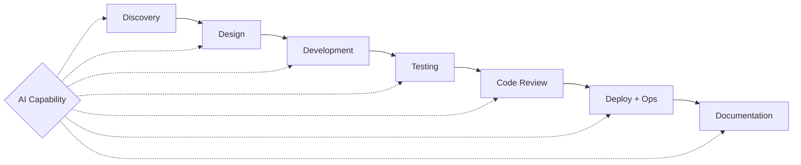

# 🔄 AI-Assisted SDLC

  

---

## 1. 🎯 Overview

AI is not a phase of the SDLC - it is a capability that runs through every phase. This document defines how AI tools integrate into each stage of software delivery at {Company}, from discovery through production operations.

The goal is not "use AI everywhere." The goal is **use AI where it compounds** - where it reduces toil, catches what humans miss, or accelerates feedback loops - and **stay human where it matters** - architecture decisions, ethical judgements, and customer empathy.

For approved tools and security guardrails, see [AI-Assisted Development Practices](../10-ai-ml-platform/02-ai-governance.md#4-ai-assisted-development-practices) in the AI Governance document.

**Visual overview:**

---

## 2. 🔍 Discovery & Requirements

### Where AI Helps

| Activity | AI Role | Human Role |
|----------|---------|------------|
| User story drafting | Generate initial acceptance criteria from a one-line description | Validate against domain knowledge and user research |
| Requirement gap analysis | Scan existing stories for missing edge cases, error scenarios, accessibility | Prioritize which gaps to address |
| Competitive analysis | Summarize public documentation and API surfaces | Interpret strategic implications |
| Technical feasibility | Estimate complexity by analyzing existing codebase patterns | Final judgement on effort and risk |

### Workflow

1. Product manager writes a one-line feature description
2. AI assistant generates draft user stories with acceptance criteria
3. Engineering lead reviews and annotates with technical constraints
4. AI assistant identifies gaps: "No error scenario for payment failure" or "No accessibility criteria specified"
5. Team finalizes stories in planning session

### Guardrails

- AI-generated requirements are **drafts**. They must be reviewed by a human who understands the domain before entering the backlog.
- Never feed customer interview transcripts or PII-containing feedback into AI tools unless the tool is {Company}-licensed with a data processing agreement (see [AI Governance](../10-ai-ml-platform/02-ai-governance.md#7-data-privacy-with-ai)).

---

## 3. 🏗️ Design & Architecture

### Where AI Helps

| Activity | AI Role | Human Role |
|----------|---------|------------|
| RFC drafting | Generate initial structure, enumerate trade-offs, cite relevant ADRs | Make the actual architectural decision |
| Sequence diagram generation | Generate Mermaid diagrams from natural language descriptions | Verify correctness against real service contracts |
| API contract design | Draft OpenAPI specs from requirements | Review for backward compatibility and domain accuracy |
| Trade-off analysis | Enumerate pros/cons of approaches (e.g., sync vs async) | Weigh trade-offs against team context, timeline, and strategy |
| Dependency impact analysis | Scan codebase for downstream impact of a proposed change | Decide whether the impact is acceptable |

### Workflow for AI-Assisted RFCs

1. Author describes the problem and constraints to an AI assistant with the manifesto and relevant ADRs as context
2. AI generates an RFC skeleton: problem statement, options, trade-offs, recommendation
3. Author validates, enriches with team-specific knowledge, and submits for review
4. Reviewers engage with the RFC as normal - the origin (AI-assisted) does not change the review bar

> **Rule:** AI-assisted RFCs must be tagged with `ai-assisted` in the PR description. This is for transparency, not stigma - the same quality bar applies regardless of origin.

---

## 4. 💻 Development

This is where most teams start with AI. The goal is to move beyond "AI as autocomplete" to "AI as a pair programmer that knows your standards."

### Effective AI Pairing

| Practice | Description |
|----------|-------------|
| **Context-first prompting** | Before asking AI to write code, ensure it has access to: AGENTS.md, relevant rules files, the interface/type definitions, and related test files |
| **Test-first with AI** | Write the test (or describe the test to AI), then have AI implement the production code to pass it. This constrains AI output to verifiable behavior |
| **Incremental generation** | Generate code in small, reviewable chunks. A 500-line AI-generated file is as hard to review as a 500-line human-written file |
| **Refactor with AI** | AI excels at mechanical refactoring: extracting methods, renaming, applying patterns. Use it for the tedious parts, review the results |

### When NOT to Use AI for Code Generation

| Scenario | Why |
|----------|-----|
| Security-sensitive logic (auth, encryption, PII handling) | AI may generate plausible but subtly insecure patterns. Requires explicit human review annotation in PR |
| Novel algorithmic work | AI generates common patterns; novel algorithms need human reasoning |
| Cross-service data contracts | Schema changes have blast radius AI cannot reason about. Use human-driven schema evolution ([08-event-schema-evolution.md](../02-architecture-and-api/08-event-schema-evolution.md)) |
| Infrastructure as code for production | Terraform/Pulumi changes to production infrastructure require human review for cost and security implications |

### Prompt Patterns for Development

| Pattern | When to Use | Example Prompt Shape |
|---------|------------|---------------------|
| **Implement from interface** | You have a port/interface, need an adapter | "Implement this interface following hexagonal architecture. Here is the port: [interface]. Here is an example adapter: [existing adapter]." |
| **Generate tests from implementation** | Code exists, tests are missing | "Write unit tests for this class. Follow the testing patterns in this test file: [example test]. Cover happy path, edge cases, and error scenarios." |
| **Migrate pattern** | Replacing deprecated pattern with new one | "Refactor this code from [old pattern] to [new pattern]. Here is an example of the new pattern: [example]. Preserve all existing behavior." |
| **Explain then fix** | Debugging unfamiliar code | "Explain what this code does step by step, then identify the bug causing [symptom]." |

---

## 5. 🧪 Testing

AI-generated tests are valuable but dangerous. They look comprehensive but often test implementation details, assert on meaningless values, or pass without actually validating behavior.

### Where AI Adds Value

| Test Type | AI Role | Human Verification |
|-----------|---------|-------------------|
| **Unit tests** | Generate test cases for edge cases humans miss (null inputs, boundary values, concurrent access) | Review that assertions test behavior, not implementation |
| **Integration test scaffolding** | Generate boilerplate: test containers, fixtures, HTTP client setup | Verify the test actually exercises the integration point |
| **Contract test generation** | Generate consumer-driven contracts from OpenAPI specs | Verify contract reflects real consumer expectations |
| **Test data generation** | Generate realistic but synthetic test data matching schema constraints | Review for PII, bias, and edge case coverage |
| **Mutation testing analysis** | Identify surviving mutants and suggest additional assertions | Prioritize which surviving mutants actually matter |

### Anti-Patterns in AI-Generated Tests

| Anti-Pattern | Example | Fix |
|-------------|---------|-----|
| **Tautological test** | `assertEquals(service.calculate(5), service.calculate(5))` | Assert against a known expected value |
| **Implementation mirror** | Test reimplements the production logic to compute expected value | Use hard-coded expected values derived from requirements |
| **Happy-path-only** | AI generates 10 tests, all with valid inputs | Explicitly request: "Generate tests for invalid inputs, nulls, boundary values, and error scenarios" |
| **Mock everything** | Every dependency is mocked, so the test verifies wiring, not behavior | Use real implementations for in-process dependencies; mock only external services |
| **False coverage** | Test executes code but asserts nothing meaningful | Every test must have at least one assertion that would fail if the behavior changed |

> **Rule:** AI-generated tests are held to the same review standard as human-written tests. "AI generated these tests" does not reduce the reviewer's responsibility to verify they test real behavior.

---

## 6. 👀 Code Review

AI-assisted code review augments human reviewers - it does not replace them.

### AI Review Capabilities

| AI Catches Well | AI Misses |
|----------------|-----------|
| Style violations, naming inconsistencies | Whether the design is right for the problem |
| Common bug patterns (off-by-one, null deref, resource leaks) | Business logic correctness |
| Missing error handling, unclosed resources | Whether the PR solves the right problem |
| Test coverage gaps | Architectural fit and domain alignment |
| Documentation staleness | Team dynamics and mentoring opportunities |
| Security anti-patterns (SQL injection, hardcoded secrets) | Subtle security issues in business logic |

### Review Workflow

1. **Automated AI review** runs as a GitHub Action on PR open/update
2. AI review comments are posted as suggestions, not approvals
3. Human reviewer focuses on design, correctness, and domain fit
4. Human reviewer validates or dismisses AI suggestions
5. Final approval is always human

### Configuring AI Review

AI review tools must be configured with the repository's context files (AGENTS.md, cursor rules) so they review against {Company}'s standards, not generic best practices. See [Context Engineering](./01-context-engineering.md) for how to structure these files.

---

## 7. 🚀 Deployment & Operations

### AI-Assisted Deployment Decisions

| Activity | AI Role | Human Role |
|----------|---------|------------|
| Canary analysis | Automated anomaly detection on canary metrics (error rate, latency, saturation) | Decision to promote or rollback |
| Change risk assessment | Score PRs by blast radius (files changed, services affected, data migration) | Final risk classification for change management |
| Rollback recommendation | Alert when metrics breach thresholds during rollout | Execute rollback |

### AI-Assisted Incident Response

| Phase | AI Role | Human Role |
|-------|---------|------------|
| **Detection** | Correlate alerts across services, suggest related incidents from history | Acknowledge and assess severity |
| **Triage** | Surface relevant runbooks, recent deployments, and similar past incidents | Decide response strategy |
| **Diagnosis** | Query logs and metrics, summarize findings, suggest root cause hypotheses | Validate hypotheses, apply domain knowledge |
| **Resolution** | Suggest remediation steps from runbooks, draft customer communications | Execute remediation, approve communications |
| **Post-incident** | Generate PIR draft from incident timeline, alerts, and Slack thread | Add human context: what was confusing, what we missed, what to change |

> **Rule:** AI-generated incident communications (customer-facing status updates, internal announcements) must be reviewed by the incident commander before publishing.

See [04-incident-management.md](../05-operational-excellence/04-incident-management.md) for the full incident response framework.

---

## 8. 📝 Documentation

Documentation is where AI has the clearest ROI: humans avoid writing docs, AI does not mind. But AI-generated docs are only useful if they are accurate and maintained.

### Where AI Helps

| Documentation Type | AI Workflow |
|-------------------|------------|
| **API documentation** | Auto-generate from OpenAPI spec + code comments. AI enriches with examples and edge case notes |
| **README updates** | AI detects when code changes invalidate README instructions and suggests updates in PR |
| **Runbook generation** | AI generates initial runbook from alert definition + code path analysis. Human validates with on-call experience |
| **ADR drafts** | AI generates ADR skeleton from RFC discussion thread or PR comments |
| **Onboarding guides** | AI identifies gaps by comparing setup steps against actual codebase dependencies |

### Documentation Freshness

- CI pipeline compares documentation last-modified date against related code last-modified date
- If code changed more recently than its documentation, a warning is raised in the PR
- AI can generate a diff summary: "These code changes may require documentation updates to [files]"

---

## 9. 🚫 Anti-Patterns & Guardrails

| Anti-Pattern | Risk | Mitigation |
|-------------|------|------------|
| **AI slop** - accepting AI output without reading it | Bugs, security vulnerabilities, standards violations enter the codebase | Every line of AI-generated code must be understood by the developer (see [AI Governance guardrails](../10-ai-ml-platform/02-ai-governance.md#guardrails)) |
| **Cargo-culting AI suggestions** - adopting a pattern because AI suggested it, without understanding why | Patterns proliferate that nobody can explain or maintain | If you cannot explain why the code is written this way, rewrite it |
| **AI-generated complexity** - AI produces working but unnecessarily complex solutions | Maintenance burden increases; future developers (and future AI) struggle to understand the code | Prefer the simplest solution. AI-generated code should be simpler than what you would write, not more complex |
| **Skipping review for AI code** - "AI wrote it, it must be right" | AI confidently generates incorrect code, especially for domain-specific logic | AI-generated code gets the same review bar as human-written code. Period |
| **Over-automation** - using AI for decisions that require human judgement | Architecture decisions, security trade-offs, and ethical considerations get reduced to pattern matching | Use AI for analysis and options; reserve decisions for humans |

---

⬅️ [Back to section](./README.md) · 🏠 [Back to root](../README.md)

