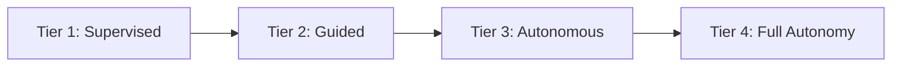

# 🔐 Trust-Tiered Autonomy

  

---

## 🎯 1. Overview

AI agents operating in your engineering organization need explicit boundaries. Too much restriction and you lose the productivity gains that agents provide. Too little and you introduce risk - unreviewed code merging to main, infrastructure changes without human oversight, or production deploys with no approval gate.

The trust-tiered autonomy model defines four tiers of agent independence. Every agent-performed activity maps to a minimum tier. Teams promote or demote agents between tiers based on demonstrated reliability, not assumptions.

> **Rule:** No agent operates above Tier 2 without explicit CTO or engineering leadership approval. Tier promotions are earned through tracked performance, not granted by default.

---

## 🏗️ 2. The Four Tiers

**Visual overview:**

### Tier 1 - Supervised

The agent suggests; a human approves everything before any action takes effect.

| Aspect | Detail |
|:-------|:-------|
| **Agent role** | Generate suggestions, draft code, propose changes |
| **Human role** | Review and approve every action before execution |
| **Merge authority** | None - human merges all PRs |
| **Deploy authority** | None - human triggers all deployments |
| **Typical use** | New agent onboarding, unfamiliar codebases, security-sensitive repositories |

### Tier 2 - Guided

The agent acts independently but a human reviews before merge. This is the default tier for most agent workflows.

| Aspect | Detail |
|:-------|:-------|
| **Agent role** | Write code, open PRs, run tests, update documentation |
| **Human role** | Review PRs before merge, approve deployments |
| **Merge authority** | None - human merges after review |
| **Deploy authority** | None - human approves promotion to production |
| **Typical use** | Feature development, bug fixes, test generation, documentation updates |

### Tier 3 - Autonomous

The agent merges approved changes and manages routine deployments. A human reviews asynchronously and intervenes only when needed.

| Aspect | Detail |
|:-------|:-------|
| **Agent role** | Write code, open PRs, merge when CI passes and auto-review criteria are met, trigger staging deploys |
| **Human role** | Async review of merged changes, approve production deploys, audit weekly |
| **Merge authority** | Merge to main when all CI gates pass and change is within scope boundaries |
| **Deploy authority** | Deploy to staging and non-production environments. Production requires human approval |
| **Typical use** | Dependency updates, config changes, generated code from specs, routine maintenance |

### Tier 4 - Full Autonomy

The agent owns the end-to-end workflow. Humans audit periodically and set policy, but do not approve individual actions.

| Aspect | Detail |
|:-------|:-------|
| **Agent role** | Full SDLC ownership - plan, code, test, merge, deploy, monitor, respond to alerts |
| **Human role** | Set policies and guardrails, audit periodically (weekly or monthly), intervene on escalations |
| **Merge authority** | Full - merge to any branch including main |
| **Deploy authority** | Full - deploy to all environments including production |
| **Typical use** | Internal tooling, non-customer-facing services with comprehensive test coverage, infrastructure automation |

---

## 📋 3. Activity-to-Tier Mapping

Every agent activity has a minimum required tier. Operating below the minimum tier for an activity is a policy violation.

| Activity | Minimum Tier | Rationale |
|:---------|:-------------|:----------|
| Generate code suggestions | Tier 1 | Low risk - human reviews before use |
| Open pull requests | Tier 2 | PR exists for review; no production impact until merge |
| Run tests and report results | Tier 2 | Read-only CI activity with no side effects |
| Update documentation | Tier 2 | Low risk but should be reviewed for accuracy |
| Merge PRs (non-main branches) | Tier 3 | Requires demonstrated CI reliability |
| Merge PRs (main branch) | Tier 3 | Requires CI gates, auto-review criteria, and scope boundaries |
| Deploy to staging | Tier 3 | Non-production environment with rollback capability |
| Deploy to production | Tier 4 | Highest risk - requires full autonomy approval |
| Modify infrastructure (Terraform, K8s) | Tier 3 (staging) / Tier 4 (prod) | Infrastructure changes have blast radius beyond single service |
| Respond to production alerts | Tier 3 (diagnose) / Tier 4 (remediate) | Diagnosis is low risk; remediation changes production state |
| Architecture decisions (new services, schema changes) | Always human | Architectural decisions require human judgment regardless of tier |
| Security-sensitive changes (auth, encryption, PII) | Always human | Security trade-offs require human accountability |

---

## ⬆️ 4. Tier Promotion Criteria

Promotion is earned through demonstrated performance over a minimum observation period.

| Promotion | Minimum Period | Required Criteria |
|:----------|:---------------|:------------------|
| Tier 1 to Tier 2 | 2 weeks | Zero rejected suggestions due to correctness issues. Agent follows coding standards consistently. All generated code passes CI on first attempt > 90% of the time |
| Tier 2 to Tier 3 | 4 weeks | PR approval rate > 95% without rework requests. Zero security or compliance findings in agent-authored code. Test coverage maintained or improved on all changes |
| Tier 3 to Tier 4 | 8 weeks | Zero production incidents caused by agent-merged changes. All deployments successful with no rollbacks. Weekly human audits show no policy violations. CTO or VP Engineering explicit sign-off |

### Demotion triggers

An agent is immediately demoted one tier (or to Tier 1 for critical issues) when any of the following occur:

- **Production incident** caused by agent-authored or agent-merged code
- **Security vulnerability** introduced by agent changes
- **Policy violation** - agent acts outside its tier boundaries
- **CI bypass** - agent merges code that has not passed all required gates
- **Scope creep** - agent modifies files or services outside its designated scope

After demotion, the agent must re-earn promotion through the standard criteria above.

---

## 🛡️ 5. Guardrails by Tier

| Guardrail | Tier 1 | Tier 2 | Tier 3 | Tier 4 |
|:----------|:-------|:-------|:-------|:-------|
| Human approval before merge | Required | Required | Not required (async review) | Not required (periodic audit) |
| CI gates must pass | Yes | Yes | Yes | Yes |
| Scope boundaries enforced | N/A | Yes - repo-level | Yes - repo and file-level | Yes - service-level |
| Change size limits | N/A | < 400 lines per PR | < 200 lines per PR | < 500 lines per PR |
| Automated security scanning | Yes | Yes | Yes - block on critical/high | Yes - block on critical/high |
| Audit log of all actions | Yes | Yes | Yes | Yes |
| Human escalation path | Immediate | Within 1 hour | Within 4 hours | Within 1 business day |
| Production deploy approval | Human only | Human only | Human only | Agent (with rollback automation) |

> **Non-negotiable at every tier:** All agent actions are logged with full audit trail. All agent-opened PRs are clearly attributed to the agent identity. CI gates are never bypassed regardless of tier.

---

## 🔗 6. Cross-References

- [Context Engineering](./01-context-engineering.md) - how agents receive the context needed to operate at any tier
- [AI-Assisted SDLC](./02-ai-assisted-sdlc.md) - where agents participate across the development lifecycle
- [AI Adoption Metrics](./03-ai-adoption-metrics.md) - measuring agent effectiveness and tracking tier performance
- [Code Review Guide](../03-engineering-practices/06-code-review-guide.md) - review standards that apply to agent-authored code

---

⬅️ [Back to section](./README.md) · 🏠 [Back to root](../README.md)

