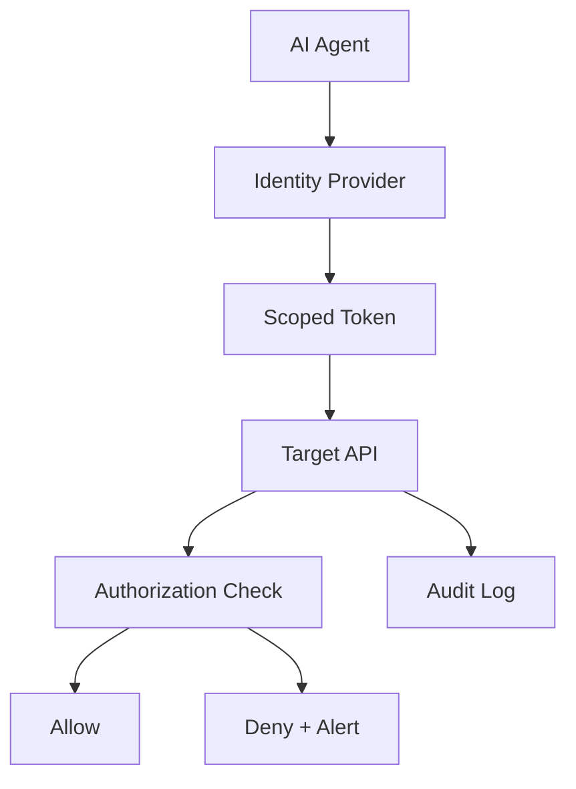

# 🛡️ Agent Security Model

  

---

## 🎯 1. Overview

AI agents are autonomous software actors that interact with your systems - reading code, making API calls, modifying infrastructure, and accessing data stores. They require the same identity, access control, and audit rigor as any human engineer, plus additional constraints that account for their speed, scale, and lack of judgment.

> **Rule:** Every agent must have a unique, auditable identity. No agent may operate using a shared service account or a human user's credentials.

An agent without proper identity and access controls is an unaudited administrator with no accountability. This document defines the security model that prevents that outcome.

---

## 🪪 2. Agent Identity Standards

Every agent operating within {Company} infrastructure must have a distinct identity that is traceable, rotatable, and revocable.

| Identity Type | Use Case | Requirements |
|---------------|----------|--------------|
| **Service account** | CI/CD agents, background automation | Dedicated per agent, no shared accounts |
| **OAuth2 client credentials** | API access, service-to-service calls | Short-lived tokens (max 1 hour), scoped grants |
| **API keys** | External integrations, third-party agents | Per-agent keys, IP-restricted, rotated every 90 days |
| **SPIFFE identity** | Mesh-internal agent workloads | Auto-issued by service mesh, mTLS enforced |

> **Rule:** Agent credentials must have a maximum TTL of 1 hour for tokens and 90 days for API keys. Long-lived credentials are not permitted.

**Visual overview:**

---

## 🔒 3. Least Privilege

Agents must operate with the minimum permissions required for their specific task. Broad access grants are prohibited even when they would simplify integration.

**Permission scoping rules:**

1. **Read vs. write** - Agents that only need to read code or data must not have write permissions
2. **Resource scope** - Permissions are scoped to specific repositories, namespaces, or data stores, never org-wide
3. **Time-bound** - Elevated permissions for specific tasks expire automatically after the task completes
4. **No admin access** - No agent may hold cluster-admin, org-owner, or database superuser roles

| Agent Tier | Allowed Permissions | Approval Required |
|------------|--------------------|--------------------|
| Tier 1 (Supervised) | Read code, suggest changes, run tests | None |
| Tier 2 (Semi-autonomous) | Open PRs, run CI, deploy to staging | Team lead |
| Tier 3 (Autonomous) | Merge PRs (non-critical), deploy to production | Engineering manager |
| Tier 4 (Full autonomy) | Infrastructure changes, data migrations | CTO / VP Engineering |

> **Rule:** Tier promotion requires at least 30 days of tracked performance data with zero security incidents.

---

## 📋 4. Audit Trail Requirements

Every action performed by an agent must produce an immutable audit record. Audit records must capture enough context to reconstruct what the agent did, why, and with what authorization.

**Required audit fields:**

| Field | Description |
|-------|-------------|
| `agent_id` | Unique identifier of the agent |
| `action` | Operation performed (read, write, delete, deploy) |
| `resource` | Target resource (repo, API endpoint, database, file) |
| `timestamp` | ISO 8601 timestamp with timezone |
| `authorization` | Token or credential used, scopes granted |
| `outcome` | Success, failure, or partial result |
| `parent_context` | Human request or trigger that initiated the action |

> **Rule:** Audit logs for agent actions must be retained for a minimum of 2 years and stored in tamper-evident storage.

---

## ⚠️ 5. Threat Model

Agents introduce unique threat vectors that traditional access controls do not fully address.

| Threat | Description | Mitigation |
|--------|-------------|------------|
| **Credential theft** | Agent tokens extracted from logs or memory | Short TTL tokens, no logging of secrets |
| **Privilege escalation** | Agent modifies its own permissions | Permissions managed externally, not self-serviceable |
| **Data exfiltration** | Agent reads sensitive data and sends it externally | Network egress controls, DLP scanning |
| **Prompt injection** | Malicious input causes agent to perform unintended actions | Input validation, sandboxed execution |
| **Lateral movement** | Compromised agent pivots to other systems | Microsegmentation, per-service identity |

> **Rule:** All agent workloads must run in sandboxed environments with restricted network egress. Agents must not have direct internet access unless explicitly approved.

---

## 🔗 6. Cross-References

- [Trust-Tiered Autonomy](./04-trust-tiered-autonomy.md) - Tier definitions and promotion criteria for agent autonomy
- [Security](../04-infrastructure-and-cloud/03-security.md) - IAM, encryption, incident response, shift-left security

---

⬅️ [Back to section](./README.md) · 🏠 [Back to root](../README.md)

