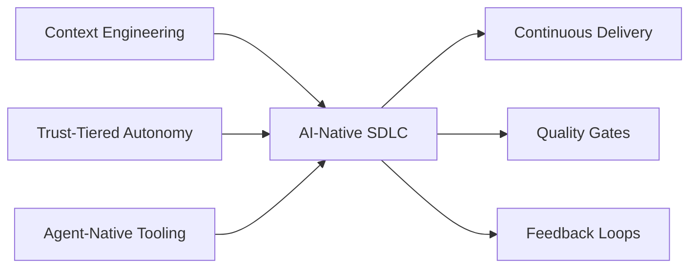

# 🏗️ AI-Native SDLC

  

---

## 🎯 1. Overview

The AI-native SDLC reframes software delivery around three pillars: **Context Engineering**, **Trust-Tiered Autonomy**, and **Agent-Native Tooling**. Rather than bolting AI onto existing workflows, this strategy treats AI agents as first-class participants in every phase of delivery.

> **Rule:** Every SDLC process must be evaluated against all three pillars. A process that fails any pillar is not AI-native - it is AI-adjacent.

**Visual overview:**

---

## 🧠 2. Pillar 1 - Context Engineering

Context engineering ensures that every AI agent operating in the SDLC has access to the right information at the right time. Without structured context, agents produce generic output that requires heavy human correction.

| Context Layer | Purpose | Examples |
|---------------|---------|----------|
| **Repository context** | Local rules, conventions, patterns | AGENTS.md, cursor rules, .editorconfig |
| **Organizational context** | Standards, architecture decisions | This manifesto, ADR repository, tech radar |
| **Task context** | Specific requirements for the current task | Ticket description, RFC, design doc |
| **Runtime context** | Live system state for operational tasks | Metrics, logs, deployment status |

> **Rule:** Every repository must have an AGENTS.md file and structured rules files. See [Context Engineering](./01-context-engineering.md) for implementation details.

---

## 🔐 3. Pillar 2 - Trust-Tiered Autonomy

Not every task deserves the same level of agent autonomy. Trust-tiered autonomy assigns agent independence based on task risk, agent maturity, and verification capability.

| Tier | Agent Role | Human Role | Example Tasks |
|------|-----------|------------|---------------|
| **Tier 1** | Suggest | Decide and execute | Architecture decisions, security reviews |
| **Tier 2** | Draft | Review and approve | Code generation, test writing, PR creation |
| **Tier 3** | Execute with review | Approve or rollback | Deployments, dependency updates |
| **Tier 4** | Fully autonomous | Monitor | Linting, formatting, trivial bug fixes |

Tier assignment follows the model defined in [Trust-Tiered Autonomy](./04-trust-tiered-autonomy.md). Promotion between tiers requires demonstrated reliability and zero security incidents over 30 days.

---

## 🔧 4. Pillar 3 - Agent-Native Tooling

Agent-native tooling means every tool in the SDLC exposes machine-readable interfaces, not just human UIs. Agents interact with tools through APIs, CLIs, and structured protocols.

| Requirement | Description |
|-------------|-------------|
| **API-first** | Every platform tool exposes a documented API |
| **Structured output** | CLIs produce JSON or structured output |
| **MCP compatibility** | Tools expose capabilities through Model Context Protocol where applicable |
| **Idempotent operations** | Agent-invoked operations must be safe to retry |
| **Audit trail** | Every agent-invoked operation is logged with agent identity |

---

## 🔄 5. SDLC Phase Mapping

Each phase maps to specific pillar requirements.

| SDLC Phase | Context Needed | Autonomy Tier | Tooling Required |
|------------|---------------|---------------|-----------------|
| Discovery | Tickets, user research, domain docs | Tier 1 - 2 | Issue trackers with API |
| Design | ADRs, manifesto, codebase | Tier 1 - 2 | RFC templates, diagram tools |
| Development | Repo context, standards, tests | Tier 2 - 4 | IDE agents, CI runners |
| Testing | Test patterns, coverage data | Tier 2 - 3 | Test frameworks, coverage tools |
| Code review | Review standards, PR context | Tier 2 - 3 | GitHub API, review bots |
| Deployment | Runbooks, metrics, rollback plans | Tier 2 - 3 | CD pipelines, feature flags |
| Operations | Dashboards, alerts, incident history | Tier 1 - 3 | Observability stack |

---

## 📏 6. Maturity Assessment

Teams assess their AI-native SDLC maturity quarterly.

| Level | Context | Autonomy | Tooling |
|-------|---------|----------|---------|
| **L1 - Ad hoc** | No structured context files | All Tier 1 | Human-only interfaces |
| **L2 - Emerging** | AGENTS.md exists, partial rules | Tier 1 - 2 for select tasks | Some API access |
| **L3 - Defined** | Full context layers in place | Tiers 1 - 3 assigned per task | All tools API-accessible |
| **L4 - Optimized** | Context updated automatically | Tiers 1 - 4 with earned trust | Full MCP integration |

> **Rule:** All teams must reach L2 within 90 days and L3 within 180 days of adopting AI-native SDLC practices.

---

## 🔗 7. Cross-References

- [Context Engineering](./01-context-engineering.md) - Structuring repository and organizational context for agents
- [AI-Assisted SDLC](./02-ai-assisted-sdlc.md) - Per-phase AI integration patterns
- [Trust-Tiered Autonomy](./04-trust-tiered-autonomy.md) - Tier definitions and promotion criteria
- [Agent Security Model](./05-agent-security-model.md) - Identity, access control, and audit for agents

---

⬅️ [Back to section](./README.md) · 🏠 [Back to root](../README.md)

