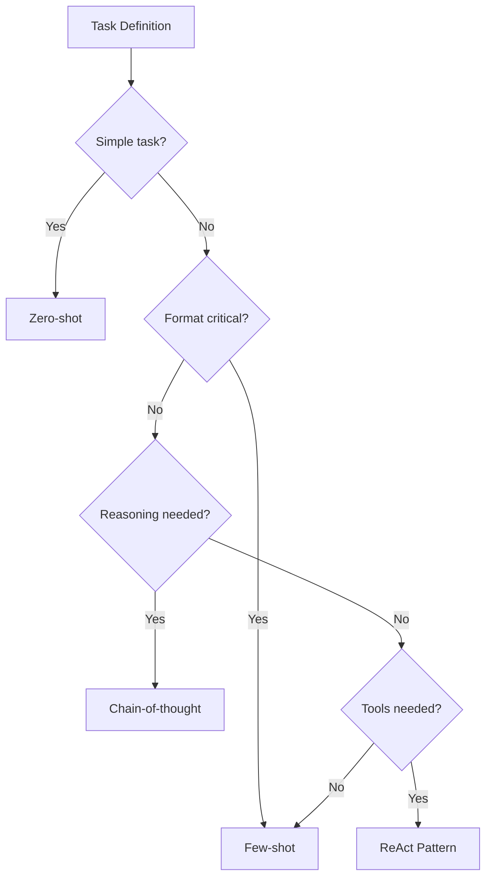

# 🎯 Prompt Engineering and LLM Integration

  

---

## 🎯 1. Overview

Prompt engineering is the discipline of crafting effective instructions for large language models. At {Company}, prompts are treated as production artifacts - versioned, tested, and reviewed with the same rigor as application code. This document defines standards for prompt design, LLM integration patterns, and quality assurance.

> **Rule:** All prompts used in production systems must be stored in version control, not hardcoded in application logic or scattered across configuration files.

---

## 🧩 2. Prompt Design Principles

| Principle | Description |
|-----------|-------------|
| **Be explicit** | State the task, format, and constraints clearly - do not rely on the model to infer intent |
| **Provide examples** | Include 2 - 3 examples of desired input/output pairs (few-shot prompting) |
| **Constrain output** | Specify output format (JSON, markdown, specific schema) to enable programmatic parsing |
| **Set boundaries** | Tell the model what NOT to do - refuse hallucination, stay within scope |
| **Separate concerns** | Use system prompts for persona and rules, user prompts for the specific task |

---

## 📐 3. Prompt Patterns

| Pattern | When to Use | Structure |
|---------|------------|-----------|
| **Zero-shot** | Simple, well-defined tasks | System prompt + task instruction |
| **Few-shot** | Tasks requiring specific output format | System prompt + examples + task |
| **Chain-of-thought** | Reasoning tasks, math, logic | "Think step by step" with intermediate output |
| **ReAct** | Tasks requiring tool use or data lookup | Thought-Action-Observation loop |
| **Self-consistency** | High-stakes decisions | Multiple generations + majority vote |

**Visual overview:**

---

## 🔌 4. LLM Integration Standards

All LLM calls in production must route through {Company}'s LLM gateway. Direct API calls to model providers are prohibited.

| Requirement | Standard |
|-------------|----------|
| **Gateway routing** | All calls via `llm-gateway.internal.{company}.com` |
| **Authentication** | Service-to-service OAuth2 tokens, scoped per application |
| **Rate limiting** | Per-service quotas enforced at the gateway |
| **Timeout** | Maximum 30 seconds for synchronous calls, 120 seconds for async |
| **Retry policy** | Exponential backoff with jitter, max 3 retries |
| **Fallback** | Graceful degradation when LLM is unavailable |

> **Rule:** Never embed API keys for model providers in application code or environment variables. All keys are managed by the LLM gateway.

---

## 🧪 5. Prompt Testing

Prompts must be tested before production deployment. Untested prompts introduce unpredictable behavior.

| Test Type | Purpose | Method |
|-----------|---------|--------|
| **Golden set** | Verify expected output for known inputs | Assert against curated input/output pairs |
| **Regression** | Detect output changes after prompt edits | Compare new output against baseline |
| **Adversarial** | Test for prompt injection and jailbreaks | Red-team with injection payloads |
| **Format validation** | Ensure structured output parses correctly | JSON schema validation on output |
| **Latency benchmarks** | Verify response time meets SLAs | Measure p50, p95, p99 under load |

> **Rule:** Every production prompt must have a golden set of at least 20 test cases with expected outputs.

---

## 🚫 6. Anti-Patterns

| Anti-Pattern | Risk | Mitigation |
|-------------|------|------------|
| **Prompt sprawl** | Untracked prompts across services | Centralized prompt registry in version control |
| **Mega-prompts** | Fragile, hard to debug, high token cost | Decompose into focused sub-prompts |
| **Implicit format** | Unparseable model output | Always specify output schema explicitly |
| **No fallback** | Service failure when LLM is down | Every LLM-powered feature has a degraded mode |
| **Ignoring cost** | Runaway token spend | Set per-service token budgets at the gateway |

---

## 🔗 7. Cross-References

- [AI-Assisted SDLC](./02-ai-assisted-sdlc.md) - AI integration across the software delivery lifecycle
- [AI Governance](../10-ai-ml-platform/02-ai-governance.md) - Approved tools and security guardrails

---

⬅️ [Back to section](./README.md) · 🏠 [Back to root](../README.md)

