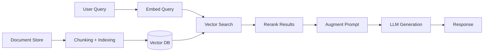

# 📚 RAG Patterns and Vector Database Standards

  

---

## 🎯 1. Overview

Retrieval-Augmented Generation (RAG) grounds LLM responses in factual, up-to-date data by retrieving relevant context before generation. At {Company}, RAG is the default pattern for any LLM feature that requires domain-specific knowledge - documentation search, code Q&A, support automation, and internal knowledge bases.

> **Rule:** Never fine-tune a model to inject knowledge that can be served through RAG. Fine-tuning is for behavior; RAG is for knowledge.

**Visual overview:**

---

## 🧩 2. RAG Architecture Patterns

| Pattern | Description | When to Use |
|---------|-------------|-------------|
| **Naive RAG** | Embed, retrieve top-k, generate | Simple Q&A, low-stakes queries |
| **RAG with reranking** | Retrieve top-k, rerank with cross-encoder, generate | Higher accuracy requirements |
| **Multi-step RAG** | Decompose query, retrieve per sub-query, merge | Complex multi-part questions |
| **Agentic RAG** | Agent decides when and what to retrieve | Dynamic workflows with tool use |
| **Hybrid search** | Combine vector search with keyword (BM25) search | Mixed exact-match and semantic queries |

> **Rule:** Start with naive RAG. Add complexity only when evaluation data proves the simpler approach is insufficient.

---

## 🗄️ 3. Vector Database Standards

| Criterion | Standard |
|-----------|----------|
| **Approved stores** | pgvector (PostgreSQL), Qdrant, Pinecone |
| **Default choice** | pgvector for < 10M vectors, Qdrant for larger workloads |
| **Embedding model** | Approved models via the LLM gateway only |
| **Dimension** | Match embedding model output (typically 768 - 3072) |
| **Distance metric** | Cosine similarity (default), inner product for normalized vectors |
| **Index type** | HNSW for low-latency search, IVFFlat for cost-sensitive batch |

> **Rule:** Vector databases storing {Company} data must run within {Company} infrastructure. SaaS vector databases require security review and DPA.

---

## 📄 4. Chunking Strategy

| Strategy | Chunk Size | Overlap | Best For |
|----------|-----------|---------|----------|
| **Fixed-size** | 512 tokens | 64 tokens | General-purpose, unstructured text |
| **Semantic** | Variable (paragraph) | None | Well-structured documents with clear sections |
| **Recursive** | 512 tokens, split on headings first | 64 tokens | Technical documentation, markdown files |
| **Code-aware** | Function/class level | None | Source code repositories |

| Metadata Field | Purpose |
|----------------|---------|
| `source_file` | Traceability to original document |
| `section_title` | Context for the chunk's position |
| `last_updated` | Freshness filtering |
| `access_level` | Authorization filtering at query time |

---

## 🧪 5. RAG Quality Assurance

| Metric | Target | Measurement |
|--------|--------|-------------|
| **Retrieval precision@5** | > 80% | Fraction of top-5 results that are relevant |
| **Retrieval recall** | > 70% | Fraction of relevant docs retrieved |
| **Answer faithfulness** | > 90% | Answers grounded in retrieved context (no hallucination) |
| **Latency (end-to-end)** | < 3 seconds | Embed + retrieve + generate |
| **Index freshness** | < 24 hours | Time between source update and index update |

> **Rule:** Every RAG pipeline must have a golden evaluation set of at least 50 query-answer pairs reviewed by domain experts.

---

## 🚫 6. Anti-Patterns

| Anti-Pattern | Risk | Mitigation |
|-------------|------|------------|
| **Chunk and forget** | Stale context leads to wrong answers | Automated re-indexing on source change |
| **No access control** | Users retrieve documents they lack permission for | Filter by `access_level` metadata at query time |
| **Giant chunks** | Dilutes relevance, wastes context window | Keep chunks under 512 tokens |
| **No evaluation** | Cannot detect quality degradation | Golden set evaluation on every pipeline change |
| **Single retrieval** | Misses context spread across documents | Use multi-step RAG for complex queries |

---

## 🔗 7. Cross-References

- [AI Governance](../10-ai-ml-platform/02-ai-governance.md) - Data privacy and approved model usage
- [Context Engineering](./01-context-engineering.md) - Structuring context for AI agents

---

⬅️ [Back to section](./README.md) · 🏠 [Back to root](../README.md)

