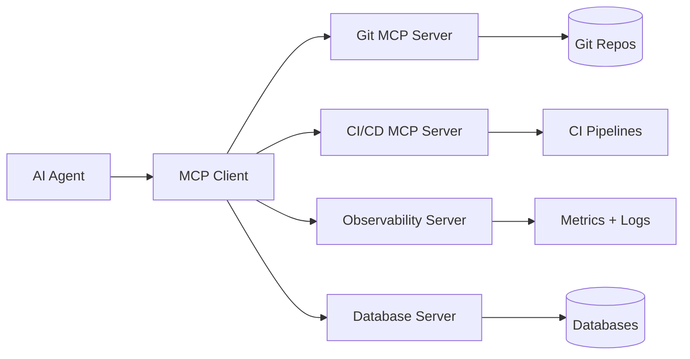

# 🔌 MCP and Tool-Use Integration Standards

  

---

## 🎯 1. Overview

The Model Context Protocol (MCP) is {Company}'s standard for exposing tools, resources, and context to AI agents. MCP provides a uniform interface that decouples agents from the specifics of underlying systems - an agent that can call an MCP server can interact with any tool without custom integration code.

> **Rule:** Every internal platform tool that agents interact with must expose an MCP server. Direct API integrations from agents to platform tools are not permitted for new development.

**Visual overview:**

---

## 📐 2. MCP Server Standards

Every MCP server at {Company} must comply with these requirements.

| Requirement | Standard |
|-------------|----------|
| **Protocol version** | MCP 1.0+ (latest stable) |
| **Transport** | stdio for local, SSE or streamable HTTP for remote |
| **Authentication** | OAuth2 bearer tokens via the agent identity provider |
| **Authorization** | Per-tool permission scoping aligned with agent trust tiers |
| **Schema** | Every tool must have a JSON Schema for inputs and outputs |
| **Idempotency** | Write operations must be idempotent or clearly documented as non-idempotent |
| **Timeout** | Maximum 30 seconds per tool invocation |
| **Audit** | Every invocation logged with agent ID, tool name, inputs, and outcome |

---

## 🔧 3. Tool Design Guidelines

| Guideline | Description |
|-----------|-------------|
| **Single responsibility** | Each tool does one thing well - do not combine unrelated operations |
| **Descriptive names** | Tool names must clearly convey their purpose (e.g., `get_service_health`, not `check`) |
| **Typed parameters** | All parameters must have types, descriptions, and validation rules |
| **Error messages** | Return actionable error messages, not stack traces or internal codes |
| **Pagination** | List operations must support pagination with cursor-based tokens |
| **Dry-run support** | Destructive operations should offer a `dry_run` parameter |

> **Rule:** Tool descriptions must be written for LLM consumption. The description is the primary way an agent decides whether and how to use the tool.

---

## 🏗️ 4. Approved MCP Servers

| MCP Server | Owner | Capabilities | Trust Tier Required |
|------------|-------|-------------|---------------------|
| **Git Operations** | Platform | Clone, diff, commit, open PR | Tier 2+ |
| **CI/CD** | Platform | Trigger builds, check status, read logs | Tier 2+ |
| **Observability** | SRE | Query metrics, search logs, list alerts | Tier 1+ |
| **Database** | Data Platform | Read-only queries against approved schemas | Tier 2+ |
| **Incident** | SRE | Read incidents, post updates, page on-call | Tier 3+ |
| **Infrastructure** | Platform | Read resource status, request scaling | Tier 3+ |
| **Feature Flags** | Platform | Read flag state, toggle flags in non-prod | Tier 2+ |

---

## 🛡️ 5. Security and Access Control

| Control | Implementation |
|---------|---------------|
| **Scoped tokens** | Each MCP server validates agent tokens against allowed scopes |
| **Read vs write** | Separate tool definitions for read and write operations |
| **Rate limiting** | Per-agent rate limits enforced at the MCP server level |
| **Input validation** | All inputs validated against JSON Schema before execution |
| **Sensitive data** | MCP servers must never return secrets, tokens, or PII in tool output |
| **Network isolation** | MCP servers run within {Company}'s internal network only |

> **Rule:** No MCP server may expose destructive operations (delete, drop, force-push) without requiring explicit human approval in the agent's workflow.

---

## 📊 6. Observability

| Metric | Target | Source |
|--------|--------|--------|
| Tool invocation count | Tracked per agent, per tool | MCP server logs |
| Invocation latency (p95) | < 5 seconds | MCP server metrics |
| Error rate | < 1% | MCP server metrics |
| Authorization denials | Tracked, alerted on spikes | MCP server logs |

---

## 🔗 7. Cross-References

- [Agent Security Model](./05-agent-security-model.md) - Agent identity and access control standards
- [Trust-Tiered Autonomy](./04-trust-tiered-autonomy.md) - Tier definitions and promotion criteria

---

⬅️ [Back to section](./README.md) · 🏠 [Back to root](../README.md)

