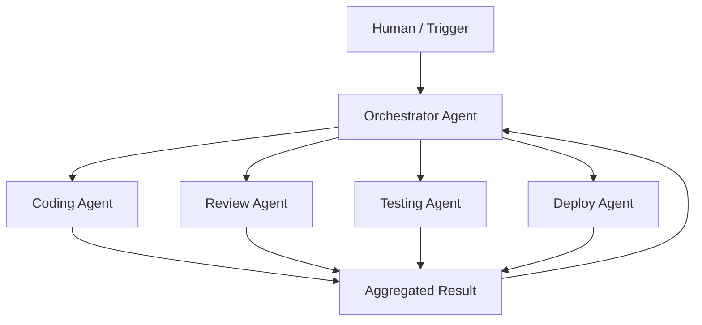

# 🤝 Multi-Agent Orchestration Patterns

  

---

## 🎯 1. Overview

Multi-agent systems decompose complex tasks across specialized agents that collaborate to produce results no single agent could achieve alone. At {Company}, multi-agent patterns are used for SDLC workflows, incident response, and cross-domain analysis. This document defines approved orchestration patterns, communication standards, and failure handling.

> **Rule:** Multi-agent workflows must have a single orchestrator agent responsible for task coordination. Peer-to-peer agent communication without an orchestrator is not permitted in production.

**Visual overview:**

---

## 🏗️ 2. Orchestration Patterns

| Pattern | Description | When to Use |
|---------|-------------|-------------|
| **Sequential pipeline** | Agents execute in order, each receiving the previous agent's output | Linear workflows - code, review, test, deploy |
| **Fan-out / fan-in** | Orchestrator sends task to multiple agents in parallel, merges results | Independent subtasks - multi-file analysis, parallel reviews |
| **Router** | Orchestrator classifies the task and routes to a specialist agent | Varied input types - support triage, incident classification |
| **Supervisor** | Orchestrator monitors agent progress and intervenes on failure | Long-running tasks requiring human-like oversight |
| **Hierarchical** | Top-level orchestrator delegates to sub-orchestrators | Complex workflows spanning multiple domains |

> **Rule:** Fan-out patterns must define a merge strategy before execution. "Concatenate all outputs" is not a valid merge strategy.

---

## 📡 3. Agent Communication Standards

| Requirement | Standard |
|-------------|----------|
| **Message format** | Structured JSON with schema validation |
| **Task envelope** | Every message includes `task_id`, `agent_id`, `timestamp`, and `parent_task_id` |
| **Result format** | Standardized result object with `status`, `output`, `errors`, and `metadata` |
| **Context passing** | Shared context passed via explicit parameters, not implicit shared state |
| **Timeout** | Each agent invocation has a maximum timeout (default: 5 minutes) |
| **Cancellation** | Orchestrator can cancel in-flight agent tasks via cancellation token |

---

## ⚠️ 4. Failure Handling

| Failure Mode | Handling Strategy |
|-------------|-------------------|
| **Agent timeout** | Retry once with extended timeout, then fail the subtask and notify orchestrator |
| **Agent error** | Log error with context, retry if idempotent, escalate to human if retry fails |
| **Partial failure** | Orchestrator decides whether partial results are acceptable or full retry is needed |
| **Cascading failure** | Circuit breaker at orchestrator level - stop dispatching after 3 consecutive failures |
| **Conflicting results** | Orchestrator applies conflict resolution strategy (e.g., majority vote, human tiebreak) |

> **Rule:** Every multi-agent workflow must define its failure mode before deployment. "Retry forever" and "ignore errors" are not acceptable strategies.

---

## 🔒 5. Security Constraints

| Constraint | Rationale |
|-----------|-----------|
| Each agent runs with its own scoped identity | Prevents privilege escalation through agent chaining |
| Orchestrator cannot grant agents higher privileges than it holds | Least privilege propagation |
| Cross-agent data is validated at each boundary | Prevents prompt injection through agent-to-agent messages |
| All agent-to-agent communication is logged | Full audit trail for multi-agent workflows |
| Human approval gates required for Tier 3+ operations | Preserves human oversight on high-risk actions |

See [Agent Security Model](./05-agent-security-model.md) for identity and access control details.

---

## 📊 6. Observability

| Metric | Target | Source |
|--------|--------|--------|
| Workflow completion rate | > 95% | Orchestrator logs |
| Agent invocation latency (p95) | < 60 seconds per agent | Agent metrics |
| Human escalation rate | < 10% of workflows | Orchestrator logs |
| End-to-end workflow latency | < 10 minutes for SDLC workflows | Orchestrator metrics |
| Cost per workflow | Tracked per workflow type | LLM gateway + infra costs |

---

## 🔗 7. Cross-References

- [Trust-Tiered Autonomy](./04-trust-tiered-autonomy.md) - Tier definitions governing agent autonomy
- [Agent Security Model](./05-agent-security-model.md) - Agent identity, access control, and audit

---

⬅️ [Back to section](./README.md) · 🏠 [Back to root](../README.md)

