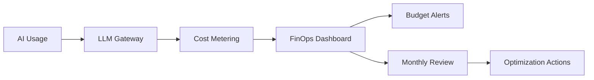

# 💰 AI FinOps

  

---

## 🎯 1. Overview

AI workloads - LLM inference, model training, vector search, and agent orchestration - introduce cost patterns that traditional cloud FinOps does not cover. Token-based pricing, GPU compute, and per-call API costs can scale rapidly without visibility. This document defines {Company}'s framework for AI cost optimization, budgeting, and accountability.

> **Rule:** Every AI workload must have a cost owner, a monthly budget, and automated alerting at 80% and 100% of budget.

**Visual overview:**

---

## 📊 2. Cost Categories

| Category | Cost Driver | Measurement Unit |
|----------|------------|-----------------|
| **LLM inference** | Token consumption (input + output) | Cost per 1M tokens |
| **Embedding generation** | Embedding API calls | Cost per 1M tokens |
| **Vector database** | Storage + query volume | Cost per GB + cost per query |
| **Model training** | GPU hours | Cost per GPU-hour |
| **Agent orchestration** | Multi-step LLM calls per workflow | Cost per workflow execution |
| **Fine-tuning** | Training tokens + GPU hours | Cost per training run |

---

## 🏷️ 3. Cost Tagging Standards

Every AI resource and API call must carry these cost allocation tags.

| Tag | Description | Example |
|-----|-------------|---------|
| `team` | Owning team | `platform-engineering` |
| `service` | Calling service or application | `support-bot` |
| `environment` | Deployment environment | `production`, `staging` |
| `model` | Model identifier | `gpt-4o`, `claude-haiku` |
| `use_case` | Business use case | `code-review`, `doc-search` |
| `cost_center` | Finance cost center | `eng-ai-platform` |

> **Rule:** API calls to the LLM gateway without valid cost tags are rejected. No untagged AI spend is permitted.

---

## 💡 4. Optimization Strategies

| Strategy | Savings Potential | Implementation |
|----------|------------------|----------------|
| **Model right-sizing** | 50 - 90% | Use mid-tier models for simple tasks, foundation models only when needed |
| **Prompt optimization** | 20 - 40% | Reduce prompt length, remove redundant context, use structured output |
| **Caching** | 30 - 70% | Cache identical or semantically similar queries at the gateway |
| **Batching** | 10 - 30% | Batch embedding and classification requests |
| **Spot instances for training** | 50 - 70% | Use spot/preemptible GPUs for training jobs > 2 hours |
| **Token budgets** | Prevents runaway | Set per-request and per-service token limits |

---

## 📈 5. Budget and Alerting

| Threshold | Action |
|-----------|--------|
| 50% of monthly budget consumed | Informational notification to team lead |
| 80% of monthly budget consumed | Warning alert to team lead and FinOps |
| 100% of monthly budget consumed | Escalation to engineering manager; requests throttled to essential only |
| 120% of monthly budget consumed | VP Engineering approval required for continued spend |

| Review Cadence | Participants | Focus |
|---------------|-------------|-------|
| Weekly | Team lead + AI Platform | Usage trends, anomaly detection |
| Monthly | Engineering leads + FinOps | Budget vs actual, optimization opportunities |
| Quarterly | VP Engineering + CTO | Strategic AI spend, ROI assessment |

---

## 📋 6. Unit Economics

Teams must track AI cost as a function of business value, not just raw spend.

| Metric | Formula | Target |
|--------|---------|--------|
| Cost per AI-assisted PR | Total AI spend / PRs with AI assistance | Track trend, reduce quarterly |
| Cost per support resolution | AI support cost / tickets resolved by AI | < human agent cost |
| Cost per search query | RAG pipeline cost / search queries served | < $0.01 per query |
| Training ROI | Model improvement value / training cost | > 3x within 6 months |

> **Rule:** Teams must demonstrate positive ROI for AI workloads exceeding $1,000/month within two quarters, or the workload is subject to decommissioning review.

---

## 🔗 7. Cross-References

- [FinOps](../04-infrastructure-and-cloud/05-finops.md) - Cloud cost management and optimization practices
- [AI Governance](../10-ai-ml-platform/02-ai-governance.md) - Approved AI tools and usage policies

---

⬅️ [Back to section](./README.md) · 🏠 [Back to root](../README.md)

