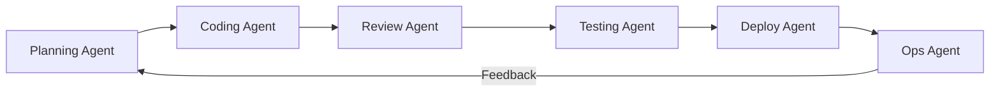

# 🤖 SDLC Agent Blueprint

  

---

## 🎯 1. Overview

The SDLC Agent Blueprint defines how AI agents are deployed across the software delivery lifecycle at {Company}. Each agent has a defined scope, trust tier, tools, and human escalation path. This blueprint serves as the reference architecture for teams building or adopting SDLC agents.

> **Rule:** Every SDLC agent must be registered in the agent catalog with its scope, trust tier, and owner before production deployment.

**Visual overview:**

---

## 🗂️ 2. Agent Catalog

| Agent | SDLC Phase | Trust Tier | Owner |
|-------|-----------|------------|-------|
| **Planning Agent** | Discovery | Tier 1 | Product Engineering |
| **Coding Agent** | Development | Tier 2 - 3 | Platform Engineering |
| **Review Agent** | Code Review | Tier 2 | Platform Engineering |
| **Testing Agent** | Testing | Tier 2 - 3 | Platform Engineering |
| **Deploy Agent** | Deployment | Tier 2 - 3 | SRE |
| **Ops Agent** | Operations | Tier 1 - 2 | SRE |
| **Documentation Agent** | Documentation | Tier 3 | Platform Engineering |

---

## 📐 3. Agent Specifications

### Planning Agent

| Attribute | Value |
|-----------|-------|
| **Scope** | Generate user stories, acceptance criteria, gap analysis |
| **Inputs** | Feature descriptions, existing tickets, domain context |
| **Outputs** | Draft user stories, risk assessments |
| **Escalation** | All output is draft - product manager approves |
| **Tools** | Issue tracker (read/write), manifesto search |

### Coding Agent

| Attribute | Value |
|-----------|-------|
| **Scope** | Implement features, fix bugs, refactor code |
| **Inputs** | Ticket context, repository code, AGENTS.md, cursor rules |
| **Outputs** | Code changes as PRs |
| **Escalation** | Security-sensitive code, architecture changes |
| **Tools** | Git, IDE, CI/CD, test runners |

### Review Agent

| Attribute | Value |
|-----------|-------|
| **Scope** | Automated code review for style, bugs, security patterns |
| **Inputs** | PR diff, repository standards, review guidelines |
| **Outputs** | Review comments and suggestions |
| **Escalation** | Final approval is always human |
| **Tools** | Git, static analysis, linters |

---

## 🔄 4. Orchestration Model

SDLC agents can be composed into automated pipelines or invoked independently.

| Mode | Description | Use Case |
|------|-------------|----------|
| **Independent** | Single agent invoked for a specific task | Human triggers coding agent for a bug fix |
| **Pipeline** | Sequential agent chain triggered by events | PR opened triggers review, then test, then deploy |
| **Supervised** | Orchestrator coordinates agents with human checkpoints | Complex feature development with architecture review |

> **Rule:** Pipeline mode requires at least one human approval gate before production deployment. Fully autonomous end-to-end pipelines are not permitted without VP Engineering approval.

---

## 📊 5. Agent Performance Metrics

| Metric | Target | Measurement |
|--------|--------|-------------|
| Task completion rate | > 90% | Tasks completed without human takeover |
| Review comment accuracy | > 85% | Review comments accepted by human reviewer |
| Test generation coverage | > 70% | Agent-generated tests covering meaningful behavior |
| Time to first PR | < 30 minutes | Time from task assignment to PR creation |
| Human override rate | < 15% | Tasks where human overrides agent output |
| Security incident rate | 0 | Agent-caused security incidents |

---

## 🛡️ 6. Guardrails

| Guardrail | Enforcement |
|-----------|-------------|
| No agent may modify production infrastructure without human approval | Deploy agent requires Tier 3+ and approval gate |
| Agent-generated code must pass all CI checks | CI pipeline is mandatory, no bypass |
| Agents must not access data outside their scoped permissions | MCP server enforces access control |
| Agent actions must be fully auditable | All actions logged with agent identity |
| Agents must respect repository-level AGENTS.md rules | Agent runtime enforces AGENTS.md constraints |

---

## 🔗 7. Cross-References

- [AI-Assisted SDLC](./02-ai-assisted-sdlc.md) - Per-phase AI integration patterns and guardrails
- [Trust-Tiered Autonomy](./04-trust-tiered-autonomy.md) - Tier definitions and promotion criteria
- [Agent Security Model](./05-agent-security-model.md) - Identity, access control, and audit
- [Context Engineering](./01-context-engineering.md) - Structuring context for agent consumption

---

⬅️ [Back to section](./README.md) · 🏠 [Back to root](../README.md)

