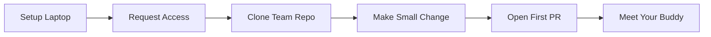

# 🚀 New Joiner Onboarding Guide

  

Welcome to {Company} engineering! This is your single starting page. Everything you need to get productive - from laptop setup to your first PR to going on-call - is linked from here. If something is missing or confusing, open a PR against this file. Making onboarding better is one of the most impactful things you can do.

---

## 📑 Table of Contents

1. [Day 1 Checklist](#1-day-1-checklist)
2. [Access Requests](#2-access-requests)
3. [Minimum Viable Manifesto](#3-minimum-viable-manifesto)
4. [Week 1-4 Milestones](#4-week-14-milestones)
5. [How to Disagree](#5-how-to-disagree)
6. [Help Channels](#6-help-channels)
7. [Key References](#7-key-references)

---

## ✅ 1. Day 1 Checklist

- [ ] **Laptop setup** - Run the bootstrap script:
  ```bash
  curl -fsSL https://setup.internal.{company}.com/setup.sh | bash
  ```
  This installs Homebrew, Node.js, Docker, AWS CLI, kubectl, and clones the golden-path template repos. Takes ~30 minutes.

- [ ] **Meet your onboarding buddy** - Your manager has assigned a buddy who will be your go-to person for the first month. Reach out on Slack to say hello and schedule a 30-minute intro chat.

- [ ] **Join Slack channels** - Your buddy will invite you to the relevant channels. At minimum, join `#engineering`, `#your-team-name`, `#incidents`, and `#platform-support`.

- [ ] **Set up 2FA** - Enable two-factor authentication on GitHub, AWS SSO, and Jira before the end of day 1. This is a security requirement.

- [ ] **Read this onboarding guide** - You're doing it right now. Keep going.

**Visual overview:**



---

## 🔑 2. Access Requests

Request access to the following systems on day 1. Your manager or buddy can help if you get stuck.

| System | Purpose | How to Request | Approver | SLA |
|--------|---------|---------------|----------|-----|
| **GitHub** | Source code, PRs, CI | IT self-service portal | Manager (auto-approved for eng) | < 1 hour |
| **AWS SSO** | Cloud console and CLI | IT self-service portal | Manager + Security team | < 4 hours |
| **Jira** | Issue tracking, sprint boards | IT self-service portal | Manager (auto-approved) | < 1 hour |
| **PagerDuty** | On-call schedules, incident response | Request in `#platform-support` | Team lead | < 1 business day |
| **Slack** | Team communication | Auto-provisioned on day 1 | N/A | Immediate |
| **LaunchDarkly** | Feature flags | Request in `#platform-support` | Team lead | < 1 business day |
| **Backstage** | Service catalog, golden path templates | Auto-provisioned via SSO | N/A | Immediate |
| **Grafana** | Dashboards, metrics, alerting | Auto-provisioned via SSO | N/A | Immediate |
| **Sentry** | Error tracking | Request in `#platform-support` | Team lead | < 1 business day |
| **BrowserStack** | Mobile device testing | Request in `#platform-support` | QA Platform team | < 1 business day |

If any access request takes longer than the SLA, escalate in `#platform-support` and tag your manager.

---

## 📚 3. Minimum Viable Manifesto

You don't need to read the entire manifesto in your first week. Here's a prioritized reading order.

### Read in Week 1

These five documents give you the essential context to start contributing:

| # | Document | Why |
|---|----------|-----|
| 1 | [README.md](./README.md) | The big picture - principles, platform overview, team structure |
| 2 | [01-tech-stack.md](./01-platform-standards/01-tech-stack.md) | What languages, frameworks, and tools we use and why |
| 3 | [05-git-workflow.md](./03-engineering-practices/05-git-workflow.md) | How we branch, commit, and merge - your daily workflow |
| 4 | [06-code-review-guide.md](./03-engineering-practices/06-code-review-guide.md) | How to give and receive PR feedback |
| 5 | [02-golden-path.md](./06-developer-guides/02-golden-path.md) | The "right way" to create a new service or feature |

### Read in Week 2

These documents deepen your understanding of how we build and ship:

| # | Document | Why |
|---|----------|-----|
| 6 | [01-testing-pyramid.md](./03-engineering-practices/01-testing-pyramid.md) | Our testing philosophy and required coverage |
| 7 | [02-ci-practices.md](./03-engineering-practices/02-ci-practices.md) | How CI pipelines work and what gates your PR must pass |
| 8 | [03-cd-practices.md](./03-engineering-practices/03-cd-practices.md) | How code gets from main to production |
| 9 | [04-coding-standards.md](./03-engineering-practices/04-coding-standards.md) | Naming, error handling, code style |
| 10 | [03-security.md](./04-infrastructure-and-cloud/03-security.md) | Security baseline every engineer must know |

### Reference When Needed

Everything else in the manifesto is **reference material**. Consult it when you're working on something related:

- **Mobile?** → [09-mobile-and-frontend/](./09-mobile-and-frontend/)
- **Infrastructure?** → [04-infrastructure-and-cloud/](./04-infrastructure-and-cloud/)
- **Data or Kafka?** → [06-developer-guides/](./06-developer-guides/)
- **Incident response?** → [05-operational-excellence/](./05-operational-excellence/)
- **AI/ML products?** → [10-ai-ml-platform/](./10-ai-ml-platform/)
- **Working with AI tools?** → [12-ai-engineering/](./12-ai-engineering/)
- **Building an agent-native org?** → [Agent-Native by Design](./README.md#-agent-native-by-design)
- **Acronym you don't recognize?** → [GLOSSARY.md](./GLOSSARY.md)

### Onboarding AI Agents

If your organization operates AI agents as first-class engineering participants, agents need onboarding too. This checklist complements (not replaces) the human onboarding above.

| Step | What | How |
|:-----|:-----|:----|
| **Identity** | Create a dedicated service account or GitHub App for the agent | IT self-service portal or GitHub org settings. Never share a human engineer's credentials with an agent |
| **Repository access** | Grant the agent read/write access scoped to its team's repositories | GitHub team membership or fine-grained PAT |
| **Context files** | Ensure every repo the agent operates in has `AGENTS.md` and `.cursor/rules/` | See [Context Engineering](./12-ai-engineering/01-context-engineering.md) |
| **CI identity** | Configure the agent's commits and PRs to use the service account identity | Git config in the agent's environment: `user.name` and `user.email` |
| **Human approval gates** | Define which actions the agent may perform autonomously and which require human approval | At minimum: merges to main, production deploys, infrastructure changes, and security-sensitive code require human sign-off |
| **Manifesto as context** | Index the manifesto into the agent's context (RAG, system prompt, or tool retrieval) | The agent should follow the same standards as human engineers |

> **Rule:** Agent-opened PRs are held to the same review and CI gate standards as human PRs. "An agent wrote this" does not reduce the review bar.

---

## 🏁 4. Week 1-4 Milestones

Use this table to track your progress. Share it with your buddy and manager in your weekly 1:1.

| Week | Milestones | How You Know You're Done |
|------|-----------|------------------------|
| **Week 1** | Laptop fully set up via `setup.sh` · First PR opened (even a typo fix counts) · One service running locally · Met buddy and team | You can run `make setup`, `make up`, `make seed`, and `make run` on your team's service and see it respond on localhost |
| **Week 2** | First feature PR merged · Attended sprint ceremonies (standup, planning, retro) · Completed security orientation (30-min self-paced module) | Your code is in `main` and you've participated in a sprint cycle |
| **Week 3** | Shadowed an on-call shift (observe, don't respond) · Completed a domain deep-dive session with your tech lead · Read your team's service documentation in Backstage | You can explain your team's service architecture and its dependencies to your buddy |
| **Week 4** | Eligible for solo on-call (added to PagerDuty rotation) · Buddy graduation (final sync, feedback exchange) · Completed onboarding feedback survey | You're comfortable responding to a P3/P4 alert independently and your buddy confirms readiness |

### If You're Falling Behind

It's completely normal for some milestones to slip. If you're blocked:

1. Tell your buddy - that's what they're there for.
2. Raise it in your 1:1 with your manager.
3. Post in `#platform-support` if it's a tooling or access issue.

---

## 💬 5. How to Disagree

{Company} engineering values **constructive disagreement**. If you think a standard in this manifesto is wrong, outdated, or doesn't apply to your situation, here's how to push back:

1. **Start a conversation** - Post in `#engineering-discussions` on Slack or bring it up in the **Architecture Clinic** (bi-weekly, Thursdays). Get a feel for whether others share your perspective.

2. **Write it down** - If there's support for the change, open a PR against the relevant manifesto file with your proposed change and a clear rationale in the description.

3. **Get review** - PRs to the manifesto require at least **one Staff Engineer** approval. Significant changes (new standards, removal of existing ones) go through the Architecture Clinic for group discussion.

4. **Don't go rogue** - While your PR is in review, follow the existing standard. Consistency matters more than any individual preference.

> "Strong opinions, weakly held" - It's okay to feel strongly. It's also okay to change your mind when presented with better information.

---

## 📞 6. Help Channels

| Channel | What It's For | Response Time |
|---------|-------------|--------------|
| `#platform-support` | Tooling issues, CI failures, infra questions, access requests | < 4 hours (business hours) |
| `#frontend-guild` | Web and React Native questions, design system help | Best-effort, usually < 1 day |
| `#backend-guild` | Backend framework, API design, data layer questions | Best-effort, usually < 1 day |
| `#security` | Security questions, vulnerability reports, compliance | < 4 hours for security concerns |
| `#incidents` | Active incident communication (read-only unless you're responding) | Real-time during incidents |
| `#engineering-discussions` | RFCs, architecture debates, manifesto change proposals | Async, check weekly |
| Your team channel | Day-to-day team communication | Real-time |

---

## 📌 7. Key References

| Resource | Link |
|----------|------|
| Platform Manifesto (this repo) | [README.md](./README.md) |
| Glossary | [GLOSSARY.md](./GLOSSARY.md) |
| Backstage Service Catalog | `https://backstage.internal.{company}.com` |
| Grafana Dashboards | `https://grafana.internal.{company}.com` |
| PagerDuty | `https://{company}.pagerduty.com` |
| IT Self-Service Portal | `https://it.internal.{company}.com` |

---
<div align="center">

🏠 [Back to root](./README.md)

</div>
