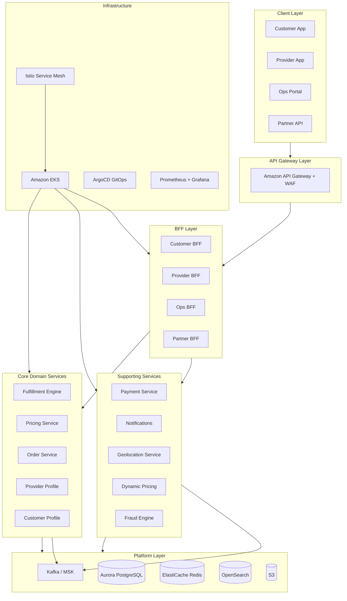
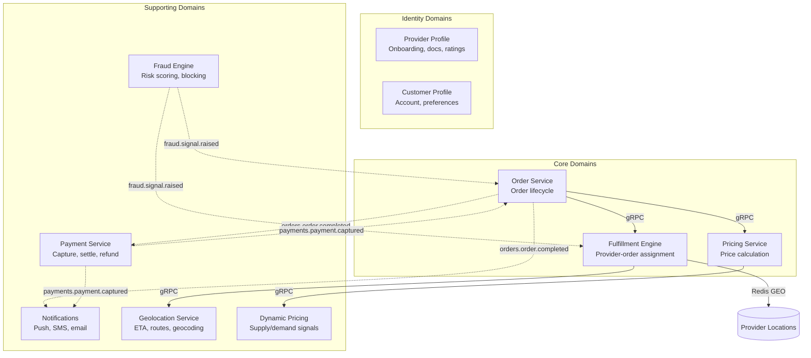

# 🏗️ {Company} Platform Engineering Manifesto

### The operating system for how we build software.

**One manifesto. 83 documents. Every decision you shouldn't have to make twice.**

*Opinionated by design. When in doubt, follow it. When you disagree, raise a PR.*

---

## 🤔 Why This Exists

Every hour an engineer spends debating *"which database should I use?"* or *"how do I structure this service?"* is an hour not spent solving customer problems. This manifesto exists to **eliminate that tax**.

It is the **single source of truth** for our engineering platform - the standards, practices, tools, and architecture every team is expected to adopt. Consistency compounds: every shared decision here is one fewer decision each team makes alone.

> 📖 This is a **living document**. It evolves as our platform matures, as industry practices shift, and as we learn from running systems in production. All changes require a PR with at least one Staff Engineer approval.

---

## 🧭 Where Do I Start?

| You are... | Start here | Then explore |
|:-----------|:-----------|:-------------|
| 🆕 **Day 1 new joiner** | [`ONBOARDING.md`](./ONBOARDING.md) | Tech stack → Golden Path → Git workflow |
| ⚙️ **Backend engineer** | [Spring Boot Standards](03-engineering-practices/09-spring-boot-standards.md) | Architecture, Kafka, Caching, Testing |
| 🌐 **Frontend engineer** | [Web Frontend Standards](09-mobile-and-frontend/02-web-frontend-standards.md) | Frontend CI/CD, Design System |
| 📱 **Mobile engineer** | [Mobile Standards](09-mobile-and-frontend/01-mobile-standards.md) | Android / iOS / React Native guides |
| 🏛️ **Tech lead** | [System Architecture](02-architecture-and-api/01-system-architecture.md) | Service Decomposition, Team Topology |
| 👥 **Engineering manager** | [Engineering Management](07-ways-of-working/09-engineering-management.md) | Ladder, Metrics, Product Ops |
| 🔥 **On-call and panicking** | [Incident Management](05-operational-excellence/04-incident-management.md) | Debugging Guide, DR Playbook |
| 🎨 **Designer** | [Design System](09-mobile-and-frontend/06-design-system.md) | Web Frontend, Mobile Standards |
| 📊 **Product manager** | [Product Operations](07-ways-of-working/10-product-operations.md) | A/B Testing, Engineering Metrics |
| 🔒 **Security engineer** | [Security Operations](04-infrastructure-and-cloud/10-security-operations.md) | Security Standards, Privacy Engineering |

> 💡 Don't know a term? Check the [**Glossary**](./GLOSSARY.md).

---

## 🎯 The 8 Principles

These aren't aspirations. They're constraints. Every technical decision in this manifesto traces back to one of these.

| | Principle | In Practice |
|:-:|-----------|-------------|
| 🛤️ | **Pave the golden path** | Make the right way the easy way. Teams feel *pulled* toward standards, not pushed. |
| 📦 | **Ship artifacts, not code** | The same container image built in CI runs in production. Never rebuild between environments. |
| 👁️ | **Observable by default** | Logs, metrics, and traces ship from day one. Observability is not a retrofit. |
| 🔒 | **Own your data, respect boundaries** | Services own their data stores. Cross-service DB access is forbidden. No exceptions. |
| 📝 | **Everything in Git** | Infrastructure, config, runbooks, ADRs. If it's not in Git, it doesn't exist. |
| 🤖 | **Automate the boring** | Pipelines handle repetition. Humans handle architecture and product problems. |
| 💥 | **Design for failure** | Every dependency will fail. Circuit breakers, retries, fallbacks, graceful degradation. |
| 🛡️ | **Security is not a phase** | It runs in every pipeline, in every environment, from the first commit. |

---

## 🗺️ Platform at a Glance

---

## 📚 What's Inside

**87 documents** across 11 sections. Click any section to expand.

<b>📐 01 - Platform Standards</b> &nbsp;·&nbsp; <i>What we build with and how we name things</i> &nbsp;·&nbsp; <code>5 docs</code>

 

The approved tech stack, naming conventions, repository structure, service catalog, and container standards. The foundation everything else builds on.

| File | What You'll Learn |
|------|-------------------|
| [`01-tech-stack.md`](01-platform-standards/01-tech-stack.md) | Java 21, Spring Boot 3, React, React Native, AWS services, and why we chose them |
| [`02-naming-conventions.md`](01-platform-standards/02-naming-conventions.md) | How to name everything - services, repos, packages, topics, buckets, metrics, flags |
| [`03-repository-standards.md`](01-platform-standards/03-repository-standards.md) | Required files, README template, branch protection, PR template, repo lifecycle |
| [`04-service-catalog.md`](01-platform-standards/04-service-catalog.md) | Backstage catalog-info.yaml spec, lifecycle states, scorecards, ownership |
| [`05-container-standards.md`](01-platform-standards/05-container-standards.md) | Base images, Dockerfile standards, tagging, size limits, signing, ECR |

<b>🏛️ 02 - Architecture & API</b> &nbsp;·&nbsp; <i>How the system fits together</i> &nbsp;·&nbsp; <code>9 docs</code>

 

Domain decomposition, communication patterns, API contracts, event schemas, and the error catalog.

| File | What You'll Learn |
|------|-------------------|
| [`01-system-architecture.md`](02-architecture-and-api/01-system-architecture.md) | Domain map, event backbone, BFF pattern, resilience ownership matrix |
| [`02-api-standards.md`](02-architecture-and-api/02-api-standards.md) | URL design, versioning, error shapes, pagination, rate limiting, idempotency |
| [`03-hexagonal-architecture.md`](02-architecture-and-api/03-hexagonal-architecture.md) | Ports & adapters with a full worked example you can copy |
| [`04-real-time-architecture.md`](02-architecture-and-api/04-real-time-architecture.md) | WebSocket, SSE, push notifications, and location streaming |
| [`05-grpc-standards.md`](02-architecture-and-api/05-grpc-standards.md) | Proto conventions, code generation, load balancing, cancellation |
| [`06-saga-patterns.md`](02-architecture-and-api/06-saga-patterns.md) | Distributed transactions, choreography, compensation patterns |
| [`07-service-decomposition.md`](02-architecture-and-api/07-service-decomposition.md) | When to split or merge services, with a decision framework |
| [`08-event-schema-evolution.md`](02-architecture-and-api/08-event-schema-evolution.md) | Avro compatibility rules, partition keys, and the breaking change playbook |
| [`09-error-catalog.md`](02-architecture-and-api/09-error-catalog.md) | Central error registry, exception handling, and frontend error boundaries |

<b>⚙️ 03 - Engineering Practices</b> &nbsp;·&nbsp; <i>How we write and ship code</i> &nbsp;·&nbsp; <code>11 docs</code>

 

The day-to-day craft. Testing, CI/CD, code review, coding standards, and the Spring Boot platform.

| File | What You'll Learn |
|------|-------------------|
| [`01-testing-pyramid.md`](03-engineering-practices/01-testing-pyramid.md) | Unit, integration, contract, E2E, load tests - with worked examples |
| [`02-ci-practices.md`](03-engineering-practices/02-ci-practices.md) | GitHub Actions pipelines, quality gates, DAST, Terraform testing |
| [`03-cd-practices.md`](03-engineering-practices/03-cd-practices.md) | GitOps, canary deployments, feature flags, change risk rubric |
| [`04-coding-standards.md`](03-engineering-practices/04-coding-standards.md) | Naming, error handling, null safety - with before/after examples |
| [`05-git-workflow.md`](03-engineering-practices/05-git-workflow.md) | Trunk-based dev in practice |
| [`06-code-review-guide.md`](03-engineering-practices/06-code-review-guide.md) | How to give and receive feedback that makes code better |
| [`07-ab-testing.md`](03-engineering-practices/07-ab-testing.md) | Experiment design, statistical rigor, guardrails, product analytics |
| [`08-deprecation-lifecycle.md`](03-engineering-practices/08-deprecation-lifecycle.md) | How we sunset APIs, events, services, and flags |
| [`09-spring-boot-standards.md`](03-engineering-practices/09-spring-boot-standards.md) | Logging, config, health checks, LaunchDarkly, virtual threads, versioning |
| [`10-frontend-ci-cd.md`](03-engineering-practices/10-frontend-ci-cd.md) | Frontend golden path, monorepo structure, preview environments |
| [`11-qa-standards.md`](03-engineering-practices/11-qa-standards.md) | Test environments, test data, bug triage severity, device matrix |

<b>☁️ 04 - Infrastructure & Cloud</b> &nbsp;·&nbsp; <i>The platform under the platform</i> &nbsp;·&nbsp; <code>10 docs</code>

 

AWS architecture, security, FinOps, multi-tenancy, and everything Terraform.

| File | What You'll Learn |
|------|-------------------|
| [`01-cloud-architecture.md`](04-infrastructure-and-cloud/01-cloud-architecture.md) | AWS accounts, VPC topology, EKS, Aurora, MSK, backup & restore |
| [`02-infra-components.md`](04-infrastructure-and-cloud/02-infra-components.md) | Istio, Backstage, ArgoCD, ECR - and the self-service boundaries |
| [`03-security.md`](04-infrastructure-and-cloud/03-security.md) | Shift-left security, IAM/IRSA, PII handling, KMS, egress control |
| [`04-configuration-management.md`](04-infrastructure-and-cloud/04-configuration-management.md) | Secrets vs config vs flags - what lives where |
| [`05-finops.md`](04-infrastructure-and-cloud/05-finops.md) | Cost allocation, rightsizing, reservations, real-time cost visibility |
| [`06-capacity-planning.md`](04-infrastructure-and-cloud/06-capacity-planning.md) | Demand modeling, pre-scaling, load test-driven validation |
| [`07-api-gateway-strategy.md`](04-infrastructure-and-cloud/07-api-gateway-strategy.md) | API Gateway configuration, routing, throttling, WAF |
| [`08-privacy-engineering.md`](04-infrastructure-and-cloud/08-privacy-engineering.md) | GDPR, PCI, SOC 2, ISO 27001, anonymization, consent |
| [`09-multi-tenancy.md`](04-infrastructure-and-cloud/09-multi-tenancy.md) | Data isolation patterns, noisy-neighbor controls, tenant-aware observability |
| [`10-security-operations.md`](04-infrastructure-and-cloud/10-security-operations.md) | Threat modeling, SIEM, pen testing, SBOM, bug bounty, PAM |

<b>🚨 05 - Operational Excellence</b> &nbsp;·&nbsp; <i>Keeping it running</i> &nbsp;·&nbsp; <code>9 docs</code>

 

Observability, resilience, incidents, chaos engineering, and what to do when things break.

| File | What You'll Learn |
|------|-------------------|
| [`01-observability-standards.md`](05-operational-excellence/01-observability-standards.md) | Logging, metrics, tracing, SLOs, error budgets, alert hygiene |
| [`02-observability-in-practice.md`](05-operational-excellence/02-observability-in-practice.md) | Step-by-step: structured logging, correlation IDs, Prometheus, tracing |
| [`03-resilience-patterns.md`](05-operational-excellence/03-resilience-patterns.md) | Circuit breaker, retry, timeout, bulkhead - Resilience4j worked examples |
| [`04-incident-management.md`](05-operational-excellence/04-incident-management.md) | Response playbook, on-call structure, PIR template, change management |
| [`05-load-shedding.md`](05-operational-excellence/05-load-shedding.md) | Priority tiers, backpressure, graceful degradation, auto-remediation |
| [`06-chaos-engineering.md`](05-operational-excellence/06-chaos-engineering.md) | Fault injection, game days, resilience validation |
| [`07-disaster-recovery-playbook.md`](05-operational-excellence/07-disaster-recovery-playbook.md) | Region failover, failback, DNS strategy, rollback SLAs |
| [`08-testing-in-production.md`](05-operational-excellence/08-testing-in-production.md) | Synthetic monitoring, traffic mirroring, dark launches |
| [`09-debugging-guide.md`](05-operational-excellence/09-debugging-guide.md) | How to debug locally, in staging, and in production - with real queries |

<b>🛠️ 06 - Developer Guides</b> &nbsp;·&nbsp; <i>Hands-on playbooks</i> &nbsp;·&nbsp; <code>10 docs</code>

 

The guides you keep open while writing code.

| File | What You'll Learn |
|------|-------------------|
| [`01-developer-experience.md`](06-developer-guides/01-developer-experience.md) | Local setup, onboarding milestones, buddy program, documentation standards |
| [`02-golden-path.md`](06-developer-guides/02-golden-path.md) | Scaffold to production in one walkthrough |
| [`03-database-migrations.md`](06-developer-guides/03-database-migrations.md) | Flyway, expand-contract, large table migrations |
| [`04-kafka-patterns.md`](06-developer-guides/04-kafka-patterns.md) | Producers, consumers, DLQ, idempotency, topic creation, DLQ replay |
| [`05-data-platform.md`](06-developer-guides/05-data-platform.md) | CDC, Redshift conventions, Airflow orchestration, data access controls |
| [`06-multi-region-patterns.md`](06-developer-guides/06-multi-region-patterns.md) | Region config, i18n, localization, UX writing |
| [`07-distributed-locking.md`](06-developer-guides/07-distributed-locking.md) | Optimistic locking, Redis locks, preventing double-assignment |
| [`08-cache-patterns.md`](06-developer-guides/08-cache-patterns.md) | Cache-aside, TTL, event-driven invalidation, Caffeine, stampede prevention |
| [`09-data-governance.md`](06-developer-guides/09-data-governance.md) | Data stewards, quality SLAs, retention matrices, analytics contracts |
| [`10-local-development.md`](06-developer-guides/10-local-development.md) | Docker Compose, database seeding, your first PR |

<b>🤝 07 - Ways of Working</b> &nbsp;·&nbsp; <i>How we work together</i> &nbsp;·&nbsp; <code>10 docs</code>

 

Team structure, decision-making, hiring, career growth, and knowledge sharing.

| File | What You'll Learn |
|------|-------------------|
| [`01-team-topology.md`](07-ways-of-working/01-team-topology.md) | Stream-aligned teams, platform team, inner source, tech debt registry |
| [`02-engineering-ladder.md`](07-ways-of-working/02-engineering-ladder.md) | Engineer I to Principal - expectations at every level |
| [`03-open-source-policy.md`](07-ways-of-working/03-open-source-policy.md) | License compliance, contribution guidelines |
| [`04-product-engineering.md`](07-ways-of-working/04-product-engineering.md) | PM-engineering collaboration, discovery, rituals, user stories |
| [`05-rfc-process.md`](07-ways-of-working/05-rfc-process.md) | How to propose cross-cutting changes |
| [`06-technology-radar.md`](07-ways-of-working/06-technology-radar.md) | How we evaluate and adopt new technology |
| [`07-hiring-standards.md`](07-ways-of-working/07-hiring-standards.md) | Interview loop, rubrics, bar-raiser, bias mitigation |
| [`08-knowledge-sharing.md`](07-ways-of-working/08-knowledge-sharing.md) | Guilds, tech talks, architecture clinics |
| [`09-engineering-management.md`](07-ways-of-working/09-engineering-management.md) | 1:1s, reviews, team health, headcount, career development |
| [`10-product-operations.md`](07-ways-of-working/10-product-operations.md) | Roadmap, OKRs, launch management, customer feedback loops |

<b>📈 08 - Program</b> &nbsp;·&nbsp; <i>Where we are and where we're going</i> &nbsp;·&nbsp; <code>5 docs</code>

 

Maturity assessment, migration roadmap, metrics, and vendor management.

| File | What You'll Learn |
|------|-------------------|
| [`01-maturity-model.md`](08-program/01-maturity-model.md) | Self-assessment rubric - L0 to L4 across 11 dimensions |
| [`02-migration-roadmap.md`](08-program/02-migration-roadmap.md) | Phased migration program, DORA targets, risk register |
| [`03-vendor-assessment.md`](08-program/03-vendor-assessment.md) | AWS lock-in analysis, portability, exit costs |
| [`04-engineering-metrics.md`](08-program/04-engineering-metrics.md) | What we measure, what we don't, and why |
| [`05-vendor-intake.md`](08-program/05-vendor-intake.md) | How to evaluate and onboard new SaaS tools |

<b>📱 09 - Mobile & Frontend</b> &nbsp;·&nbsp; <i>What users actually see and touch</i> &nbsp;·&nbsp; <code>6 docs</code>

 

Everything for the engineers building client applications.

| File | What You'll Learn |
|------|-------------------|
| [`01-mobile-standards.md`](09-mobile-and-frontend/01-mobile-standards.md) | Offline-first, push, performance budgets, auth lifecycle, cert pinning |
| [`02-web-frontend-standards.md`](09-mobile-and-frontend/02-web-frontend-standards.md) | SPA/SSR, design system, a11y, Core Web Vitals, LaunchDarkly React |
| [`03-react-native-guide.md`](09-mobile-and-frontend/03-react-native-guide.md) | Turbo Modules, navigation, Hermes, CodePush, versioning |
| [`04-android-standards.md`](09-mobile-and-frontend/04-android-standards.md) | Gradle, Compose, Kotlin coroutines, Hilt, WorkManager |
| [`05-ios-standards.md`](09-mobile-and-frontend/05-ios-standards.md) | SwiftUI, SPM, privacy manifest, extensions, dSYM |
| [`06-design-system.md`](09-mobile-and-frontend/06-design-system.md) | Design-dev handoff, tokens, motion, dark mode, data visualization |

<b>🤖 10 - AI/ML Platform</b> &nbsp;·&nbsp; <i>Model infrastructure and responsible AI</i> &nbsp;·&nbsp; <code>2 docs</code>

 

| File | What You'll Learn |
|------|-------------------|
| [`01-ml-platform.md`](10-ai-ml-platform/01-ml-platform.md) | Model serving, feature stores, training pipelines, GPU governance |
| [`02-ai-governance.md`](10-ai-ml-platform/02-ai-governance.md) | Bias auditing, LLM guardrails, red-teaming, generative AI patterns |

<b>🗂️ 11 - Domain Catalog</b> &nbsp;·&nbsp; <i>Every bounded context, documented</i> &nbsp;·&nbsp; <code>10 docs</code>

 

Detailed documentation for every domain service - APIs, events, data models, SLOs, and failure modes.

| File | What You'll Learn |
|------|-------------------|
| [`01-order-service.md`](11-domain-catalog/01-order-service.md) | Order lifecycle - the central orchestrating domain |
| [`02-fulfillment-engine.md`](11-domain-catalog/02-fulfillment-engine.md) | Provider-order assignment and geospatial algorithms |
| [`03-pricing-service.md`](11-domain-catalog/03-pricing-service.md) | Price calculation, estimates, dynamic pricing integration |
| [`04-provider-profile.md`](11-domain-catalog/04-provider-profile.md) | Provider onboarding, documents, ratings, availability |
| [`05-customer-profile.md`](11-domain-catalog/05-customer-profile.md) | Customer account, preferences, payment methods |
| [`06-payment-service.md`](11-domain-catalog/06-payment-service.md) | Payments, settlements, wallets, refunds |
| [`07-notifications.md`](11-domain-catalog/07-notifications.md) | Push, SMS, email dispatch across all channels |
| [`08-geolocation-service.md`](11-domain-catalog/08-geolocation-service.md) | ETA calculation, route planning, geocoding |
| [`09-dynamic-pricing.md`](11-domain-catalog/09-dynamic-pricing.md) | Supply/demand signals, zone management, multipliers |
| [`10-fraud-engine.md`](11-domain-catalog/10-fraud-engine.md) | Real-time risk scoring, blocking rules, ML fallbacks |

---

## 🗺️ Domain Map

> *Solid arrows = synchronous (gRPC) · Dashed arrows = asynchronous (Kafka events)*

---

## 📏 Governance

| | Aspect | Rule |
|:-:|--------|------|
| 👤 | **Owner** | Platform Engineering team |
| 🔀 | **How to change it** | PR required - at least one Staff Engineer or Principal approval |
| 📋 | **How to deviate** | Any exception requires an ADR documenting the rationale |
| 🗓️ | **Review cadence** | Maturity model quarterly with Tech Leads; full manifesto bi-annually |
| 💬 | **How to disagree** | Start in `#engineering-discussions` or raise it at Architecture Clinic → then open a PR |

---

### 📊 By The Numbers

| Section | Documents |
|:--------|:---------:|
| Platform Standards | 5 |
| Architecture & API | 9 |
| Engineering Practices | 11 |
| Infrastructure & Cloud | 10 |
| Operational Excellence | 9 |
| Developer Guides | 10 |
| Ways of Working | 10 |
| Program | 5 |
| Mobile & Frontend | 6 |
| AI/ML Platform | 2 |
| Domain Catalog | 10 |
| **Total** | **87** |

Plus [`ONBOARDING.md`](./ONBOARDING.md) and [`GLOSSARY.md`](./GLOSSARY.md) at the root.

---

*Built with ❤️ by {Company} Platform Engineering - 2026*

