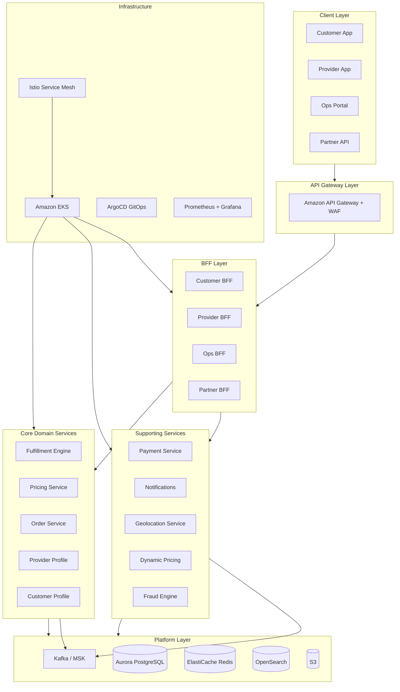
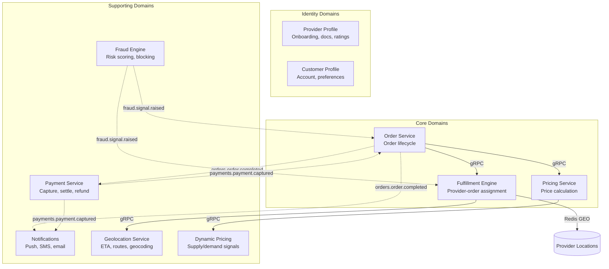

# {Company} Platform Engineering Manifesto

> *The single source of truth for how we build, ship, and operate software at {Company}.*
> *Opinionated by design. When in doubt, follow it. When you disagree, raise a PR.*

---

## What This Is

This manifesto defines our target engineering platform — the standards, practices, tools, and architecture every team is expected to adopt. It exists because consistency compounds: every shared decision here is one fewer decision each team makes alone, and one more hour spent on product problems instead of infrastructure debates.

This is a **living document**. It evolves as our platform matures, as industry practices shift, and as we learn from running systems in production. All changes require a PR with at least one Staff Engineer approval.

---

## Who This Is For

| Audience | How to Use It |
|----------|--------------|
| **New joiners** | Start here. Read sections 1–3 and the Golden Path in your first week. |
| **Engineers** | Primary audience. This tells you how to build things at {Company}. |
| **Tech Leads** | Enforcer and contributor. You own sections relevant to your domain. |
| **Engineering Managers** | Context. Helps you understand what "done right" looks like. |

---

## Core Principles

These principles underpin every decision in this manifesto:

1. **Pave the golden path, don't police the wilderness** — Make the right way the easy way. Teams should feel pulled toward standards, not pushed.
2. **Ship artifacts, not code** — Promote built, tested, scanned containers through environments. Never rebuild.
3. **Observable by default** — Every service ships with logs, metrics, and traces from day one. Observability is not a retrofit.
4. **Own your data, respect boundaries** — Services own their data stores. Direct cross-service DB access is forbidden.
5. **Everything in Git** — Infrastructure, config, runbooks, ADRs. If it's not in Git, it doesn't exist.
6. **Automate the boring, document the interesting** — Repetitive tasks belong in pipelines. Human attention belongs on architecture and product problems.
7. **Design for failure** — Assume every dependency will fail. Build circuit breakers, retries, fallbacks, and graceful degradation.
8. **Security is not a phase** — It runs in every pipeline, in every environment, from the first commit.

---

## Platform at a Glance

---

## Getting Started

| Document | Description |
|----------|-------------|
| [`ONBOARDING.md`](./ONBOARDING.md) | Step-by-step onboarding guide for new engineers — first day to first PR |
| [`GLOSSARY.md`](./GLOSSARY.md) | Definitions for platform, architecture, and domain-specific terms used across this manifesto |

---

## Structure

The manifesto is organised into 11 sections. Each section is a folder containing related documents.

---

### `01-platform-standards/`
The foundational technology decisions — language, frameworks, cloud services, and approved tooling. **Start here to understand what we build with.**

| File | Description |
|------|-------------|
| `01-tech-stack.md` | Approved languages, frameworks, AWS services, data stores, and toolchain |

---

### `02-architecture-and-api/`
How our system is structured — domain decomposition, communication patterns, and the API contracts that tie it together.

| File | Description |
|------|-------------|
| `01-system-architecture.md` | Domain map, event backbone, BFF pattern, resilience requirements |
| `02-api-standards.md` | URL design, versioning, error shapes, pagination, auth, OpenAPI-first |
| `03-hexagonal-architecture.md` | Ports & adapters — full worked example with domain, infrastructure, and API layers |
| `04-real-time-architecture.md` | WebSocket, SSE, push notifications, location streaming patterns |
| `05-grpc-standards.md` | Proto conventions, code generation, Spring Boot integration, testing |
| `06-saga-patterns.md` | Distributed transactions — choreography, compensation, order lifecycle saga |
| `07-service-decomposition.md` | When to split or merge services, boundary validation criteria |
| `08-event-schema-evolution.md` | Avro compatibility, partition keys, breaking change playbook |
| `09-error-catalog.md` | Error catalog, exception handling, error code registry, frontend error boundaries |

---

### `03-engineering-practices/`
How we write, review, test, and ship code. The day-to-day craft of engineering at {Company}.

| File | Description |
|------|-------------|
| `01-testing-pyramid.md` | Unit, integration, contract, E2E, load tests — standards and worked examples |
| `02-ci-practices.md` | GitHub Actions pipelines, quality gates, trunk-based development |
| `03-cd-practices.md` | GitOps, canary deployments, feature flags, rollback strategy |
| `04-coding-standards.md` | Naming, error handling, null handling, logging — with before/after examples |
| `05-git-workflow.md` | Trunk-based dev in practice — daily workflow and common scenarios |
| `06-code-review-guide.md` | How to give and receive feedback; good/bad comment examples |
| `07-ab-testing.md` | A/B testing strategy — hypothesis, experiment design, statistical rigor, guardrails |
| `08-deprecation-lifecycle.md` | Deprecation lifecycle for APIs, events, services, and flags |
| `09-spring-boot-standards.md` | Spring Boot platform standards — logging, config, health checks, LaunchDarkly, virtual threads |
| `10-frontend-ci-cd.md` | Frontend & mobile CI/CD — golden path, monorepo, preview environments, deployment |
| `11-qa-standards.md` | QA standards — test environments, test data, bug triage, device testing |

---

### `04-infrastructure-and-cloud/`
Our AWS platform — network topology, compute, data stores, security, and configuration.

| File | Description |
|------|-------------|
| `01-cloud-architecture.md` | AWS account structure, VPC topology, EKS, Aurora, MSK, Terraform standards |
| `02-infra-components.md` | Istio, Backstage, ArgoCD, ECR, Secrets Manager — platform-managed components |
| `03-security.md` | Shift-left security, IAM/IRSA, PII handling, incident response |
| `04-configuration-management.md` | Secrets vs config vs flags — what lives where and how to load it |
| `05-finops.md` | Cost allocation, budgets, rightsizing, FinOps practices |
| `06-capacity-planning.md` | Demand modeling, pre-scaling, load test-driven validation |
| `07-api-gateway-strategy.md` | API Gateway configuration, routing, throttling, WAF integration |
| `08-privacy-engineering.md` | Data classification, PIA, anonymization, GDPR erasure, consent management |
| `09-multi-tenancy.md` | Multi-tenancy patterns, data isolation, tenant-aware observability |
| `10-security-operations.md` | Security operations — threat modeling, vulnerability management, SIEM, pen testing, supply chain |

---

### `05-operational-excellence/`
How we keep services healthy in production — observability, resilience, and incident response.

| File | Description |
|------|-------------|
| `01-observability-standards.md` | Logging, metrics, tracing, alerting, SLOs — the standards |
| `02-observability-in-practice.md` | Step-by-step setup: structured logging, correlation IDs, metrics, tracing |
| `03-resilience-patterns.md` | Circuit breaker, retry, timeout, bulkhead — Resilience4j worked examples |
| `04-incident-management.md` | Response playbook, roles, blameless PIR template, runbook template |
| `05-load-shedding.md` | Priority tiers, backpressure, graceful degradation strategies |
| `06-chaos-engineering.md` | Fault injection, game days, resilience validation program |
| `07-disaster-recovery-playbook.md` | Region failover procedure, failback, data reconciliation |
| `08-testing-in-production.md` | Synthetic monitoring, traffic mirroring, dark launches |
| `09-debugging-guide.md` | Debugging guide — local, staging, log search, trace exploration, common scenarios |

---

### `06-developer-guides/`
Hands-on guides for building things the right way. Reference these while writing code.

| File | Description |
|------|-------------|
| `01-developer-experience.md` | Local dev setup, onboarding targets, inner loop speed, platform BOM |
| `02-golden-path.md` | End-to-end walkthrough: scaffold → code → PR → production + compliance checklist |
| `03-database-migrations.md` | Flyway, naming conventions, expand-contract pattern, large table migrations |
| `04-kafka-patterns.md` | Producers, consumers, DLQ, idempotency, outbox pattern — with worked examples |
| `05-data-platform.md` | Data ownership, CDC pipeline, geospatial patterns, analytics architecture |
| `06-multi-region-patterns.md` | Region/tenant config, multi-currency, localization, regulatory compliance |
| `07-distributed-locking.md` | Optimistic locking, Redis locks, preventing double-assignment |
| `08-cache-patterns.md` | Cache-aside, TTL strategy, event-driven invalidation, stampede prevention |
| `09-data-governance.md` | Data governance, quality SLAs, retention matrices, analytics contracts |
| `10-local-development.md` | Local development — Docker Compose, seeding, secrets, first PR path, troubleshooting |

---

### `07-ways-of-working/`
Team structure, decision-making, and how we work together.

| File | Description |
|------|-------------|
| `01-team-topology.md` | Stream-aligned teams, platform team, ADR process, on-call, worked ADR example |
| `02-engineering-ladder.md` | Career levels mapped to manifesto practices — Engineer I to Principal |
| `03-open-source-policy.md` | License compliance, contribution guidelines, publishing policy |
| `04-product-engineering.md` | Product-engineering collaboration, discovery, rituals, prioritization |
| `05-rfc-process.md` | RFC process — template, stages, reviewers, timeout rules |
| `06-technology-radar.md` | Technology radar — Adopt/Trial/Assess/Hold quadrants |
| `07-hiring-standards.md` | Hiring & interview standards, rubrics, bar-raiser process |
| `08-knowledge-sharing.md` | Knowledge sharing — guilds, tech talks, architecture clinics |
| `09-engineering-management.md` | Engineering management — performance reviews, 1:1s, team health, headcount, career dev |
| `10-product-operations.md` | Product operations — roadmap, OKRs, user stories, launch management, customer feedback |

---

### `08-program/`
Where we are, where we're going, and how we measure progress.

| File | Description |
|------|-------------|
| `01-maturity-model.md` | 11-dimension self-assessment rubric — L0 to L4 per practice area |
| `02-migration-roadmap.md` | Phased migration program, DORA targets, risk register |
| `03-vendor-assessment.md` | AWS lock-in analysis, portability assessment, exit cost estimation |
| `04-engineering-metrics.md` | Developer satisfaction, toil, platform adoption, tech debt quantification |
| `05-vendor-intake.md` | Vendor & SaaS intake process, security review, procurement |

---

### `09-mobile-and-frontend/`
Standards for the client applications that customers and providers interact with every day.

| File | Description |
|------|-------------|
| `01-mobile-standards.md` | Offline-first, push notifications, performance budgets, accessibility, BFF patterns |
| `02-web-frontend-standards.md` | Web frontend — SPA/SSR, design system, accessibility, Core Web Vitals |
| `03-react-native-guide.md` | React Native guide — Turbo Modules, navigation, debugging, Hermes, CodePush |
| `04-android-standards.md` | Android standards — Gradle, Compose, Kotlin, Hilt, WorkManager |
| `05-ios-standards.md` | iOS standards — SwiftUI, SPM, privacy manifest, extensions, dSYM |
| `06-design-system.md` | Design system — handoff, governance, tokens, motion, dark mode, data viz |

---

### `10-ai-ml-platform/`
Machine learning infrastructure, AI governance, and responsible AI practices.

| File | Description |
|------|-------------|
| `01-ml-platform.md` | Model serving, feature stores, A/B testing, training pipelines, ML CI/CD |
| `02-ai-governance.md` | Responsible AI, bias auditing, AI-assisted development, generative AI patterns |

---

### `11-domain-catalog/`
Detailed documentation for each bounded context — responsibilities, APIs, events, data models, and team ownership.

| File | Description |
|------|-------------|
| `01-order-service.md` | Order lifecycle management — the central orchestrating domain |
| `02-fulfillment-engine.md` | Provider-order assignment, geospatial algorithms |
| `03-pricing-service.md` | Price calculation, estimates, dynamic pricing integration |
| `04-provider-profile.md` | Provider onboarding, documents, ratings, availability |
| `05-customer-profile.md` | Customer account, preferences, payment methods, history |
| `06-payment-service.md` | Payment processing, settlements, wallets, refunds |
| `07-notifications.md` | Push, SMS, email dispatch across all channels |
| `08-geolocation-service.md` | ETA calculation, route planning, geocoding proxy |
| `09-dynamic-pricing.md` | Supply/demand signals, zone management, multiplier calculation |
| `10-fraud-engine.md` | Real-time fraud signals, risk scoring, blocking rules |

---

## Quick Links by Role

### I'm a new joiner — where do I start?
1. `01-platform-standards/01-tech-stack.md` — understand what we build with
2. `06-developer-guides/01-developer-experience.md` — get your laptop set up
3. `06-developer-guides/02-golden-path.md` — ship your first service end-to-end
4. `03-engineering-practices/05-git-workflow.md` — how we use Git day-to-day
5. `03-engineering-practices/04-coding-standards.md` — how we write code

### I'm building a new service — what do I need?
1. `06-developer-guides/02-golden-path.md` — the complete checklist
2. `02-architecture-and-api/03-hexagonal-architecture.md` — how to structure it
3. `02-architecture-and-api/02-api-standards.md` — how to design the API
4. `06-developer-guides/03-database-migrations.md` — how to manage the schema
5. `05-operational-excellence/02-observability-in-practice.md` — how to make it observable

### I'm on-call and something is broken — where do I go?
1. `05-operational-excellence/04-incident-management.md` — the response playbook
2. Your service's `docs/runbook.md` — service-specific steps
3. `05-operational-excellence/02-observability-in-practice.md` — how to read the signals
4. `05-operational-excellence/07-disaster-recovery-playbook.md` — if it's a region-level failure

### I want to understand a domain
1. `11-domain-catalog/` — detailed docs for every bounded context
2. `02-architecture-and-api/01-system-architecture.md` — the system blueprint
3. `07-ways-of-working/01-team-topology.md` — which team owns what

---

## Domain Map

*Solid arrows = synchronous (gRPC). Dashed arrows = asynchronous (Kafka events).*

---

## Governance

- **Owner:** Platform Engineering team
- **Changes:** PR required; at least one Staff Engineer or Principal approval
- **Exceptions:** Any deviation from a standard requires an ADR documenting the rationale
- **Review cadence:** Maturity model reviewed quarterly with all Tech Leads; manifesto reviewed bi-annually

---

## Document Count

| Section | Documents |
|---------|-----------|
| Platform Standards | 1 |
| Architecture & API | 9 |
| Engineering Practices | 11 |
| Infrastructure & Cloud | 10 |
| Operational Excellence | 9 |
| Developer Guides | 10 |
| Ways of Working | 10 |
| Program | 5 |
| Mobile & Frontend | 6 |
| AI/ML Platform | 2 |
| Domain Catalog | 10 |
| **Total** | **83 documents** |

---

*{Company} Platform Engineering — last updated 2026*
