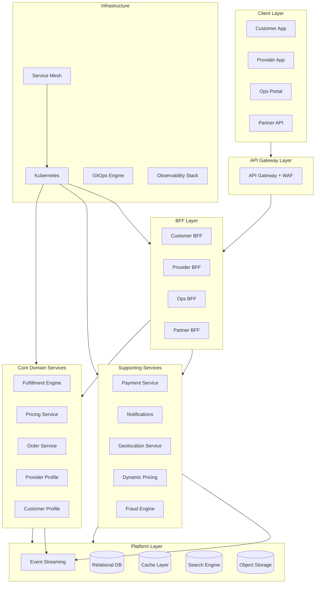
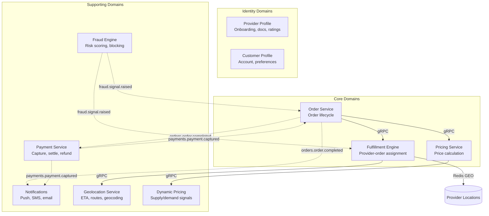

 

# 🏗️ {Company} Platform Engineering Manifesto

*The engineering playbook for teams that ship fast and sleep well.*

 

 

Every *"how should I do this?"* answered. Every *"which tool should I use?"* decided. 
**Opinionated. Zero meetings required.**

 

`Opinionated by design` &nbsp; `Follow by default` &nbsp; `Challenge by PR` &nbsp; `Agent-native ready`

---

[🆕 Onboarding](./ONBOARDING.md) &nbsp;·&nbsp; [📖 Glossary](./GLOSSARY.md) &nbsp;·&nbsp; [📊 Executive summary](./EXECUTIVE-SUMMARY.md) &nbsp;·&nbsp; [📋 Meta](./META.md) &nbsp;·&nbsp; [🏛️ Architecture](02-architecture-and-api/01-system-architecture.md) &nbsp;·&nbsp; [⚙️ Backend Standards](03-engineering-practices/09-backend-framework-standards.md) &nbsp;·&nbsp; [🛤️ Golden Path](06-developer-guides/02-golden-path.md) &nbsp;·&nbsp; [🚨 Incidents](05-operational-excellence/04-incident-management.md)

---

## 💡 What This Is (And What It Isn't)

| ✅ This is | ❌ This is not |
|:-----------|:---------------|
| A decision record that prevents re-debates | A suggestion box you can ignore |
| A living playbook, updated from production lessons | A dusty wiki page someone wrote two years ago |
| Opinionated and prescriptive by design | A buffet of options for every preference |
| The fastest path from idea to production | The *only* path - deviations just need an ADR |
| A shared operating system for human and AI agent teams alike | A human-only playbook that agents cannot parse or follow |

---

## 🤔 Why This Exists

You've seen it before. A new service gets built. The team picks a different database. Invents their own error format. Structures logs differently. Deploys with a custom pipeline. Six months later, nobody can debug across services, onboarding takes weeks, and every team is solving the same problems in isolation.

**This manifesto exists to make that impossible.**

One source of truth. One set of standards. Every team, every service, every environment. Consistency compounds - every shared decision here is one fewer decision each team makes alone.

> 📖 **Living document.** It evolves as our platform matures and as we learn from production. Changes require a PR with at least one Staff Engineer approval.

> 🔧 **Adopting this for your organization?** The principles are universal; the specific tools are our reference implementation. See [Customize This Manifesto](#-customize-this-manifesto) for how to swap in your own stack.

---

## 🤖 Agent-Native by Design

This manifesto is built for **human-led and agent-operated organizations alike**. If you are building an agentic software company - where AI agents plan, code, review, test, deploy, and operate alongside humans - this manifesto serves as the shared operating system that both humans and agents follow.

### Why it works for agents

| Design Choice | Agent Benefit |
|:--------------|:-------------|
| **Opinionated rules, not suggestions** | Agents need constraints, not options. "All services must use RFC 7807 errors" is a rule an agent can enforce. "Consider using RFC 7807" is not |
| **Structured, consistent formatting** | Numbered files (`NN-kebab-case.md`), emoji-prefixed sections, and consistent document structure make the manifesto machine-parseable without special tooling |
| **Explicit contracts everywhere** | API standards, event schemas, error catalogs, and naming conventions give agents the specs they need to generate compliant code autonomously |
| **Context engineering built in** | [Section 12](./12-ai-engineering/) defines how to structure knowledge so AI tools can access and apply it - from AGENTS.md to cursor rules to RAG pipelines |
| **Golden path templates** | Scaffold templates and standardized patterns let agents bootstrap new services that are compliant from the first commit |
| **Machine-readable glossary** | The [Glossary](./GLOSSARY.md) provides shared terminology so agents use the same domain language as your teams |

### For agentic organizations

If your engineering organization uses AI agents as first-class participants - not just assistants - this manifesto provides:

- **Agent-to-agent contracts** - The same API standards, event schemas, and error formats that govern human-built services govern agent-built services. No separate "agent API" layer needed.
- **Autonomous compliance** - Agents can read the manifesto, extract rules, and enforce them in CI/CD pipelines, code generation, architecture reviews, and incident response without human intervention.
- **Human-in-the-loop where it matters** - The manifesto is explicit about where human judgment is required (architecture decisions, security trade-offs, ethical considerations) and where agents can operate autonomously.
- **Onboarding for agents, not just humans** - The same AGENTS.md and context files that help a new human engineer ramp up help a new AI agent operate correctly in your codebase from its first interaction.

> 🤖 **Building an agent-native org?** Start with [Context Engineering](./12-ai-engineering/01-context-engineering.md) to wire the manifesto into your agent orchestration layer. Then follow the [Golden Path](./06-developer-guides/02-golden-path.md) to set up your first agent-operated service.

---

## 🧭 Pick Your Path

| You are... | Start here | Then explore |
|:-----------|:-----------|:-------------|
| 📊 **CTO, COO, or procurement** | [`EXECUTIVE-SUMMARY.md`](./EXECUTIVE-SUMMARY.md) | Why this exists → adoption phases → migration roadmap |
| 🆕 **Day 1 new joiner** | [`ONBOARDING.md`](./ONBOARDING.md) | Tech stack → Golden Path → Git workflow |
| ⚙️ **Backend engineer** | [Backend Framework Standards](03-engineering-practices/09-backend-framework-standards.md) | Architecture, Kafka, Caching, Testing |
| 🌐 **Frontend engineer** | [Web Frontend Standards](09-mobile-and-frontend/02-web-frontend-standards.md) | Frontend CI/CD, Design System |
| 📱 **Mobile engineer** | [Mobile Standards](09-mobile-and-frontend/01-mobile-standards.md) | Android / iOS / React Native guides |
| 🏛️ **Tech lead** | [System Architecture](02-architecture-and-api/01-system-architecture.md) | Service Decomposition, Team Topology |
| 👥 **Engineering manager** | [Engineering Management](07-ways-of-working/09-engineering-management.md) | Ladder, Metrics, Product Ops |
| 🔥 **On-call and panicking** | [Incident Management](05-operational-excellence/04-incident-management.md) | Debugging Guide, DR Playbook |
| 🎨 **Designer** | [Design System](09-mobile-and-frontend/06-design-system.md) | Web Frontend, Mobile Standards |
| 📊 **Product manager** | [Product Operations](07-ways-of-working/10-product-operations.md) | A/B Testing, Engineering Metrics |
| 🔒 **Security engineer** | [Security Operations](04-infrastructure-and-cloud/10-security-operations.md) | Security Standards, Privacy Engineering |
| 🧬 **AI-first engineer** | [Context Engineering](12-ai-engineering/01-context-engineering.md) | AI-Assisted SDLC, Adoption Metrics |
| 🤖 **Agentic org builder** | [Agent-Native by Design](#-agent-native-by-design) · [Context Engineering](12-ai-engineering/01-context-engineering.md) | AI-Assisted SDLC, API Standards, Golden Path, Service Catalog |
| 📝 **Technical Writer / Documentation** | [Developer Experience](06-developer-guides/01-developer-experience.md) · [Knowledge Sharing](07-ways-of-working/08-knowledge-sharing.md) | Content standards, documentation governance |
| 🧪 **QA / Test Engineer** | [Testing Pyramid](03-engineering-practices/01-testing-pyramid.md) · [QA Standards](03-engineering-practices/11-qa-standards.md) | Test strategy, environments, automation |
| ⚖️ **Procurement / Legal** | [Vendor Intake](08-program/05-vendor-intake.md) · [Vendor Assessment](08-program/03-vendor-assessment.md) | Vendor intake, assessment, compliance |
| 🎧 **Support / Customer Success** | [Incident Management](05-operational-excellence/04-incident-management.md) · [Debugging Guide](05-operational-excellence/09-debugging-guide.md) | Incident response, debugging, SLOs |
| 🔢 **Data Analyst / BI** | [Data Platform](06-developer-guides/05-data-platform.md) · [Data Governance](06-developer-guides/09-data-governance.md) | Data platform, governance, analytics |

> 💡 Lost on a term? The [**Glossary**](./GLOSSARY.md) has you covered.

---

## 🎯 The Non-Negotiables

Eight principles. Not aspirations - **constraints**. Every technical decision in this manifesto traces back to one of these.

<table>
<tr>
<td align="center" width="50%">

🛤️ <b>Pave the golden path</b> Make the right way the easy way. Teams feel <i>pulled</i> toward standards, not pushed.

</td>
<td align="center" width="50%">

📦 <b>Ship artifacts, not code</b> The same container image built in CI runs in production. Never rebuild between environments.

</td>
</tr>
<tr>
<td align="center">

👁️ <b>Observable by default</b> Logs, metrics, and traces ship from day one. Observability is not a retrofit.

</td>
<td align="center">

🔒 <b>Own your data, respect boundaries</b> Services own their data stores. Cross-service DB access is forbidden. No exceptions.

</td>
</tr>
<tr>
<td align="center">

📝 <b>Everything in Git</b> Infrastructure, config, runbooks, ADRs. If it's not in Git, it doesn't exist.

</td>
<td align="center">

🤖 <b>Automate the boring</b> Pipelines handle repetition. Humans handle architecture and product problems.

</td>
</tr>
<tr>
<td align="center">

💥 <b>Design for failure</b> Every dependency will fail. Circuit breakers, retries, fallbacks, graceful degradation.

</td>
<td align="center">

🛡️ <b>Security is not a phase</b> It runs in every pipeline, in every environment, from the first commit.

</td>
</tr>
</table>

 

<i>Those are the beliefs. Here's the system they built. ↓</i>

---

## 🗺️ The Big Picture

From client apps to infrastructure, here's how the pieces fit together.

 

<i>That's the 30,000-foot view. Now here's every document, organized by domain. ↓</i>

---

## 📚 The Full Library

Click any section to explore.

<b>📐 01 - Platform Standards</b> &nbsp;·&nbsp; <i>The foundation layer - touch this, everything changes</i>

 

The approved tech stack, naming conventions, repository structure, service catalog, and container standards. The foundation everything else builds on.

| File | What You'll Learn |
|------|-------------------|
| [`01-tech-stack.md`](01-platform-standards/01-tech-stack.md) | Approved languages, frameworks, cloud services, data stores, and the principles behind each choice |
| [`02-naming-conventions.md`](01-platform-standards/02-naming-conventions.md) | How to name everything - services, repos, packages, topics, buckets, metrics, flags |
| [`03-repository-standards.md`](01-platform-standards/03-repository-standards.md) | Required files, README template, branch protection, PR template, repo lifecycle |
| [`04-service-catalog.md`](01-platform-standards/04-service-catalog.md) | Backstage catalog-info.yaml spec, lifecycle states, scorecards, ownership |
| [`05-container-standards.md`](01-platform-standards/05-container-standards.md) | Base images, Dockerfile standards, tagging, size limits, signing, registry |

<b>🏛️ 02 - Architecture & API</b> &nbsp;·&nbsp; <i>Domains, contracts, and the rules between services</i>

 

Domain decomposition, communication patterns, API contracts, event schemas, and the error catalog.

| File | What You'll Learn |
|------|-------------------|
| [`01-system-architecture.md`](02-architecture-and-api/01-system-architecture.md) | Domain map, event backbone, BFF pattern, resilience ownership matrix |
| [`02-api-standards.md`](02-architecture-and-api/02-api-standards.md) | URL design, versioning, error shapes, pagination, rate limiting, idempotency |
| [`03-hexagonal-architecture.md`](02-architecture-and-api/03-hexagonal-architecture.md) | Ports & adapters with a full worked example you can copy |
| [`04-real-time-architecture.md`](02-architecture-and-api/04-real-time-architecture.md) | WebSocket, SSE, push notifications, and location streaming |
| [`05-grpc-standards.md`](02-architecture-and-api/05-grpc-standards.md) | Proto conventions, code generation, load balancing, cancellation |
| [`06-saga-patterns.md`](02-architecture-and-api/06-saga-patterns.md) | Distributed transactions, choreography, compensation patterns |
| [`07-service-decomposition.md`](02-architecture-and-api/07-service-decomposition.md) | When to split or merge services, with a decision framework |
| [`08-event-schema-evolution.md`](02-architecture-and-api/08-event-schema-evolution.md) | Avro compatibility rules, partition keys, and the breaking change playbook |
| [`09-error-catalog.md`](02-architecture-and-api/09-error-catalog.md) | Central error registry, exception handling, and frontend error boundaries |

<b>⚙️ 03 - Engineering Practices</b> &nbsp;·&nbsp; <i>Testing, CI/CD, code review - the daily craft</i>

 

The day-to-day craft. Testing, CI/CD, code review, coding standards, and backend framework standards.

| File | What You'll Learn |
|------|-------------------|
| [`01-testing-pyramid.md`](03-engineering-practices/01-testing-pyramid.md) | Unit, integration, contract, E2E, load tests - with worked examples |
| [`02-ci-practices.md`](03-engineering-practices/02-ci-practices.md) | GitHub Actions pipelines, quality gates, DAST, Terraform testing |
| [`03-cd-practices.md`](03-engineering-practices/03-cd-practices.md) | GitOps, canary deployments, feature flags, change risk rubric |
| [`04-coding-standards.md`](03-engineering-practices/04-coding-standards.md) | Naming, error handling, null safety - with before/after examples |
| [`05-git-workflow.md`](03-engineering-practices/05-git-workflow.md) | Trunk-based dev in practice |
| [`06-code-review-guide.md`](03-engineering-practices/06-code-review-guide.md) | How to give and receive feedback that makes code better |
| [`07-ab-testing.md`](03-engineering-practices/07-ab-testing.md) | Experiment design, statistical rigor, guardrails, product analytics |
| [`08-deprecation-lifecycle.md`](03-engineering-practices/08-deprecation-lifecycle.md) | How we sunset APIs, events, services, and flags |
| [`09-backend-framework-standards.md`](03-engineering-practices/09-backend-framework-standards.md) | Structured logging, config layering, health checks, feature flags, graceful shutdown, versioning |
| [`10-frontend-ci-cd.md`](03-engineering-practices/10-frontend-ci-cd.md) | Frontend golden path, monorepo structure, preview environments |
| [`11-qa-standards.md`](03-engineering-practices/11-qa-standards.md) | Test environments, test data, bug triage severity, device matrix |
| [`12-engineering-principles.md`](03-engineering-practices/12-engineering-principles.md) | Core engineering principles for the AI era with agent-native context |

<b>☁️ 04 - Infrastructure & Cloud</b> &nbsp;·&nbsp; <i>The invisible floor you stand on</i>

 

Cloud architecture, security, FinOps, multi-tenancy, and infrastructure as code.

| File | What You'll Learn |
|------|-------------------|
| [`01-cloud-architecture.md`](04-infrastructure-and-cloud/01-cloud-architecture.md) | Account structure, network topology, compute, data tier, backup & restore |
| [`02-infra-components.md`](04-infrastructure-and-cloud/02-infra-components.md) | Service mesh, developer portal, GitOps, container registry, and self-service boundaries |
| [`03-security.md`](04-infrastructure-and-cloud/03-security.md) | Shift-left security, identity and access, PII handling, encryption, egress control |
| [`04-configuration-management.md`](04-infrastructure-and-cloud/04-configuration-management.md) | Secrets vs config vs flags - what lives where |
| [`05-finops.md`](04-infrastructure-and-cloud/05-finops.md) | Cost allocation, rightsizing, reservations, real-time cost visibility, sustainability |
| [`06-capacity-planning.md`](04-infrastructure-and-cloud/06-capacity-planning.md) | Demand modeling, pre-scaling, load test-driven validation |
| [`07-api-gateway-strategy.md`](04-infrastructure-and-cloud/07-api-gateway-strategy.md) | API Gateway configuration, routing, throttling, WAF |
| [`08-privacy-engineering.md`](04-infrastructure-and-cloud/08-privacy-engineering.md) | GDPR, PCI, SOC 2, ISO 27001, anonymization, consent |
| [`09-multi-tenancy.md`](04-infrastructure-and-cloud/09-multi-tenancy.md) | Data isolation patterns, noisy-neighbor controls, tenant-aware observability |
| [`10-security-operations.md`](04-infrastructure-and-cloud/10-security-operations.md) | Threat modeling, SIEM, pen testing, SBOM, bug bounty, PAM |
| [`11-deployment-architecture.md`](04-infrastructure-and-cloud/11-deployment-architecture.md) | Environment landscape, artifact promotion, production gates, multi-region deployment |

<b>🚨 05 - Operational Excellence</b> &nbsp;·&nbsp; <i>When things break - and they will</i>

 

Observability, resilience, incidents, chaos engineering, and what to do when things break.

| File | What You'll Learn |
|------|-------------------|
| [`01-observability-standards.md`](05-operational-excellence/01-observability-standards.md) | Logging, metrics, tracing, SLOs, error budgets, alert hygiene |
| [`02-observability-in-practice.md`](05-operational-excellence/02-observability-in-practice.md) | Step-by-step: structured logging, correlation IDs, Prometheus, tracing |
| [`03-resilience-patterns.md`](05-operational-excellence/03-resilience-patterns.md) | Circuit breaker, retry, timeout, bulkhead - with worked examples |
| [`04-incident-management.md`](05-operational-excellence/04-incident-management.md) | Response playbook, on-call structure, PIR template, change management |
| [`05-load-shedding.md`](05-operational-excellence/05-load-shedding.md) | Priority tiers, backpressure, graceful degradation, auto-remediation |
| [`06-chaos-engineering.md`](05-operational-excellence/06-chaos-engineering.md) | Fault injection, game days, resilience validation |
| [`07-disaster-recovery-playbook.md`](05-operational-excellence/07-disaster-recovery-playbook.md) | Region failover, failback, DNS strategy, rollback SLAs |
| [`08-testing-in-production.md`](05-operational-excellence/08-testing-in-production.md) | Synthetic monitoring, traffic mirroring, dark launches |
| [`09-debugging-guide.md`](05-operational-excellence/09-debugging-guide.md) | How to debug locally, in staging, and in production - with real queries |

<b>🛠️ 06 - Developer Guides</b> &nbsp;·&nbsp; <i>The tabs you keep open while coding</i>

 

The guides you keep open while writing code.

| File | What You'll Learn |
|------|-------------------|
| [`01-developer-experience.md`](06-developer-guides/01-developer-experience.md) | Local setup, onboarding milestones, buddy program, documentation standards |
| [`02-golden-path.md`](06-developer-guides/02-golden-path.md) | Scaffold to production in one walkthrough |
| [`03-database-migrations.md`](06-developer-guides/03-database-migrations.md) | Automated schema migrations, expand-contract, large table strategies |
| [`04-kafka-patterns.md`](06-developer-guides/04-kafka-patterns.md) | Producers, consumers, DLQ, idempotency, topic creation, DLQ replay |
| [`05-data-platform.md`](06-developer-guides/05-data-platform.md) | CDC, data warehouse conventions, pipeline orchestration, data access controls |
| [`06-multi-region-patterns.md`](06-developer-guides/06-multi-region-patterns.md) | Region config, i18n, localization, UX writing |
| [`07-distributed-locking.md`](06-developer-guides/07-distributed-locking.md) | Optimistic locking, Redis locks, preventing double-assignment |
| [`08-cache-patterns.md`](06-developer-guides/08-cache-patterns.md) | Cache-aside, TTL, event-driven invalidation, in-process caching, stampede prevention |
| [`09-data-governance.md`](06-developer-guides/09-data-governance.md) | Data stewards, quality SLAs, retention matrices, analytics contracts |
| [`10-local-development.md`](06-developer-guides/10-local-development.md) | Docker Compose, database seeding, your first PR |

<b>🤝 07 - Ways of Working</b> &nbsp;·&nbsp; <i>Teams, hiring, growth, and how we decide</i>

 

Team structure, decision-making, hiring, career growth, and knowledge sharing.

| File | What You'll Learn |
|------|-------------------|
| [`01-team-topology.md`](07-ways-of-working/01-team-topology.md) | Stream-aligned teams, platform team, inner source, tech debt registry |
| [`02-engineering-ladder.md`](07-ways-of-working/02-engineering-ladder.md) | Engineer I to Principal - expectations at every level |
| [`03-open-source-policy.md`](07-ways-of-working/03-open-source-policy.md) | License compliance, contribution guidelines |
| [`04-product-engineering.md`](07-ways-of-working/04-product-engineering.md) | PM-engineering collaboration, discovery, rituals, user stories |
| [`05-rfc-process.md`](07-ways-of-working/05-rfc-process.md) | How to propose cross-cutting changes |
| [`06-technology-radar.md`](07-ways-of-working/06-technology-radar.md) | How we evaluate and adopt new technology |
| [`07-hiring-standards.md`](07-ways-of-working/07-hiring-standards.md) | Interview loop, rubrics, bar-raiser, bias mitigation |
| [`08-knowledge-sharing.md`](07-ways-of-working/08-knowledge-sharing.md) | Guilds, tech talks, architecture clinics |
| [`09-engineering-management.md`](07-ways-of-working/09-engineering-management.md) | 1:1s, reviews, team health, headcount, career development |
| [`10-product-operations.md`](07-ways-of-working/10-product-operations.md) | Roadmap, OKRs, launch management, customer feedback loops |

<b>📈 08 - Program</b> &nbsp;·&nbsp; <i>The honest scorecard - where we are and where we're headed</i>

 

Maturity assessment, migration roadmap, metrics, and vendor management.

| File | What You'll Learn |
|------|-------------------|
| [`01-maturity-model.md`](08-program/01-maturity-model.md) | Self-assessment rubric - L0 to L4 across 11 dimensions (Dimension 11: ML Platform Maturity) |
| [`02-migration-roadmap.md`](08-program/02-migration-roadmap.md) | Phased migration program, DORA targets, risk register |
| [`03-vendor-assessment.md`](08-program/03-vendor-assessment.md) | AWS lock-in analysis, portability, exit costs |
| [`04-engineering-metrics.md`](08-program/04-engineering-metrics.md) | What we measure, what we don't, and why |
| [`05-vendor-intake.md`](08-program/05-vendor-intake.md) | How to evaluate and onboard new SaaS tools |

<b>📱 09 - Mobile & Frontend</b> &nbsp;·&nbsp; <i>Apps, browsers, pixels - the user-facing layer</i>

 

Everything for the engineers building client applications.

| File | What You'll Learn |
|------|-------------------|
| [`01-mobile-standards.md`](09-mobile-and-frontend/01-mobile-standards.md) | Offline-first, push, performance budgets, auth lifecycle, cert pinning |
| [`02-web-frontend-standards.md`](09-mobile-and-frontend/02-web-frontend-standards.md) | SPA/SSR, design system, a11y, Core Web Vitals, LaunchDarkly React |
| [`03-react-native-guide.md`](09-mobile-and-frontend/03-react-native-guide.md) | Turbo Modules, navigation, Hermes, CodePush, versioning |
| [`04-android-standards.md`](09-mobile-and-frontend/04-android-standards.md) | Gradle, Compose, Kotlin coroutines, Hilt, WorkManager |
| [`05-ios-standards.md`](09-mobile-and-frontend/05-ios-standards.md) | SwiftUI, SPM, privacy manifest, extensions, dSYM |
| [`06-design-system.md`](09-mobile-and-frontend/06-design-system.md) | Design-dev handoff, tokens, motion, dark mode, data visualization |

<b>🤖 10 - AI/ML Platform</b> &nbsp;·&nbsp; <i>ML pipelines, model governance, and AI guardrails</i>

 

| File | What You'll Learn |
|------|-------------------|
| [`01-ml-platform.md`](10-ai-ml-platform/01-ml-platform.md) | Model serving, feature stores, training pipelines, GPU governance |
| [`02-ai-governance.md`](10-ai-ml-platform/02-ai-governance.md) | Bias auditing, LLM guardrails, red-teaming, generative AI patterns |

<b>🗂️ 11 - Domain Catalog</b> &nbsp;·&nbsp; <i>Service-by-service deep dives with APIs, events, and SLOs</i>

 

Detailed documentation for every domain service - APIs, events, data models, SLOs, and failure modes.

| File | What You'll Learn |
|------|-------------------|
| [`01-order-service.md`](11-domain-catalog/01-order-service.md) | Order lifecycle - the central orchestrating domain |
| [`02-fulfillment-engine.md`](11-domain-catalog/02-fulfillment-engine.md) | Provider-order assignment and geospatial algorithms |
| [`03-pricing-service.md`](11-domain-catalog/03-pricing-service.md) | Price calculation, estimates, dynamic pricing integration |
| [`04-provider-profile.md`](11-domain-catalog/04-provider-profile.md) | Provider onboarding, documents, ratings, availability |
| [`05-customer-profile.md`](11-domain-catalog/05-customer-profile.md) | Customer account, preferences, payment methods |
| [`06-payment-service.md`](11-domain-catalog/06-payment-service.md) | Payments, settlements, wallets, refunds |
| [`07-notifications.md`](11-domain-catalog/07-notifications.md) | Push, SMS, email dispatch across all channels |
| [`08-geolocation-service.md`](11-domain-catalog/08-geolocation-service.md) | ETA calculation, route planning, geocoding |
| [`09-dynamic-pricing.md`](11-domain-catalog/09-dynamic-pricing.md) | Supply/demand signals, zone management, multipliers |
| [`10-fraud-engine.md`](11-domain-catalog/10-fraud-engine.md) | Real-time risk scoring, blocking rules, ML fallbacks |

<b>🧬 12 - AI Engineering</b> &nbsp;·&nbsp; <i>Context engineering, AI-assisted workflows, and adoption metrics</i>

 

How we work with AI across the entire software development lifecycle, including guidance for agent-native organizations. Distinct from Section 10 (building AI products) - this section is about using AI to build all products.

| File | What You'll Learn |
|------|-------------------|
| [`01-context-engineering.md`](12-ai-engineering/01-context-engineering.md) | Context stack, AGENTS.md, cursor rules, architecture-as-context, knowledge retrieval, maintenance |
| [`02-ai-assisted-sdlc.md`](12-ai-engineering/02-ai-assisted-sdlc.md) | AI integration across discovery, design, development, testing, review, deployment, operations, documentation |
| [`03-ai-adoption-metrics.md`](12-ai-engineering/03-ai-adoption-metrics.md) | Adoption metrics, effectiveness metrics, quality guardrails, AI Engineering Maturity (L0-L4), AI Champions Guild |

 

<i>Every service in the diagram above, documented in detail. ↓</i>

---

## 🔗 How Services Connect

> *Solid arrows = synchronous (gRPC) · Dashed arrows = asynchronous (Kafka events)*

---

## 🔧 Customize This Manifesto

This manifesto is **opinionated about principles, flexible about tooling**. The architectural patterns, operational standards, and engineering practices are universal. The specific technologies named throughout are our **reference implementation** - one proven instantiation of those principles.

| What's universal | What's a reference choice (substitute yours) |
|:-----------------|:---------------------------------------------|
| Structured JSON logging with correlation IDs | Logback, Pino, Serilog, Zap |
| Schema-validated async event streaming | Kafka, Pulsar, NATS, RabbitMQ |
| Managed relational database per service | PostgreSQL/Aurora, Cloud SQL, Azure SQL, PlanetScale |
| Infrastructure as code, no ClickOps | Terraform, Pulumi, CDK, Crossplane |
| Container orchestration with GitOps | EKS, GKE, AKS, self-managed Kubernetes |
| Backend framework with health checks and metrics | Spring Boot, Express/Fastify, ASP.NET, Go stdlib, Django/FastAPI |
| Feature flags for progressive rollout | LaunchDarkly, Unleash, Flagsmith, Split |
| Automated CI/CD with quality gates | GitHub Actions, GitLab CI, CircleCI, Jenkins |

> **Adopting this manifesto?** Search for specific tool names (e.g., "Spring Boot", "Aurora", "EKS") and replace them with your equivalents. The principles, patterns, and operational standards carry over unchanged.

The repo uses two company placeholders: **`{Company}`** (title case) in headings and prose, and **`{company}`** (lowercase) in URLs, package names, GitHub org paths, and other technical identifiers. Replace both with your organization when you fork or adapt this manifesto.

### For agent-native organizations

If you are building an organization where AI agents are first-class engineers - planning sprints, writing code, reviewing PRs, deploying services, and responding to incidents - this manifesto works as your shared operating system with minimal adaptation:

| Step | What to do |
|:-----|:-----------|
| **1. Feed the manifesto to your agents** | Index the manifesto into your agent orchestration layer (RAG, context window, or tool retrieval). Every agent-generated artifact should be checked against manifesto rules |
| **2. Wire AGENTS.md into every repo** | Each repository's `AGENTS.md` tells agents the local rules. Human engineers and AI agents read the same file. See [Context Engineering](./12-ai-engineering/01-context-engineering.md) |
| **3. Use contracts as agent interfaces** | API standards, event schemas, error catalogs, and naming conventions are not just documentation - they are the interface contract between your agents. Agent A publishes an event; Agent B consumes it. The manifesto defines the schema both follow |
| **4. Keep human-in-the-loop gates** | The manifesto marks where human judgment is required: architecture decisions, security trade-offs, production incident response escalations. Preserve these gates even in a fully agentic workflow |
| **5. Measure agent adoption** | Use the same [engineering metrics](./08-program/04-engineering-metrics.md) and [AI adoption metrics](./12-ai-engineering/03-ai-adoption-metrics.md) to track agent effectiveness as you would human effectiveness |

---

## 📏 How This Evolves

This isn't set in stone - it's set in Git. Here's how to shape it.

| | Aspect | Rule |
|:-:|--------|------|
| 👤 | **Owner** | Platform Engineering team |
| 🔀 | **Change it** | PR required - at least one Staff Engineer or Principal approval |
| 📋 | **Deviate from it** | Document your rationale in an ADR. No silent exceptions |
| 🗓️ | **Review cadence** | Quarterly with Tech Leads; full manifesto bi-annually |
| 💬 | **Disagree with it** | `#engineering-discussions` or Architecture Clinic, then open a PR |

---

## ⚖️ Disclaimer

This manifesto provides engineering best practices and technical guidance. It is **not legal advice**. Sections discussing compliance frameworks (GDPR, PCI-DSS, SOC 2, ISO 27001) describe technical implementation patterns, not legal interpretations. Organizations must consult their own legal counsel to validate compliance posture. All compliance claims are illustrative and require organization-specific assessment.

---

*Built with conviction by {Company} Platform Engineering.*

*The best engineering cultures don't just build great software.* 
*They write down how - and then keep making it better.*

